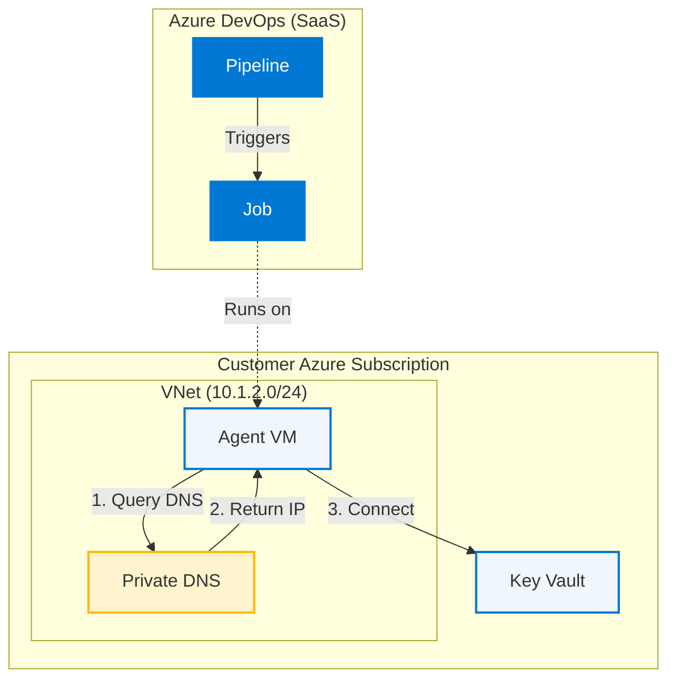

# DNS LAB 1: Connectivity Failure

## 🎯 The Situation

**Monday, 9:00 AM:** Your team's deployment pipeline suddenly started failing. The build agent can't retrieve secrets from Key Vault. 

**What you know:**
- The pipeline worked fine on Friday
- No one touched the pipeline YAML or agent configuration over the weekend
- Developers are blocked and asking what's wrong

**What you don't know:**
- On Friday evening, the infrastructure team made some "routine maintenance changes" to the Azure networking resources
- They didn't mention it because "nothing customer-facing changed"
- The change wasn't documented in your team's change log

**Your mission:** Figure out why the pipeline can't connect to Key Vault and restore service.

> **Real-World Context**
> This scenario happens constantly in production. Someone makes a "small infrastructure change" (updates a DNS record, modifies a VNet link, changes a firewall rule) without realizing it will break a pipeline. You can't just "re-run Terraform" because you don't control those resources, or the Terraform state is out of sync with reality. You need to diagnose what actually changed in Azure and fix it manually before you can update your IaC.

---

## 💥 Start the Lab

### Step 1: Simulate the Infrastructure Change

Run this command to simulate what the infrastructure team changed Friday evening:
```bash
./break-lab.sh lab1
```

This represents an infrastructure change made outside your pipeline's control. The script runs silently (just like the infra team's change—they didn't announce what they modified).

### Step 2: Observe the Pipeline Failure

Trigger your pipeline (or check the last run). You'll see this error in the "Validate Secret Retrieval" step:

```
=== Key Vault Access Test ===
✗ FAILED: Unable to retrieve secret from Key Vault

Troubleshooting steps:
1. Verify DNS resolution points to private endpoint IP
2. Check VNet peering is configured
3. Verify private DNS zone is linked to agent VNet
4. Check service connection has Key Vault access policy
```

**Key observation:** The `$(TestSecret)` variable is empty. The AzureKeyVault task couldn't fetch the secret at all.

---

## 🔍 Investigation: Systematic Troubleshooting

This is the same process you'll use on the job when a pipeline breaks. Work through each step—don't skip ahead.

---

### STEP 1: Scope the Problem (What Do We Know?)

Before diving into Azure resources, gather basic information about the failure. This is what support engineers ask first.

**Answer these questions:**

1. **What stage failed?**
   - Look at your pipeline run
   - Which step shows the red ✗?
   - Answer: `___________________`

2. **What type of agent?**
   - Self-hosted or Microsoft-hosted?
   - If self-hosted: What OS? (Windows/Linux/macOS)
   - Answer: `___________________`

3. **Did this ever work?**
   - Is this a brand new pipeline?
   - If not, when did it last succeed?
   - Answer: `___________________`

4. **What changed recently?**
   - Any pipeline code changes?
   - Agent updates?
   - Infrastructure changes (even by other teams)?
   - Answer: `___________________`

**For this lab scenario:**
- Stage: "Key Vault Secret Access" → "Fetch Secrets from Key Vault" (AzureKeyVault@2 task)
- Agent: Self-hosted Linux agent in Azure VM
- History: Last successful run was Friday; failed Monday morning
- Changes: **No** pipeline changes, **no** agent updates
- Red flag: Another team made infrastructure changes Friday evening (you'll need to figure out what)

**Key learning:** When "nothing changed" in your pipeline but it suddenly breaks, look for changes in the underlying infrastructure (network, DNS, firewall rules, service endpoints).

---

### STEP 2: Analyze the Error Message

Look at the pipeline log output. What does it tell you?

```
=== Key Vault Access Test ===
✗ FAILED: Unable to retrieve secret from Key Vault
```

**Decode the Error Signal:**

| Symptom in Logs | Likely Cause | Investigation Path |
|-----------------|--------------|--------------------|
| **Variable is empty / Task Timeout** | **Connectivity Failure** <br> Agent cannot reach the Key Vault endpoint at all. | Check DNS, Firewall, NSG, Private Endpoint status. |
| **"403 Forbidden" / "Access Denied"** | **Permission Failure** <br> Agent reached Key Vault, but was rejected. | Check Access Policies, Service Connection, RBAC. |
| **"Name not resolved"** | **DNS Failure** <br> Agent cannot find the IP address for the hostname. | Check DNS settings, Private DNS Zones. |
| **"Connection Refused"** | **Service Down / Blocked** <br> Reached IP, but port 443 is closed or blocked. | Check NSG, Firewall rules. |

**For this scenario:**
- The `$(TestSecret)` variable is empty.
- The task likely timed out or failed silently without an HTTP status code.
- **Conclusion:** This is a **Connectivity Issue**. The agent can't find or reach the Key Vault.

**Action Plan:** Focus on **Network & DNS**, not permissions.

---

### STEP 3: Build the Architecture Context (Ask Questions)

As a support engineer, you need to understand the customer's setup before diagnosing. Ask these questions:

**Q1: Where does the pipeline run?**
- Microsoft-hosted agent (runs in Azure's shared infrastructure)?
- Self-hosted agent (customer's own machine/VM)?

**A1:** Check your pipeline definition or Azure DevOps → Project Settings → Agent Pools → DNS-Lab-Pool  
Answer: `___________________`

**Q2: Where is the Azure resource the pipeline needs to access?**
- What service? (Storage Account, Key Vault, Container Registry, etc.)
- Public endpoint or Private Endpoint?

**A2:** Look at the error: "Unable to retrieve secret from Key Vault"  
Answer: `___________________`

**Q3: How do they connect?**
- Over public internet?
- Through Azure Private Link (private networking)?
- VPN or ExpressRoute?

**A3:** Check Terraform config or Azure Portal → Key Vault → Networking  
Answer: `___________________`

---

**Now you can draw the architecture:**



*(If the diagram above doesn't render, imagine the Agent VM inside a VNet, trying to reach Key Vault via a Private DNS Zone lookup.)*

**Key Insights from the Diagram:**

1. **Azure DevOps (SaaS)** triggers the pipeline job
2. **Self-hosted agent** (in customer's Azure VNet) picks up the job
3. Agent tries to connect to **Key Vault** using FQDN: `kv-*.vault.azure.net`
4. **Private DNS Zone** resolves the name to a private IP (should be the Private Endpoint IP)
5. If DNS points to wrong IP → agent can't reach Key Vault → pipeline fails
6. **Your Codespace** sees the public internet view (different from agent's private view)

**Critical difference:** 
- **You (Support Engineer):** You are outside the customer's private network. You can query Azure APIs (Control Plane) to see configuration, but you cannot "ping" private resources directly.
- **The Agent (Customer Environment):** It sits inside the private VNet (Data Plane). It relies on internal DNS and private routing.
- **The Challenge:** You need to "see what the agent sees" to diagnose the issue, but you can't always log in to a customer's production VM.

**How to "Get Inside" the Network:**

| Method | Description | When to Use |
|--------|-------------|-------------|
| **Pipeline Logs** | Check output of previous steps (like `nslookup` or `curl`). | **First choice.** Zero access required. |
| **Bastion / Jump Box** | SSH/RDP into a VM on the same VNet. | When you have network access. (Used in this lab) |
| **Run Command** | Execute scripts on Azure VMs via Portal/CLI. | When you have Azure permissions but no network access. |
| **Pipeline "Probe"** | Create a new pipeline just to run diagnostic commands. | When you have no Azure access at all. |

---

### STEP 4: Use the Pipeline History (The "Time Machine")

Before you even touch the command line, look at the evidence you already have.

**1. Check the "DNS Resolution Validation" Stage**
This pipeline has a dedicated diagnostic stage that runs `nslookup` before trying to fetch secrets.
- Go to the **failed run** logs.
- Expand the **DNS Resolution Validation** stage.
- Look at the output of `nslookup`.
- **What IP did it see?** (Likely `10.1.2.50`)

**2. Compare with a Successful Run**
- Go to the **last successful run** (from Friday).
- Expand the same **DNS Resolution Validation** stage.
- **What IP did it see then?** (Likely `10.1.2.4`)

**The "Aha!" Moment:**
By simply comparing the logs, you can prove the DNS resolution changed between Friday and Monday. You didn't need SSH, you didn't need Azure permissions—you just needed the logs.

> **Pro Tip:** If a customer doesn't have a diagnostic step, ask them to add a simple `script` task to their pipeline to run `nslookup <target>` and `curl -v <target>`. This is often faster than getting VPN/Bastion access.

---

### STEP 5: Test from Your Perspective (Baseline)

Before checking the agent, verify Key Vault is healthy from the public internet:

```bash
KV_NAME=$(terraform output -raw key_vault_name)
nslookup ${KV_NAME}.vault.azure.net
```

**Expected output:**
```
Non-authoritative answer:
Name:   kv-dns-lab-c4cbb3dd.vault.azure.net
Address: 13.66.138.88    # Public IP (13.x, 20.x, or 52.x range)
```

✓ **What this proves:** Key Vault exists and DNS works publicly. The service itself is healthy.

---

### STEP 6: Test from the Agent's Perspective (Where It Fails)

Now check what the agent sees. Get the VM connection details:

```bash
VM_IP=$(terraform output -raw vm_public_ip)
echo "Agent VM Public IP: ${VM_IP}"
```

**Connect to the agent VM:**

The VM uses password authentication (stored in Key Vault). For this lab, use the VM's public IP to SSH from your Codespace:

```bash
# Simple connection (will prompt for password)
ssh azureuser@${VM_IP}
```

*(In this lab, SSH simulates using a Bastion Host. In real life, you might rely on the pipeline logs you analyzed in Step 4.)*

*Note: If SSH hangs or times out, check the Network Security Group allows port 22 from your IP:*
```bash
az network nsg rule list \
  --resource-group $(terraform output -raw resource_group_name) \
  --nsg-name nsg-agent-vm -o table
```

**Once connected to the VM**, test DNS from the agent's perspective:

```bash
KV_NAME="kv-dns-lab-c4cbb3dd"  # Get this from pipeline logs or terraform output
nslookup ${KV_NAME}.vault.azure.net
```

**What you're looking for:**
- Does it return an IP address?
- What IP address? (Should be 10.1.2.x for private endpoint)
- Is it different from what you saw in Step 4?

**Example output:**
```
Server:         127.0.0.53
Address:        127.0.0.53#53

Non-authoritative answer:
Name:   kv-dns-lab-c4cbb3dd.vault.azure.net
Address: 10.1.2.50
```

✓ **Good sign:** Got a private IP (10.x range)  
✗ **Red flag:** Is this the *correct* private endpoint IP?

---

### STEP 7: Find the Truth (What Should It Be?)

**Goal:** Find out what IP address the Key Vault private endpoint is *actually* using in Azure.

In the real world, you won't always have Terraform outputs handy. Here are the ways to find the "Source of Truth":

| Method | How to do it | Pros/Cons |
|--------|--------------|-----------|
| **Azure Portal** | Search for "Private Endpoints" → Click the endpoint → Look at "Network Interface" → "Private IP". | **Easiest** visual check. Slow if you have many subscriptions. |
| **Azure CLI** | `az network private-endpoint show ...` | **Fastest** for automation. Requires knowing resource names. |
| **PowerShell** | `Get-AzPrivateEndpoint ...` | Good for Windows admins. |
| **Terraform State** | `terraform output` | **Unreliable during outages.** State might be stale (drift) or locked. |

**Task:** Use the Azure CLI method (since we are in a terminal) to find the real IP.

Exit the VM (type `exit`) and return to your Codespace terminal, then run:

```bash
# 1. Find the Resource Group name (if you don't know it)
az group list --query "[?starts_with(name, 'rg-dns-lab')].name" -o tsv

# 2. Get the Private Endpoint IP directly from Azure
# (Replace <RG_NAME> with the name you found above)
az network private-endpoint show \
  --resource-group <RG_NAME> \
  --name pe-kv-dns-lab \
  --query "customDnsConfigs[0].ipAddresses[0]" -o tsv
```

**Example output:**
```
10.1.2.4
```

Write down both IPs:
- DNS resolved IP (from Step 6): `_______`
- Private endpoint real IP (from Step 7): `_______`

---

### STEP 8: Compare (Are They the Same?)

| Source | IP | Match? |
|--------|-----|---------|
| DNS (from agent) | 10.1.2.50 | ? |
| Private Endpoint (from Azure) | 10.1.2.4 | ? |

**If they DON'T match:** You found the problem! DNS is pointing to the wrong IP.  
**If they DO match:** The issue is elsewhere (network routing, firewall, permissions).

For Lab 1, they should NOT match. Continue to understand why...

---

### STEP 9: Dig Deeper (Why Is DNS Wrong?)

Azure Private Endpoints use **Private DNS Zones** to map friendly names like `kv-*.vault.azure.net` to private IPs. Let's inspect the DNS record to see what Azure *thinks* the IP is.

```bash
# 1. Get the Key Vault name (if you don't have it handy)
KV_NAME=$(az keyvault list --resource-group <RG_NAME> --query "[0].name" -o tsv)

# 2. Check the A record in the Private DNS Zone
az network private-dns record-set a show \
  --resource-group <RG_NAME> \
  --zone-name privatelink.vaultcore.azure.net \
  --name ${KV_NAME} \
  --query "aRecords[0].ipv4Address" -o tsv
```

**What you'll see:**
```
10.1.2.50
```

**Root Cause Analysis:**
- **DNS Record:** Points to `10.1.2.50`
- **Actual Resource:** Lives at `10.1.2.4`
- **Result:** The agent tries to connect to `.50`, hits a black hole (or wrong server), and times out.

**How does this happen in production?**
- **"Fat Finger" Error:** Someone manually edited the DNS record.
- **Stale Records:** A private endpoint was deleted and recreated (getting a new IP), but the DNS record wasn't updated.
- **Drift:** Terraform state is out of sync with Azure reality.

---

## 🛠️ Fix the Issue

You have two choices. As a Support Engineer, you often have to decide between a quick "Hotfix" to get production running and a "Proper" fix to ensure consistency.

### Option 1: The "Hotfix" (Manual Azure CLI)
*Use this when production is down and you need immediate recovery.*

```bash
# 1. Get the correct IP from the Private Endpoint (The Truth)
CORRECT_IP=$(az network private-endpoint show \
  --resource-group <RG_NAME> \
  --name pe-kv-dns-lab \
  --query "customDnsConfigs[0].ipAddresses[0]" -o tsv)

echo "Correct IP is: $CORRECT_IP"

# 2. Update the DNS Record to match the Truth
az network private-dns record-set a update \
  --resource-group <RG_NAME> \
  --zone-name privatelink.vaultcore.azure.net \
  --name ${KV_NAME} \
  --set aRecords[0].ipv4Address=${CORRECT_IP}
```

### Option 2: The "Proper" Fix (Infrastructure as Code)
*Use this to ensure your Terraform state matches reality.*

```bash
./fix-lab.sh lab1
```
*Note: In this lab, `fix-lab.sh` just runs `terraform apply` to enforce the configuration defined in `main.tf`.*

---

## ✅ Verify the Fix

### 1. Check DNS Resolution (from the VM)

SSH back into the agent VM (if you aren't there already) and test again:
```bash
# Replace with your actual Key Vault name
nslookup ${KV_NAME}.vault.azure.net
```

**Expected output:**
```
Address: 10.1.2.4
```
✓ **Success!** The DNS now resolves to the correct Private Endpoint IP.

### 2. Re-run the Pipeline
1. Go back to Azure DevOps.
2. Find your failed pipeline run.
3. Click **"Rerun failed jobs"**.

It should now succeed (green checkmarks everywhere)! 🎉

---

## 🎓 Conclusion

**What you learned:**
1. **Split-Horizon DNS:** How Azure uses Private DNS Zones to override public DNS for private endpoints.
2. **The "Source of Truth":** Why you should trust the Azure Resource (Private Endpoint) over Terraform state or DNS records during an outage.
3. **Troubleshooting Flow:** 
   - Scope the issue (Who/What/Where).
   - Check the basics (nslookup).
   - Find the Source of Truth (Azure CLI).
   - Compare and Fix.

---

## 🧠 What You Learned

### Key Concepts

1. **DNS Resolution ≠ Connectivity**  
   Just because a name resolves doesn't mean it resolves to the *right* place. Always verify the IP matches your expectation.

2. **Private DNS Zones are Fragile**  
   A records can get out of sync with private endpoints. When troubleshooting private endpoints, always compare DNS → actual resource IP.

3. **Systematic Investigation**  
   Follow the path: Observe (what's happening) → Locate (what should happen) → Compare (find the gap) → Understand (why) → Fix.

### Reusable Troubleshooting Process

Next time a pipeline can't reach a private Azure resource:

1. Check DNS resolution from the agent's perspective (not your laptop)
2. Get the real private endpoint IP from Azure
3. Compare them—if different, inspect the DNS zone records
4. Fix the A record or recreate the private endpoint
5. Clear DNS caches if needed
6. Verify connectivity before re-running the pipeline

---

### 📺 Recommended Watching

If you want to truly master this topic, these videos are the gold standard:
- [Azure Private Link and DNS - The Missing Manual](https://www.youtube.com/watch?v=UVR9lhUGAyU) by John Savill
- [Azure Private Endpoint DNS Configuration](https://www.youtube.com/watch?v=j9QmMEWmcfo) by John Savill

---

## 🎓 Next Steps

- **Lab 2:** Missing VNet Link (DNS resolves to public IP instead of private)
- **Lab 3:** Custom DNS Misconfiguration (DNS server can't resolve private zones)

Good luck! 🚀
