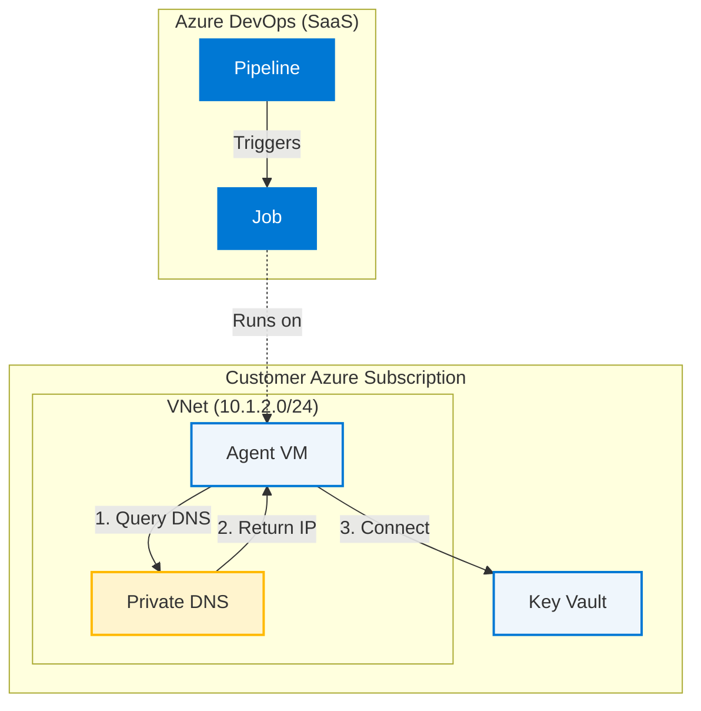

# Lab 1: Access Reliability Scenario

## 📧 Background Story

> **Read the full scenario:** [SCENARIO.md](SCENARIO.md)

You are Jordan Chen, DevOps Engineer at Contoso HealthTech Solutions. Your application developer Maya reported that the patient portal deployment pipeline has been failing since this morning with Key Vault access errors. After initial investigation, you discovered the build agent is resolving the Key Vault FQDN to a public IP instead of the private endpoint IP.

Your manager has opened a Microsoft support case, but you want to dig deeper while waiting for their response.

---

## 🎯 Your Mission

Investigate the DNS resolution issue preventing the build agent from accessing Key Vault via its private endpoint. Use diagnostic tools and Azure Portal to identify the root cause and restore pipeline functionality.

> **Real-World Context**
> This scenario mirrors common production incidents where infrastructure changes (DNS records, VNet links, firewall rules) break pipelines unexpectedly. You can't always wait for support or "re-run Terraform" when IaC state is out of sync with reality. You need to diagnose what changed in Azure and fix it manually.

---

## 💥 Start the Lab

### Step 1: Simulate the Infrastructure Change

Run this command to simulate the infrastructure issue:
```bash
./break-lab.sh lab1
```

This represents an infrastructure change made outside your pipeline's control. The script runs silently (just like real-world undocumented changes).

### Step 2: Observe the Pipeline Failure

Trigger your pipeline in Azure DevOps. The deployment will fail during the Key Vault retrieval stage with timeout or 403 Forbidden errors.

---

## 💡 TA Note: Before Escalating to Azure Networking Team

When troubleshooting private endpoint connectivity issues in production environments, Azure Support follows a systematic diagnostic process before escalating to specialized teams. This ensures the issue is well-documented and simple misconfigurations are caught early.

### Standard Troubleshooting Workflow

Before opening a collaboration ticket with the Azure Networking Team, complete these diagnostic steps:

| Step | Description | Tools/Commands |
|------|-------------|----------------|
| **1. Run Guided Troubleshooter** | Perform initial diagnostics for DNS, NSG, and firewall issues | Azure Portal → Resource → Diagnose and Solve Problems |
| **2. Validate DNS Zone Links** | Ensure private DNS zones are linked to relevant VNets | `az network private-dns link vnet list` |
| **3. Test Endpoint Reachability** | Confirm connectivity to required endpoints over TLS 443 | `curl -v https://<endpoint>`, `telnet <ip> 443` |
| **4. Review Network Policies** | Check NSGs, route tables, and subnet delegations | Network Watcher, `az network nsg rule list` |
| **5. Verify Proxy Settings** | Ensure proxy variables are correctly configured | `echo $HTTP_PROXY`, `echo $HTTPS_PROXY` |
| **6. Collect Evidence** | Attach GT results, Network Watcher logs, and diagrams | Screenshots, command output, architecture diagrams |

### Why This Matters

**In this lab:** You have full control of the environment and can fix issues directly. However, understanding this workflow prepares you for real-world scenarios where:

- You may need to work with separate networking teams who control DNS/VNet configurations
- Support engineers will ask for this data before escalating internally
- Documenting your troubleshooting steps helps justify infrastructure changes to management

### For This Exercise

You'll focus on **Steps 2-3** (DNS validation and connectivity testing). In production, you'd complete all six steps before escalating. The goal is to identify the root cause using DNS diagnostic tools (`nslookup`, `dig`) and Azure Portal inspection.

**Key Question to Answer:** Is the private DNS zone correctly configured to resolve the Key Vault FQDN to its private IP address?

Once you've gathered diagnostic evidence:
- ✅ **If you identify the issue:** Document the finding and implement the fix
- ⚠️ **If the issue remains unclear:** This is when you'd escalate to the Azure Networking Team with your complete diagnostic data

---

## 🔍 Investigation: Systematic Troubleshooting

This is the same process you'll use on the job when a pipeline breaks. Work through each step—don't skip ahead.

---

### STEP 1: Scope the Problem (What Do We Know?)

Before diving into Azure resources, gather basic information about the failure. This is what support engineers ask first.

**Answer these questions:**

1. **What stage failed?**
   - Look at your pipeline run
   - Which step shows the red ✗?
   - Answer: `___________________`

2. **What type of agent?**
   - Self-hosted or Microsoft-hosted?
   - If self-hosted: What OS? (Windows/Linux/macOS)
   - Answer: `___________________`

3. **Did this ever work?**
   - Is this a brand new pipeline?
   - If not, when did it last succeed?
   - Answer: `___________________`

4. **What changed recently?**
   - Any pipeline code changes?
   - Agent updates?
   - Infrastructure changes (even by other teams)?
   - Answer: `___________________`

**For this lab scenario:**
- Stage: "RetrieveConfig" → "Get Message from Key Vault" (AzureKeyVault@2 task)
- Agent: Self-hosted Linux agent in Azure VM
- History: Last successful run was Friday; failed Monday morning
- Changes: **No** pipeline changes, **no** agent updates
- Red flag: Another team made infrastructure changes Friday evening (you'll need to figure out what)

**Key learning:** When "nothing changed" in your pipeline but it suddenly breaks, look for changes in the underlying infrastructure (network, DNS, firewall rules, service endpoints).

---

### STEP 2: Analyze the Error Message

Look at the pipeline log output. What does it tell you?

**Actual error you'll see in the RetrieveConfig stage:**

```
Starting: Get Message from Key Vault
==============================================================================
Task         : Azure Key Vault
Description  : Download Azure Key Vault secrets
Version      : 2.8.0
==============================================================================
Downloading secret value for: AppMessage.
##[error]The task has timed out.
Finishing: Get Message from Key Vault
```

---

**Decode the Error Signal:**

| Symptom in Logs | Likely Cause | Investigation Path |
|-----------------|--------------|--------------------|
| **Task times out (60 seconds)** | **Connectivity Failure** <br> Agent cannot reach the Key Vault endpoint. The task waits for 60 seconds trying to connect, then gives up. | Check DNS resolution, Firewall, NSG, Private Endpoint status. |
| **"403 Forbidden" / "Access Denied"** | **Permission Failure** <br> Agent reached Key Vault quickly, but was rejected. | Check Access Policies, Service Connection, RBAC. |
| **"Name not resolved"** | **DNS Failure** <br> Agent cannot find the IP address for the hostname. | Check DNS settings, Private DNS Zones. |
| **"Connection Refused"** | **Service Down / Blocked** <br> Reached IP, but port 443 is closed or blocked. | Check NSG, Firewall rules. |

---

**For this scenario:**
- The task shows "Downloading secret value for: AppMessage." (it knows what to get)
- Then it **times out after 60 seconds** (it can't reach the endpoint)
- The RetrieveConfig stage fails, blocking subsequent Build and Deploy stages
- **Conclusion:** This is a **Connectivity Issue**—the agent can't reach the Key Vault

**What the timeout tells us:**
- ✅ Authentication is working (the task got past service connection validation)
- ✅ Permissions are likely OK (no immediate "403 Forbidden")
- ❌ Network connectivity is broken (agent waited 60 seconds and couldn't connect)

**Action Plan:** Focus on **Network & DNS**, not permissions.

---

### STEP 3: Gather Architecture Context and Update Email Draft

As a support engineer investigating an issue, you need to understand the customer's architecture before proceeding with diagnostics. This information will be required when escalating to Azure Support.

**Your Task:** Answer the following questions and add them to your collaboration email draft.

---

#### Architecture Discovery Questions

**Q1: Where does the pipeline run?**
- ☐ Microsoft-hosted agent (runs in Azure's shared infrastructure)
- ☐ Self-hosted agent (customer's own machine/VM)

**How to find the answer:**
- Check Azure DevOps → **Pipelines** → **DNS-Lab-Pipeline** → View YAML
- Look for `pool:` section
- Or check: Azure DevOps → **Project Settings** → **Agent Pools** → **DNS-Lab-Pool**

**Your Answer:** `___________________`

---

**Q2: Where is the Azure resource the pipeline needs to access?**
- What service? (Storage Account, Key Vault, Container Registry, etc.)
- Public endpoint or Private Endpoint?

**How to find the answer:**
- Review the pipeline error: "Unable to retrieve secret from Key Vault"
- Check Azure Portal → **Key Vaults** → Select your Key Vault → **Networking**
- Look for "Private endpoint connections" section

**Your Answer:** `___________________`

---

**Q3: How do they connect?**
- ☐ Over public internet
- ☐ Through Azure Private Link (private networking)
- ☐ VPN or ExpressRoute

**How to find the answer:**
- Azure Portal → **Key Vault** → **Networking** → **Private endpoint connections**
- Or Azure CLI: `az network private-endpoint list --query "[?contains(privateLinkServiceConnections[0].privateLinkServiceId, 'vault')].{Name:name, IP:customDnsConfigs[0].ipAddresses[0]}" -o table`

**Your Answer:** `___________________`

---

#### Update Your Email Draft

Open your **[EMAIL_TEMPLATE.md](./EMAIL_TEMPLATE.md)** draft from STEP 5B and add this architecture information to the **"Additional Context"** section:

**Example text to add:**
```
## Architecture Details

**Pipeline Execution Environment:**
- Pipeline runs on: Self-hosted agent VM (DNS-Lab-Pool)
- Agent VM location: Azure VNet 10.1.0.0/16
- Agent VM uses Azure-provided DNS (168.63.129.16)

**Target Resource:**
- Service: Azure Key Vault
- Connectivity: Private Endpoint (10.1.2.5)
- Private DNS Zone: privatelink.vaultcore.azure.net

**Connection Method:**
- Agent connects to Key Vault via Private Link (private networking)
- Public endpoint is disabled on Key Vault
```

💾 **Save your updated email draft.** You'll add more diagnostic findings in the next steps.

---

**Now you can visualize the architecture:**


```mermaid
graph TD
    %% Nodes
    subgraph ADO ["Azure DevOps (SaaS)"]
        Pipeline["Pipeline"] -->|Triggers| Job["Job"]
    end

    subgraph Azure ["Customer Azure Subscription"]
        subgraph VNet ["VNet (10.1.2.0/24)"]
            Agent["Agent VM"]
            DNS["Private DNS"]
        end
        
        KV["Key Vault"]
    end

    %% Connections
    Job -.->|Runs on| Agent
    Agent -->|1. Query DNS| DNS
    DNS -->|2. Return IP| Agent
    Agent -->|3. Connect| KV

    %% Styling
    classDef azure fill:#0078d4,color:white,stroke:none;
    classDef resource fill:#eff6fc,stroke:#0078d4,stroke-width:2px;
    classDef dns fill:#fff4ce,stroke:#ffb900,stroke-width:2px;

    class Job,Pipeline azure;
    class Agent,KV resource;
    class DNS dns;
```

*(If the diagram above doesn't render, imagine the Agent VM inside a VNet, trying to reach Key Vault via a Private DNS Zone lookup.)*

**Key Insights from the Diagram:**

1. **Azure DevOps (SaaS)** triggers the pipeline job
2. **Self-hosted agent** (in customer's Azure VNet) picks up the job
3. Agent tries to connect to **Key Vault** using FQDN: `kv-*.vault.azure.net`
4. **Private DNS Zone** resolves the name to a private IP (should be the Private Endpoint IP)
5. If DNS points to wrong IP → agent can't reach Key Vault → pipeline fails
6. **Your Codespace** sees the public internet view (different from agent's private view)

**Critical difference:** 
- **You (Support Engineer):** You are outside the customer's private network. You can query Azure APIs (Control Plane) to see configuration, but you cannot "ping" private resources directly.
- **The Agent (Customer Environment):** It sits inside the private VNet (Data Plane). It relies on internal DNS and private routing.
- **The Challenge:** You need to "see what the agent sees" to diagnose the issue, but you can't always log in to a customer's production VM.

**How to "Get Inside" the Network:**

| Method | Description | When to Use |
|--------|-------------|-------------|
| **Pipeline Logs** | Check output of previous steps (like `nslookup` or `curl`). | **First choice.** Zero access required. |
| **Bastion / Jump Box** | SSH/RDP into a VM on the same VNet. | When you have network access. (Used in this lab) |
| **Run Command** | Execute scripts on Azure VMs via Portal/CLI. | When you have Azure permissions but no network access. |
| **Pipeline "Probe"** | Create a new pipeline just to run diagnostic commands. | When you have no Azure access at all. |

---

### STEP 4: Compare Current vs. Previous Pipeline Runs

Before you SSH into the agent, compare pipeline runs to identify what changed.

**1. Navigate to Pipeline History**
- In Azure DevOps, go to **Pipelines** → **DNS-Lab-Pipeline**
- Click on **Runs** to see the history
- Compare the **last successful run** (before break-lab.sh) with the **current failing run**

**2. Last Successful Run (before Lab 1 break):**
- ✅ RetrieveConfig stage: Completes successfully (~30 seconds)
- ✅ Build stage: Creates Node.js app artifact
- ✅ Deploy stage: Shows `✓ Lab completed successfully!` with message length

**3. Current Failing Run (after Lab 1 break):**
- ❌ RetrieveConfig stage: Times out after 60 seconds or shows connection error
- ❌ Build stage: Never executes (blocked by RetrieveConfig failure)
- ❌ Deploy stage: Never executes
- Error message: `##[error]Failed to retrieve AppMessage from Key Vault`

**The "Aha!" Moment:**
The pipeline can no longer retrieve the `AppMessage` secret from Key Vault via the private endpoint. The RetrieveConfig stage is failing on the AzureKeyVault@2 task, which means the agent cannot connect to the Key Vault's private endpoint.

**Key Observation:** This is a **connectivity issue between the agent and the Key Vault's private endpoint**, not a permissions problem (the service connection hasn't changed).

> **Pro Tip:** If a customer doesn't have detailed pipeline logging, ask them to add a `bash` task before the Key Vault task to run `nslookup <keyvault>.vault.azure.net`. This captures DNS resolution from the agent's perspective in the pipeline logs.

---

### STEP 5: Run Azure Guided Troubleshooter and Prepare Collaboration Request

You've identified that the agent cannot reach the Key Vault. This is where you would use the **Azure Guided Troubleshooter** if escalating to Azure Support.

**Access Guided Troubleshooter:**
1. Navigate to **Azure Portal** → **Key Vault** → **Diagnose and Solve Problems**
2. Select **"Connectivity Issues"** → **"Private Endpoint Connectivity"**
3. Or visit: [Azure Networking Guided Troubleshooter](https://portal.azure.com/#blade/Microsoft_Azure_Support/NetworkingGuidedTroubleshooterBlade)

**Answer the Guided Questions Below:**

---

**Question 1: Are the resources involved connected to or passing through an Azure Network resource?**

Options:
- ☐ Yes, resources are hosted in a Virtual Network or are under Microsoft.Network or Microsoft.CDN resource providers
- ☐ No, resources are outside of a Virtual Network and/or Microsoft.Network or Microsoft.CDN resource providers
- ☐ This is a request for assistance recovering deleted networking resources

**Your Answer (write in your notes):** _____________________

<details>
<summary>💡 Hint: Where is the agent VM located?</summary>

The agent VM is in VNet `10.1.0.0/16`, and the Key Vault has a private endpoint in that same VNet. Select **"Yes, resources are hosted in a Virtual Network"**.
</details>

---

**Question 2: Which option best describes the problem prompting your collaboration with Azure Networking?**

Options:
- ☐ Domain Name System (DNS) resolution issue
- ☐ Network connectivity or performance issue
- ☐ Application layer issues related to HTTP/HTTPS or TLS
- ☐ Other

**Your Answer (write in your notes):** _____________________

<details>
<summary>💡 Hint: What error is the pipeline showing?</summary>

The RetrieveConfig stage times out connecting to Key Vault. This suggests DNS resolution might be returning the wrong IP address. Select **"Domain Name System (DNS) resolution issue"**.
</details>

---

**Question 3: What type of DNS solution is the customer running?**

Options:
- ☐ Azure Traffic Manager
- ☐ Azure Public DNS Zone
- ☐ Azure Private DNS Zone
- ☐ Azure Private Resolver
- ☐ Azure-Provided DNS (168.63.129.16)
- ☐ Windows Custom DNS Server
- ☐ 3rd party DNS solution

**Your Answer (write in your notes):** _____________________

<details>
<summary>💡 Hint: Check the Azure Portal</summary>

Check Azure Portal → **Virtual Networks** → Select your VNet → **Settings** → **DNS servers**. The VNet uses Azure-provided DNS (168.63.129.16) with a Private DNS Zone for `privatelink.vaultcore.azure.net`. Select **"Azure Private DNS Zone"**.
</details>

---

**Guided Troubleshooter Result:**

Based on these answers, the troubleshooter will route you to:

**Support Category:** `SAP Azure / Azure DNS / DNS Resolution Failures / Issues resolving Private DNS records`  
**Team:** Azure Private DNS Team

**Required Information to Collect:**

Before creating a collaboration request, gather the following details:

| Information | How to Collect | Notes |
|-------------|----------------|-------|
| **Key Vault FQDN** | Azure Portal → Key Vault → Properties → Vault URI<br>OR `az keyvault list --query "[0].properties.vaultUri" -o tsv` | Used for DNS testing |
| **Key Vault Resource URI** | Azure Portal → Key Vault → Properties → Resource ID | Full ARM path |
| **Private Endpoint IP** | `az network private-endpoint list --query "[?contains(name, 'pe-keyvault')].customDnsConfigs[0].ipAddresses[0]" -o tsv` | Expected IP for DNS A record |
| **Private DNS Zone Name** | `privatelink.vaultcore.azure.net` | Zone hosting the A record |
| **Agent VNet Name** | Azure Portal → Virtual Networks → List VNets<br>OR `az network vnet list --query "[?contains(name, 'dns-lab')].name" -o tsv` | Where agent VM resides |
| **Issue Start Time** | Azure DevOps pipeline failure timestamp | When first failure occurred |
| **Error Message** | Copy from Azure DevOps pipeline logs | Exact error text |
| **Last Successful Run** | Azure DevOps pipeline history | Timestamp of last working run |

---

**Next Step: Draft Collaboration Email**

Use the **[EMAIL_TEMPLATE.md](./EMAIL_TEMPLATE.md)** file in this lab folder to draft your collaboration request.

**Instructions:**
1. Open `labs/lab1/EMAIL_TEMPLATE.md`
2. Fill in all the blanks with information from the table above
3. Answer the Guided Troubleshooter questions in the email
4. Describe the troubleshooting steps you've completed so far (STEP 1-5)
5. **Send the email to your instructor**

**To:** `your-instructor@email.com`  
**Subject:** `Lab 1 - Azure Private DNS Investigation - [Your Name]`

**Why send now?**

In the real world, you would open this collaboration request to get help queued up while you continue investigating. Even if you solve it yourself before they respond, documenting your investigation helps:
- Track progress for management/stakeholders
- Create a paper trail for post-incident reviews
- Get feedback on your troubleshooting approach
- Build your professional communication skills

You'll continue to STEP 6 to test DNS from the agent's perspective. You might discover the root cause yourself, but your instructor will see your investigation methodology and provide feedback.

> 📚 **Real-World Pro Tip:** For **critical production outages**, open the collaboration request as soon as you have the required information documented (resource IDs, error messages, timestamps, basic diagnostics). Don't wait until you're completely stuck—but also don't open requests without the needed collaboration data. Incomplete requests get rejected or delayed, wasting everyone's time.

---

### STEP 6: Analyze What We Know and Plan Data Collection

Before jumping into commands, let's think like a support engineer. Review what you've learned so far and identify what's still missing.

---

#### 📊 What We Know (From STEP 1-5)

| Evidence | What It Tells Us |
|----------|------------------|
| **Pipeline fails at RetrieveConfig stage** | Agent cannot connect to Key Vault |
| **Error: "Failed to retrieve AppMessage"** | Connection timeout or unreachable endpoint |
| **Architecture: Self-hosted agent in VNet** | Agent is inside the private network |
| **Key Vault has Private Endpoint** | Should be accessible via private IP (10.x range) |
| **Private DNS Zone exists** | `privatelink.vaultcore.azure.net` is configured |
| **Guided Troubleshooter result** | Points to "Azure Private DNS Zone" issue |
| **Service connection hasn't changed** | Rules out permissions/authentication issues |

---

#### ❓ What We DON'T Know Yet (Critical Gaps)

To diagnose a DNS issue, we need to compare **what the agent is getting** vs. **what it should get**.

| Missing Data | Why We Need It | How It Helps Us |
|--------------|----------------|-----------------|
| **What IP does the agent's DNS resolve to?** | The agent might be getting: <br>• Public IP (DNS zone not linked)<br>• Wrong private IP (A record misconfigured)<br>• No response (DNS server down) | Tells us if DNS resolution is working at all, and if so, what IP it returns |
| **What IP SHOULD the agent get?** | Need the "Source of Truth" from Azure:<br>• The actual Private Endpoint IP address | Gives us the correct value to compare against |
| **What does the DNS A record say?** | The Private DNS Zone might have:<br>• Correct IP (problem is elsewhere)<br>• Wrong IP (A record misconfigured)<br>• No record (never created) | Shows if the DNS zone configuration matches the Private Endpoint |

---

#### 🎯 Action Plan: Collect the Missing Data

We need to gather three pieces of evidence:

```
1. DNS Resolution from Agent → What IP does nslookup return?
2. Private Endpoint Real IP → What IP does Azure say the endpoint uses?
3. Private DNS Zone A Record → What IP is configured in the DNS zone?
```

**Then we can compare:**
- If DNS ≠ Private Endpoint IP → **A record is wrong**
- If DNS = Private Endpoint IP but connection fails → **Network/Firewall issue**
- If DNS returns public IP → **VNet link missing** (Lab 2 scenario)

---

#### 🧠 Networking Fundamentals: Why This Matters

**Understanding DNS in Private Networking:**

When you use Azure Private Link, DNS resolution works differently than public internet:

```
┌─────────────────────────────────────────────────────────────┐
│ Without Private Link (Public DNS)                           │
├─────────────────────────────────────────────────────────────┤
│ 1. App queries: kv-name.vault.azure.net                     │
│ 2. Public DNS returns: 20.50.1.100 (public IP)             │
│ 3. Traffic goes over internet                               │
└─────────────────────────────────────────────────────────────┘

┌─────────────────────────────────────────────────────────────┐
│ With Private Link (Split-Horizon DNS)                       │
├─────────────────────────────────────────────────────────────┤
│ 1. App queries: kv-name.vault.azure.net                     │
│ 2. Private DNS Zone intercepts and returns: 10.1.2.5       │
│ 3. Traffic stays within private VNet                        │
└─────────────────────────────────────────────────────────────┘
```

**The Problem:**
If the Private DNS Zone A record points to the **wrong private IP**, the agent connects to the wrong server (or a black hole), causing timeouts.

**Your mission:** Collect the three data points above to identify if the A record is misconfigured.

---

### STEP 7: Collect Data #1 - DNS Resolution from Agent

**Goal:** Discover what IP address the agent VM resolves when it queries the Key Vault FQDN.

**Why from the agent?** The agent is inside the private network. DNS resolution from your Codespace (outside the VNet) will give different results than what the agent sees.

---

#### Get VM Connection Details

```bash
# Option 1: Azure Portal → Virtual Machines → Select agent VM → Overview → Public IP address

# Option 2: Azure CLI
VM_IP=$(az vm list-ip-addresses --query "[?contains(virtualMachine.name, 'dns-lab-agent')].virtualMachine.network.publicIpAddresses[0].ipAddress" -o tsv)
echo "Agent VM Public IP: ${VM_IP}"
```

---

#### Connect to the Agent VM

The VM uses password authentication. For this lab, use the VM's public IP to SSH from your Codespace:

```bash
ssh azureuser@${VM_IP}
```

*(In this lab, SSH simulates using a Bastion Host. In production, you might not have direct VM access—you'd rely on pipeline logs or Azure Run Command.)*

<details>
<summary>🔧 Troubleshooting: SSH Connection Issues</summary>

If SSH hangs or times out, check the Network Security Group allows port 22 from your IP:

```bash
# Get the resource group name first
RG_NAME=$(az group list --query "[?contains(name, 'rg-dns-lab')].name" -o tsv)

# Then check NSG rules
az network nsg rule list \
  --resource-group $RG_NAME \
  --nsg-name nsg-agent-vm -o table
```

If your IP is not allowed, you may need to add an inbound rule temporarily.
</details>

---

#### Test DNS Resolution

Once connected to the VM, test DNS from the agent's perspective:

```bash
# Get Key Vault name from pipeline logs or Azure Portal → Key Vaults
KV_NAME="kv-dns-lab-c4cbb3dd"

# Test DNS resolution
nslookup ${KV_NAME}.vault.azure.net
```

**Example output:**
```
Server:         127.0.0.53
Address:        127.0.0.53#53

Non-authoritative answer:
Name:   kv-dns-lab-c4cbb3dd.vault.azure.net
Address: 10.1.2.50
```

---

#### Record Your Finding

**Data Point #1: DNS Resolution from Agent**

Write down the IP address returned:

```
Agent resolved IP: ___________________
```

**What does this tell us?**
- ✓ **Private IP (10.x.x.x):** DNS resolution is using the Private DNS Zone
- ✗ **Public IP (13.x, 20.x, 52.x):** VNet link might be missing (Lab 2 scenario)
- ✗ **No response / NXDOMAIN:** DNS server or zone configuration issue

For this lab, you should see a **private IP** (10.x range). But is it the **correct** private IP? Let's find out in STEP 8.

**Exit the VM** (type `exit`) and return to your Codespace terminal.

---

### STEP 8: Collect Data #2 - Private Endpoint Real IP

**Goal:** Find the "Source of Truth" - what IP address does the Private Endpoint actually use in Azure?

**Why this matters:** The Private Endpoint has a real IP address assigned by Azure. If DNS points somewhere else, the agent can't connect.

---

#### Methods to Find the Source of Truth

You have multiple options. Choose the one you're most comfortable with:

| Method | How to do it | When to Use |
|--------|--------------|-------------|
| **Azure Portal** | Search for "Private Endpoints" → Click endpoint → "Network Interface" → "Private IP" | Visual learners, exploring unfamiliar subscriptions |
| **Azure CLI** | `az network private-endpoint show ...` | Automation, scripting, or when you know resource names |
| **PowerShell** | `Get-AzPrivateEndpoint ...` | Windows environments, existing PowerShell workflows |
| **REST API** | `GET` to Azure Resource Manager endpoint | Advanced automation, custom tooling |

> ⚠️ **Why not IaC state files?** During an outage, Terraform/Bicep/ARM state may be stale (drift), locked, or inaccessible. Always verify against Azure's control plane directly.

---

#### Option A: Azure Portal Method

1. Go to **Azure Portal** → Search for "Private Endpoints"
2. Find the endpoint with name containing `keyvault` or `kv-dns-lab`
3. Click on it → Go to **Network Interface** in the left menu
4. Look at **IP configurations** → Copy the **Private IP address**

---

#### Option B: Azure CLI Method (Recommended for this lab)

```bash
# 1. Find the Resource Group name
RG_NAME=$(az group list --query "[?contains(name, 'rg-dns-lab')].name" -o tsv)
echo "Resource Group: $RG_NAME"

# 2. Get the Private Endpoint IP directly from Azure
az network private-endpoint show \
  --resource-group $RG_NAME \
  --name pe-kv-dns-lab \
  --query "customDnsConfigs[0].ipAddresses[0]" -o tsv
```

**Example output:**
```
10.1.2.5
```

---

#### Record Your Finding

**Data Point #2: Private Endpoint Real IP (Source of Truth)**

Write down the IP address from Azure:

```
Private Endpoint IP: ___________________
```

**What this tells us:**
This is the IP address the agent **should** be connecting to. If DNS returned a different IP in STEP 7, we've found a mismatch.

---

### STEP 9: Collect Data #3 - Private DNS Zone A Record

**Goal:** Check what IP address is configured in the Private DNS Zone A record.

**Why this matters:** Azure Private Endpoints use **Private DNS Zones** to map friendly names (like `kv-name.vault.azure.net`) to private IPs. If the A record is misconfigured, DNS will return the wrong IP.

---

#### Query the Private DNS Zone

```bash
# Use the resource group from STEP 8
RG_NAME=$(az group list --query "[?contains(name, 'rg-dns-lab')].name" -o tsv)

# Get the Key Vault name
KV_NAME=$(az keyvault list --resource-group $RG_NAME --query "[0].name" -o tsv)
echo "Key Vault Name: $KV_NAME"

# Check the A record in the Private DNS Zone
az network private-dns record-set a show \
  --resource-group $RG_NAME \
  --zone-name privatelink.vaultcore.azure.net \
  --name $KV_NAME \
  --query "aRecords[0].ipv4Address" -o tsv
```

**Example output:**
```
10.1.2.50
```

---

#### Record Your Finding

**Data Point #3: Private DNS Zone A Record**

Write down the IP address configured in the DNS zone:

```
DNS A Record IP: ___________________
```

**What this tells us:**
This is what the Private DNS Zone is telling VMs to use when they query the Key Vault FQDN. If this doesn't match the Private Endpoint IP (from STEP 8), the DNS zone has incorrect configuration.

---

### STEP 10: Compare All Three Data Points and Send Findings

Now let's put all three pieces of evidence together and identify the root cause.

---

#### Comparison Table

Fill in your findings from STEP 7, 8, and 9:

| Data Source | IP Address | Your Value |
|-------------|------------|------------|
| **DNS Resolution from Agent** (STEP 7) | What the agent gets when it queries DNS | `___________` |
| **Private Endpoint Real IP** (STEP 8) | What Azure says the endpoint uses | `___________` |
| **Private DNS Zone A Record** (STEP 9) | What the DNS zone is configured with | `___________` |

---

#### Root Cause Identification

**Compare the values:**

✅ **If all three match:**
- DNS is correctly configured
- Problem is elsewhere (firewall, NSG, routing)
- This is NOT the scenario for Lab 1

❌ **If DNS A Record ≠ Private Endpoint IP:**
- **Root Cause:** DNS A record is misconfigured
- **Why it breaks:** Agent queries DNS → gets wrong IP → tries to connect → fails
- **This IS the scenario for Lab 1**

**Expected findings for Lab 1:**
- DNS Resolution from Agent: `10.1.2.50` (wrong)
- Private Endpoint Real IP: `10.1.2.5` (correct)
- DNS A Record: `10.1.2.50` (matches DNS resolution, but wrong)

**Conclusion:** The Private DNS Zone A record points to the wrong IP address.

---

#### How Does This Happen in Production?

| Scenario | Description |
|----------|-------------|
| **"Fat Finger" Error** | Someone manually edited the DNS record and made a typo |
| **Stale Records** | Private endpoint was deleted and recreated with a new IP, but DNS wasn't updated |
| **Configuration Drift** | Resources were modified outside your deployment process (manual Portal changes, scripts, other automation) |
| **Automation Bug** | Deployment script or IaC template had incorrect IP hardcoded |

---

#### Send Findings to Instructor

Now that you've identified the root cause, send an update to your instructor.

**To:** `your-instructor@email.com`  
**Subject:** `Lab 1 - Root Cause Identified - [Your Name]`

**Email body should include:**

```
Hi [Instructor Name],

I've completed the data collection and identified the root cause:

ROOT CAUSE: Private DNS Zone A record misconfiguration

EVIDENCE:
- DNS Resolution from Agent: [your value]
- Private Endpoint Real IP (Source of Truth): [your value]
- Private DNS Zone A Record: [your value]

ANALYSIS:
The DNS A record in the privatelink.vaultcore.azure.net zone points to [wrong IP] 
instead of the correct Private Endpoint IP [correct IP]. This causes the agent 
to attempt connection to the wrong address, resulting in timeout.

NEXT STEP:
I will update the DNS A record to match the Private Endpoint IP and verify 
the fix by re-running the pipeline.

Thanks,
[Your Name]
```

📧 **Send this email now before proceeding to the fix.**

---

### STEP 11: Fix the DNS A Record

Now that you've identified the root cause and reported it, let's fix the misconfigured A record.

**You have three options.** Choose the method you're most comfortable with:

---

#### Option A: Azure Portal (Visual Method)

1. Go to **Azure Portal** → Search for "Private DNS zones"
2. Click on `privatelink.vaultcore.azure.net`
3. Go to **Recordsets** in the left menu
4. Find the A record for your Key Vault (name will be like `kv-dns-lab-xxxxx`)
5. Click on it → **Edit**
6. Change the IP address to match the Private Endpoint IP (from STEP 8)
7. Click **Save**

---

#### Option B: Azure CLI (Command Line Method)

```bash
# Variables from previous steps
RG_NAME=$(az group list --query "[?contains(name, 'rg-dns-lab')].name" -o tsv)
KV_NAME=$(az keyvault list --resource-group $RG_NAME --query "[0].name" -o tsv)

# Get the correct IP from the Private Endpoint (Source of Truth)
CORRECT_IP=$(az network private-endpoint show \
  --resource-group $RG_NAME \
  --name pe-kv-dns-lab \
  --query "customDnsConfigs[0].ipAddresses[0]" -o tsv)

echo "Correct IP is: $CORRECT_IP"

# Update the DNS A record to match the correct IP
az network private-dns record-set a update \
  --resource-group $RG_NAME \
  --zone-name privatelink.vaultcore.azure.net \
  --name $KV_NAME \
  --set aRecords[0].ipv4Address=$CORRECT_IP

echo "DNS A record updated successfully"
```

---

#### Option C: Azure REST API (Advanced Method)

```bash
# Get variables
RG_NAME=$(az group list --query "[?contains(name, 'rg-dns-lab')].name" -o tsv)
KV_NAME=$(az keyvault list --resource-group $RG_NAME --query "[0].name" -o tsv)
SUB_ID=$(az account show --query id -o tsv)
CORRECT_IP=$(az network private-endpoint show \
  --resource-group $RG_NAME \
  --name pe-kv-dns-lab \
  --query "customDnsConfigs[0].ipAddresses[0]" -o tsv)

# Get access token
TOKEN=$(az account get-access-token --query accessToken -o tsv)

# Update via REST API
curl -X PATCH \
  -H "Authorization: Bearer $TOKEN" \
  -H "Content-Type: application/json" \
  -d "{\"properties\": {\"aRecords\": [{\"ipv4Address\": \"$CORRECT_IP\"}]}}" \
  "https://management.azure.com/subscriptions/$SUB_ID/resourceGroups/$RG_NAME/providers/Microsoft.Network/privateDnsZones/privatelink.vaultcore.azure.net/A/$KV_NAME?api-version=2020-06-01"

echo "DNS A record updated via REST API"
```

---

**Choose one method above and execute it now.**

---

### STEP 12: Verify the Fix

Now let's confirm the fix worked.

---

#### 1. Re-test DNS Resolution from Agent

SSH back into the agent VM:

```bash
VM_IP=$(az vm list-ip-addresses --query "[?contains(virtualMachine.name, 'dns-lab-agent')].virtualMachine.network.publicIpAddresses[0].ipAddress" -o tsv)
ssh azureuser@$VM_IP
```

Test DNS again:

```bash
KV_NAME="kv-dns-lab-c4cbb3dd"  # Use your actual Key Vault name
nslookup $KV_NAME.vault.azure.net
```

**Expected output:**
```
Address: 10.1.2.5
```

✅ **Success!** The DNS now resolves to the correct Private Endpoint IP.

Type `exit` to disconnect from the VM.

---

#### 2. Re-run the Pipeline

1. Go to **Azure DevOps** → **Pipelines** → **DNS-Lab-Pipeline**
2. Find your most recent failed run
3. Click **"Rerun failed jobs"** or **"Run pipeline"**

**Watch the stages:**
- ✅ RetrieveConfig: Should complete successfully (~30 seconds)
- ✅ Build: Creates Node.js app
- ✅ Deploy: Shows `✓ Lab completed successfully!` with message

🎉 **Pipeline should now succeed!**

---

## 🎓 Conclusion

**What you learned:**
1. **Split-Horizon DNS:** How Azure uses Private DNS Zones to override public DNS for private endpoints.
2. **The "Source of Truth":** Why you should trust the Azure Resource (Private Endpoint) over IaC state files or DNS records during an outage.
3. **Troubleshooting Flow:** 
   - Scope the issue (Who/What/Where).
   - Check the basics (nslookup).
   - Find the Source of Truth (Azure CLI).
   - Compare and Fix.

---

## 🧠 What You Learned

### Key Concepts

1. **DNS Resolution ≠ Connectivity**  
   Just because a name resolves doesn't mean it resolves to the *right* place. Always verify the IP matches your expectation.

2. **Private DNS Zones are Fragile**  
   A records can get out of sync with private endpoints. When troubleshooting private endpoints, always compare DNS → actual resource IP.

3. **Systematic Investigation**  
   Follow the path: Observe (what's happening) → Locate (what should happen) → Compare (find the gap) → Understand (why) → Fix.

### Reusable Troubleshooting Process

Next time a pipeline can't reach a private Azure resource:

1. Check DNS resolution from the agent's perspective (not your laptop)
2. Get the real private endpoint IP from Azure
3. Compare them—if different, inspect the DNS zone records
4. Fix the A record or recreate the private endpoint
5. Clear DNS caches if needed
6. Verify connectivity before re-running the pipeline

---

### 📺 Recommended Watching

If you want to truly master this topic, these videos are the gold standard:
- [Azure Private Link and DNS - The Missing Manual](https://www.youtube.com/watch?v=UVR9lhUGAyU) by John Savill
- [Azure Private Endpoint DNS Configuration](https://www.youtube.com/watch?v=j9QmMEWmcfo) by John Savill

---

## 🎓 Next Steps

- **Lab 2:** Missing VNet Link (DNS resolves to public IP instead of private)
- **Lab 3:** Custom DNS Misconfiguration (DNS server can't resolve private zones)

Good luck! 🚀
