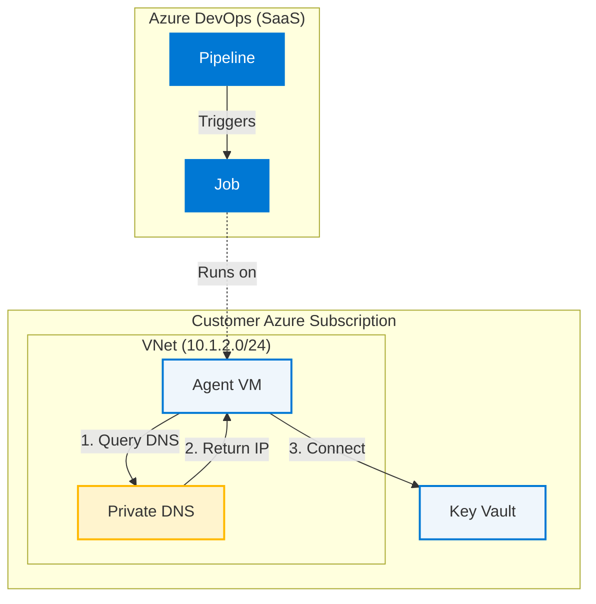

# Lab 1: Access Reliability Scenario

## 📧 Background Story

> **Read the full scenario:** [SCENARIO.md](SCENARIO.md)

You are Jordan Chen, DevOps Engineer at Contoso HealthTech Solutions. Your application developer Maya reported that the patient portal deployment pipeline has been failing since this morning with Key Vault access errors. After initial investigation, you discovered the build agent is resolving the Key Vault FQDN to a public IP instead of the private endpoint IP.

Your manager has opened a Microsoft support case, but you want to dig deeper while waiting for their response.

---

## 🎯 Your Mission

Investigate the DNS resolution issue preventing the build agent from accessing Key Vault via its private endpoint. Use diagnostic tools and Azure Portal to identify the root cause and restore pipeline functionality.

> **Real-World Context**
> This scenario mirrors common production incidents where infrastructure changes (DNS records, VNet links, firewall rules) break pipelines unexpectedly. You can't always wait for support or "re-run Terraform" when IaC state is out of sync with reality. You need to diagnose what changed in Azure and fix it manually.

---

## 💥 Start the Lab

### Step 1: Simulate the Infrastructure Change

Run this command to simulate the infrastructure issue:
```bash
./break-lab.sh lab1
```

This represents an infrastructure change made outside your pipeline's control. The script runs silently (just like real-world undocumented changes).

### Step 2: Observe the Pipeline Failure

Trigger your pipeline in Azure DevOps. The deployment will fail during the Key Vault retrieval stage with timeout or 403 Forbidden errors.

---

## 💡 TA Note: Before Escalating to Azure Networking Team

When troubleshooting private endpoint connectivity issues in production environments, Azure Support follows a systematic diagnostic process before escalating to specialized teams. This ensures the issue is well-documented and simple misconfigurations are caught early.

### Standard Troubleshooting Workflow

Before opening a collaboration ticket with the Azure Networking Team, complete these diagnostic steps:

| Step | Description | Tools/Commands |
|------|-------------|----------------|
| **1. Run Guided Troubleshooter** | Perform initial diagnostics for DNS, NSG, and firewall issues | Azure Portal → Resource → Diagnose and Solve Problems |
| **2. Validate DNS Zone Links** | Ensure private DNS zones are linked to relevant VNets | `az network private-dns link vnet list` |
| **3. Test Endpoint Reachability** | Confirm connectivity to required endpoints over TLS 443 | `curl -v https://<endpoint>`, `telnet <ip> 443` |
| **4. Review Network Policies** | Check NSGs, route tables, and subnet delegations | Network Watcher, `az network nsg rule list` |
| **5. Verify Proxy Settings** | Ensure proxy variables are correctly configured | `echo $HTTP_PROXY`, `echo $HTTPS_PROXY` |
| **6. Collect Evidence** | Attach GT results, Network Watcher logs, and diagrams | Screenshots, command output, architecture diagrams |

### Why This Matters

**In this lab:** You have full control of the environment and can fix issues directly. However, understanding this workflow prepares you for real-world scenarios where:

- You may need to work with separate networking teams who control DNS/VNet configurations
- Support engineers will ask for this data before escalating internally
- Documenting your troubleshooting steps helps justify infrastructure changes to management

### For This Exercise

You'll focus on **Steps 2-3** (DNS validation and connectivity testing). In production, you'd complete all six steps before escalating. The goal is to identify the root cause using DNS diagnostic tools (`nslookup`, `dig`) and Azure Portal inspection.

**Key Question to Answer:** Is the private DNS zone correctly configured to resolve the Key Vault FQDN to its private IP address?

Once you've gathered diagnostic evidence:
- ✅ **If you identify the issue:** Document the finding and implement the fix
- ⚠️ **If the issue remains unclear:** This is when you'd escalate to the Azure Networking Team with your complete diagnostic data

---

## 🔍 Investigation: Systematic Troubleshooting

This is the same process you'll use on the job when a pipeline breaks. Work through each step—don't skip ahead.

---

### STEP 1: Scope the Problem (What Do We Know?)

Before diving into Azure resources, gather basic information about the failure. This is what support engineers ask first.

**Answer these questions:**

1. **What stage failed?**
   - Look at your pipeline run
   - Which step shows the red ✗?
   - Answer: `___________________`

2. **What type of agent?**
   - Self-hosted or Microsoft-hosted?
   - If self-hosted: What OS? (Windows/Linux/macOS)
   - Answer: `___________________`

3. **Did this ever work?**
   - Is this a brand new pipeline?
   - If not, when did it last succeed?
   - Answer: `___________________`

4. **What changed recently?**
   - Any pipeline code changes?
   - Agent updates?
   - Infrastructure changes (even by other teams)?
   - Answer: `___________________`

**For this lab scenario:**
- Stage: "RetrieveConfig" → "Get Message from Key Vault" (AzureKeyVault@2 task)
- Agent: Self-hosted Linux agent in Azure VM
- History: Last successful run was Friday; failed Monday morning
- Changes: **No** pipeline changes, **no** agent updates
- Red flag: Another team made infrastructure changes Friday evening (you'll need to figure out what)

**Key learning:** When "nothing changed" in your pipeline but it suddenly breaks, look for changes in the underlying infrastructure (network, DNS, firewall rules, service endpoints).

---

### STEP 2: Analyze the Error Message

Look at the pipeline log output. What does it tell you?

```
##[error]Failed to retrieve AppMessage from Key Vault
This usually indicates a DNS resolution issue with the private endpoint.

Troubleshooting DNS:
  1. Check DNS resolution: nslookup <keyvault>.vault.azure.net
  2. Verify IP is in private endpoint range (10.1.2.0/24)
  3. Check Private DNS zone VNet link exists
  4. Verify A record in Private DNS zone
```

**Decode the Error Signal:**

| Symptom in Logs | Likely Cause | Investigation Path |
|-----------------|--------------|--------------------|
| **Variable is empty / Task Timeout** | **Connectivity Failure** <br> Agent cannot reach the Key Vault endpoint at all. | Check DNS, Firewall, NSG, Private Endpoint status. |
| **"403 Forbidden" / "Access Denied"** | **Permission Failure** <br> Agent reached Key Vault, but was rejected. | Check Access Policies, Service Connection, RBAC. |
| **"Name not resolved"** | **DNS Failure** <br> Agent cannot find the IP address for the hostname. | Check DNS settings, Private DNS Zones. |
| **"Connection Refused"** | **Service Down / Blocked** <br> Reached IP, but port 443 is closed or blocked. | Check NSG, Firewall rules. |

**For this scenario:**
- The `$(AppMessage)` variable is empty or the task times out.
- The RetrieveConfig stage fails, blocking subsequent Build and Deploy stages.
- **Conclusion:** This is a **Connectivity Issue**. The agent can't find or reach the Key Vault.

**Action Plan:** Focus on **Network & DNS**, not permissions.

---

### STEP 3: Gather Architecture Context and Update Email Draft

As a support engineer investigating an issue, you need to understand the customer's architecture before proceeding with diagnostics. This information will be required when escalating to Azure Support.

**Your Task:** Answer the following questions and add them to your collaboration email draft.

---

#### Architecture Discovery Questions

**Q1: Where does the pipeline run?**
- ☐ Microsoft-hosted agent (runs in Azure's shared infrastructure)
- ☐ Self-hosted agent (customer's own machine/VM)

**How to find the answer:**
- Check Azure DevOps → **Pipelines** → **DNS-Lab-Pipeline** → View YAML
- Look for `pool:` section
- Or check: Azure DevOps → **Project Settings** → **Agent Pools** → **DNS-Lab-Pool**

**Your Answer:** `___________________`

---

**Q2: Where is the Azure resource the pipeline needs to access?**
- What service? (Storage Account, Key Vault, Container Registry, etc.)
- Public endpoint or Private Endpoint?

**How to find the answer:**
- Review the pipeline error: "Unable to retrieve secret from Key Vault"
- Check Azure Portal → **Key Vaults** → Select your Key Vault → **Networking**
- Look for "Private endpoint connections" section

**Your Answer:** `___________________`

---

**Q3: How do they connect?**
- ☐ Over public internet
- ☐ Through Azure Private Link (private networking)
- ☐ VPN or ExpressRoute

**How to find the answer:**
- Check Terraform config: `main.tf` (search for `azurerm_private_endpoint`)
- Or Azure Portal → **Key Vault** → **Networking** → **Private endpoint connections**

**Your Answer:** `___________________`

---

#### Update Your Email Draft

Open your **[EMAIL_TEMPLATE.md](./EMAIL_TEMPLATE.md)** draft from STEP 5B and add this architecture information to the **"Additional Context"** section:

**Example text to add:**
```
## Architecture Details

**Pipeline Execution Environment:**
- Pipeline runs on: Self-hosted agent VM (DNS-Lab-Pool)
- Agent VM location: Azure VNet 10.1.0.0/16
- Agent VM uses Azure-provided DNS (168.63.129.16)

**Target Resource:**
- Service: Azure Key Vault
- Connectivity: Private Endpoint (10.1.2.5)
- Private DNS Zone: privatelink.vaultcore.azure.net

**Connection Method:**
- Agent connects to Key Vault via Private Link (private networking)
- Public endpoint is disabled on Key Vault
```

💾 **Save your updated email draft.** You'll add more diagnostic findings in the next steps.

---

**Now you can visualize the architecture:**


```mermaid
graph TD
    %% Nodes
    subgraph ADO ["Azure DevOps (SaaS)"]
        Pipeline["Pipeline"] -->|Triggers| Job["Job"]
    end

    subgraph Azure ["Customer Azure Subscription"]
        subgraph VNet ["VNet (10.1.2.0/24)"]
            Agent["Agent VM"]
            DNS["Private DNS"]
        end
        
        KV["Key Vault"]
    end

    %% Connections
    Job -.->|Runs on| Agent
    Agent -->|1. Query DNS| DNS
    DNS -->|2. Return IP| Agent
    Agent -->|3. Connect| KV

    %% Styling
    classDef azure fill:#0078d4,color:white,stroke:none;
    classDef resource fill:#eff6fc,stroke:#0078d4,stroke-width:2px;
    classDef dns fill:#fff4ce,stroke:#ffb900,stroke-width:2px;

    class Job,Pipeline azure;
    class Agent,KV resource;
    class DNS dns;
```

*(If the diagram above doesn't render, imagine the Agent VM inside a VNet, trying to reach Key Vault via a Private DNS Zone lookup.)*

**Key Insights from the Diagram:**

1. **Azure DevOps (SaaS)** triggers the pipeline job
2. **Self-hosted agent** (in customer's Azure VNet) picks up the job
3. Agent tries to connect to **Key Vault** using FQDN: `kv-*.vault.azure.net`
4. **Private DNS Zone** resolves the name to a private IP (should be the Private Endpoint IP)
5. If DNS points to wrong IP → agent can't reach Key Vault → pipeline fails
6. **Your Codespace** sees the public internet view (different from agent's private view)

**Critical difference:** 
- **You (Support Engineer):** You are outside the customer's private network. You can query Azure APIs (Control Plane) to see configuration, but you cannot "ping" private resources directly.
- **The Agent (Customer Environment):** It sits inside the private VNet (Data Plane). It relies on internal DNS and private routing.
- **The Challenge:** You need to "see what the agent sees" to diagnose the issue, but you can't always log in to a customer's production VM.

**How to "Get Inside" the Network:**

| Method | Description | When to Use |
|--------|-------------|-------------|
| **Pipeline Logs** | Check output of previous steps (like `nslookup` or `curl`). | **First choice.** Zero access required. |
| **Bastion / Jump Box** | SSH/RDP into a VM on the same VNet. | When you have network access. (Used in this lab) |
| **Run Command** | Execute scripts on Azure VMs via Portal/CLI. | When you have Azure permissions but no network access. |
| **Pipeline "Probe"** | Create a new pipeline just to run diagnostic commands. | When you have no Azure access at all. |

---

### STEP 4: Compare Current vs. Previous Pipeline Runs

Before you SSH into the agent, compare pipeline runs to identify what changed.

**1. Navigate to Pipeline History**
- In Azure DevOps, go to **Pipelines** → **DNS-Lab-Pipeline**
- Click on **Runs** to see the history
- Compare the **last successful run** (before break-lab.sh) with the **current failing run**

**2. Last Successful Run (before Lab 1 break):**
- ✅ RetrieveConfig stage: Completes successfully (~30 seconds)
- ✅ Build stage: Creates Node.js app artifact
- ✅ Deploy stage: Shows `✓ Lab completed successfully!` with message length

**3. Current Failing Run (after Lab 1 break):**
- ❌ RetrieveConfig stage: Times out after 60 seconds or shows connection error
- ❌ Build stage: Never executes (blocked by RetrieveConfig failure)
- ❌ Deploy stage: Never executes
- Error message: `##[error]Failed to retrieve AppMessage from Key Vault`

**The "Aha!" Moment:**
The pipeline can no longer retrieve the `AppMessage` secret from Key Vault via the private endpoint. The RetrieveConfig stage is failing on the AzureKeyVault@2 task, which means the agent cannot connect to the Key Vault's private endpoint.

**Key Observation:** This is a **connectivity issue between the agent and the Key Vault's private endpoint**, not a permissions problem (the service connection hasn't changed).

> **Pro Tip:** If a customer doesn't have detailed pipeline logging, ask them to add a `bash` task before the Key Vault task to run `nslookup <keyvault>.vault.azure.net`. This captures DNS resolution from the agent's perspective in the pipeline logs.

---

### STEP 5: Run Azure Guided Troubleshooter and Prepare Collaboration Request

You've identified that the agent cannot reach the Key Vault. This is where you would use the **Azure Guided Troubleshooter** if escalating to Azure Support.

**Access Guided Troubleshooter:**
1. Navigate to **Azure Portal** → **Key Vault** → **Diagnose and Solve Problems**
2. Select **"Connectivity Issues"** → **"Private Endpoint Connectivity"**
3. Or visit: [Azure Networking Guided Troubleshooter](https://portal.azure.com/#blade/Microsoft_Azure_Support/NetworkingGuidedTroubleshooterBlade)

**Answer the Guided Questions Below:**

---

**Question 1: Are the resources involved connected to or passing through an Azure Network resource?**

Options:
- ☐ Yes, resources are hosted in a Virtual Network or are under Microsoft.Network or Microsoft.CDN resource providers
- ☐ No, resources are outside of a Virtual Network and/or Microsoft.Network or Microsoft.CDN resource providers
- ☐ This is a request for assistance recovering deleted networking resources

**Your Answer (write in your notes):** _____________________

<details>
<summary>💡 Hint: Where is the agent VM located?</summary>

The agent VM is in VNet `10.1.0.0/16`, and the Key Vault has a private endpoint in that same VNet. Select **"Yes, resources are hosted in a Virtual Network"**.
</details>

---

**Question 2: Which option best describes the problem prompting your collaboration with Azure Networking?**

Options:
- ☐ Domain Name System (DNS) resolution issue
- ☐ Network connectivity or performance issue
- ☐ Application layer issues related to HTTP/HTTPS or TLS
- ☐ Other

**Your Answer (write in your notes):** _____________________

<details>
<summary>💡 Hint: What error is the pipeline showing?</summary>

The RetrieveConfig stage times out connecting to Key Vault. This suggests DNS resolution might be returning the wrong IP address. Select **"Domain Name System (DNS) resolution issue"**.
</details>

---

**Question 3: What type of DNS solution is the customer running?**

Options:
- ☐ Azure Traffic Manager
- ☐ Azure Public DNS Zone
- ☐ Azure Private DNS Zone
- ☐ Azure Private Resolver
- ☐ Azure-Provided DNS (168.63.129.16)
- ☐ Windows Custom DNS Server
- ☐ 3rd party DNS solution

**Your Answer (write in your notes):** _____________________

<details>
<summary>💡 Hint: Check the Terraform configuration</summary>

The VNet is configured to use Azure-provided DNS (168.63.129.16) with a Private DNS Zone for `privatelink.vaultcore.azure.net`. Select **"Azure Private DNS Zone"**.
</details>

---

**Guided Troubleshooter Result:**

Based on these answers, the troubleshooter will route you to:

**Support Category:** `SAP Azure / Azure DNS / DNS Resolution Failures / Issues resolving Private DNS records`  
**Team:** Azure Private DNS Team

**Required Information to Collect:**

Before creating a collaboration request, gather the following details:

| Information | How to Collect | Notes |
|-------------|----------------|-------|
| **Key Vault FQDN** | `terraform output -raw key_vault_name` + `.vault.azure.net` | Used for DNS testing |
| **Key Vault Resource URI** | Azure Portal → Key Vault → Properties → Resource ID | Full ARM path |
| **Private Endpoint IP** | `az network private-endpoint list --query "[?contains(name, 'pe-keyvault')].customDnsConfigs[0].ipAddresses[0]" -o tsv` | Expected IP for DNS A record |
| **Private DNS Zone Name** | `privatelink.vaultcore.azure.net` | Zone hosting the A record |
| **Agent VNet Name** | `terraform output -raw vnet_name` | Where agent VM resides |
| **Issue Start Time** | Azure DevOps pipeline failure timestamp | When first failure occurred |
| **Error Message** | Copy from Azure DevOps pipeline logs | Exact error text |
| **Last Successful Run** | Azure DevOps pipeline history | Timestamp of last working run |

---

**Next Step: Draft Collaboration Email**

Use the **[EMAIL_TEMPLATE.md](./EMAIL_TEMPLATE.md)** file in this lab folder to draft your collaboration request.

**Instructions:**
1. Open `labs/lab1/EMAIL_TEMPLATE.md`
2. Fill in all the blanks with information from the table above
3. Answer the Guided Troubleshooter questions in the email
4. Describe the troubleshooting steps you've completed so far (STEP 1-5A)
5. **SAVE YOUR DRAFT** (but don't send yet!)

**Why draft but not send?**

In the real world, you would send this now. But in this lab, you'll continue to STEP 6 to test DNS from the agent's perspective. You might discover the root cause yourself and solve it without escalating!

> 📚 **Real-World Pro Tip:** Even if you plan to troubleshoot yourself, drafting the collaboration email is valuable. The act of documenting the issue often helps you clarify the problem and identify gaps in your investigation.

---

### STEP 6: Test from the Agent's Perspective (Where It Fails)

Now check what the agent sees. Get the VM connection details:

```bash
VM_IP=$(terraform output -raw vm_public_ip)
echo "Agent VM Public IP: ${VM_IP}"
```

**Connect to the agent VM:**

The VM uses password authentication (stored in Key Vault). For this lab, use the VM's public IP to SSH from your Codespace:

```bash
# Simple connection (will prompt for password)
ssh azureuser@${VM_IP}
```

*(In this lab, SSH simulates using a Bastion Host. In real life, you might rely on the pipeline logs you analyzed in Step 4.)*

*Note: If SSH hangs or times out, check the Network Security Group allows port 22 from your IP:*
```bash
az network nsg rule list \
  --resource-group $(terraform output -raw resource_group_name) \
  --nsg-name nsg-agent-vm -o table
```

**Once connected to the VM**, test DNS from the agent's perspective:

```bash
KV_NAME="kv-dns-lab-c4cbb3dd"  # Get this from pipeline logs or terraform output
nslookup ${KV_NAME}.vault.azure.net
```

**What you're looking for:**
- Does it return an IP address?
- What IP address? (Should be 10.1.2.x for private endpoint)
- Is it different from what you saw in Step 4?

**Example output:**
```
Server:         127.0.0.53
Address:        127.0.0.53#53

Non-authoritative answer:
Name:   kv-dns-lab-c4cbb3dd.vault.azure.net
Address: 10.1.2.50
```

✓ **Good sign:** Got a private IP (10.x range)  
✗ **Red flag:** Is this the *correct* private endpoint IP?

---

### STEP 7: Find the Truth (What Should It Be?)

**Goal:** Find out what IP address the Key Vault private endpoint is *actually* using in Azure.

In the real world, you won't always have Terraform outputs handy. Here are the ways to find the "Source of Truth":

| Method | How to do it | Pros/Cons |
|--------|--------------|-----------|
| **Azure Portal** | Search for "Private Endpoints" → Click the endpoint → Look at "Network Interface" → "Private IP". | **Easiest** visual check. Slow if you have many subscriptions. |
| **Azure CLI** | `az network private-endpoint show ...` | **Fastest** for automation. Requires knowing resource names. |
| **PowerShell** | `Get-AzPrivateEndpoint ...` | Good for Windows admins. |
| **Terraform State** | `terraform output` | **Unreliable during outages.** State might be stale (drift) or locked. |

**Task:** Use the Azure CLI method (since we are in a terminal) to find the real IP.

Exit the VM (type `exit`) and return to your Codespace terminal, then run:

```bash
# 1. Find the Resource Group name (if you don't know it)
az group list --query "[?starts_with(name, 'rg-dns-lab')].name" -o tsv

# 2. Get the Private Endpoint IP directly from Azure
# (Replace <RG_NAME> with the name you found above)
az network private-endpoint show \
  --resource-group <RG_NAME> \
  --name pe-kv-dns-lab \
  --query "customDnsConfigs[0].ipAddresses[0]" -o tsv
```

**Example output:**
```
10.1.2.4
```

Write down both IPs:
- DNS resolved IP (from Step 6): `_______`
- Private endpoint real IP (from Step 7): `_______`

---

### STEP 8: Compare (Are They the Same?)

| Source | IP | Match? |
|--------|-----|---------|
| DNS (from agent) | 10.1.2.50 | ? |
| Private Endpoint (from Azure) | 10.1.2.4 | ? |

**If they DON'T match:** You found the problem! DNS is pointing to the wrong IP.  
**If they DO match:** The issue is elsewhere (network routing, firewall, permissions).

For Lab 1, they should NOT match. Continue to understand why...

---

### STEP 9: Dig Deeper (Why Is DNS Wrong?)

Azure Private Endpoints use **Private DNS Zones** to map friendly names like `kv-*.vault.azure.net` to private IPs. Let's inspect the DNS record to see what Azure *thinks* the IP is.

```bash
# 1. Get the Key Vault name (if you don't have it handy)
KV_NAME=$(az keyvault list --resource-group <RG_NAME> --query "[0].name" -o tsv)

# 2. Check the A record in the Private DNS Zone
az network private-dns record-set a show \
  --resource-group <RG_NAME> \
  --zone-name privatelink.vaultcore.azure.net \
  --name ${KV_NAME} \
  --query "aRecords[0].ipv4Address" -o tsv
```

**What you'll see:**
```
10.1.2.50
```

**Root Cause Analysis:**
- **DNS Record:** Points to `10.1.2.50`
- **Actual Resource:** Lives at `10.1.2.4`
- **Result:** The agent tries to connect to `.50`, hits a black hole (or wrong server), and times out.

**How does this happen in production?**
- **"Fat Finger" Error:** Someone manually edited the DNS record.
- **Stale Records:** A private endpoint was deleted and recreated (getting a new IP), but the DNS record wasn't updated.
- **Drift:** Terraform state is out of sync with Azure reality.

---

## 🛠️ Fix the Issue

You have two choices. As a Support Engineer, you often have to decide between a quick "Hotfix" to get production running and a "Proper" fix to ensure consistency.

### Option 1: The "Hotfix" (Manual Azure CLI)
*Use this when production is down and you need immediate recovery.*

```bash
# 1. Get the correct IP from the Private Endpoint (The Truth)
CORRECT_IP=$(az network private-endpoint show \
  --resource-group <RG_NAME> \
  --name pe-kv-dns-lab \
  --query "customDnsConfigs[0].ipAddresses[0]" -o tsv)

echo "Correct IP is: $CORRECT_IP"

# 2. Update the DNS Record to match the Truth
az network private-dns record-set a update \
  --resource-group <RG_NAME> \
  --zone-name privatelink.vaultcore.azure.net \
  --name ${KV_NAME} \
  --set aRecords[0].ipv4Address=${CORRECT_IP}
```

### Option 2: The "Proper" Fix (Infrastructure as Code)
*Use this to ensure your Terraform state matches reality.*

```bash
./fix-lab.sh lab1
```
*Note: In this lab, `fix-lab.sh` just runs `terraform apply` to enforce the configuration defined in `main.tf`.*

---

## ✅ Verify the Fix

### 1. Check DNS Resolution (from the VM)

SSH back into the agent VM (if you aren't there already) and test again:
```bash
# Replace with your actual Key Vault name
nslookup ${KV_NAME}.vault.azure.net
```

**Expected output:**
```
Address: 10.1.2.4
```
✓ **Success!** The DNS now resolves to the correct Private Endpoint IP.

### 2. Re-run the Pipeline
1. Go back to Azure DevOps.
2. Find your failed pipeline run.
3. Click **"Rerun failed jobs"**.

It should now succeed (green checkmarks everywhere)! 🎉

---

## 🎓 Conclusion

**What you learned:**
1. **Split-Horizon DNS:** How Azure uses Private DNS Zones to override public DNS for private endpoints.
2. **The "Source of Truth":** Why you should trust the Azure Resource (Private Endpoint) over Terraform state or DNS records during an outage.
3. **Troubleshooting Flow:** 
   - Scope the issue (Who/What/Where).
   - Check the basics (nslookup).
   - Find the Source of Truth (Azure CLI).
   - Compare and Fix.

---

## 🧠 What You Learned

### Key Concepts

1. **DNS Resolution ≠ Connectivity**  
   Just because a name resolves doesn't mean it resolves to the *right* place. Always verify the IP matches your expectation.

2. **Private DNS Zones are Fragile**  
   A records can get out of sync with private endpoints. When troubleshooting private endpoints, always compare DNS → actual resource IP.

3. **Systematic Investigation**  
   Follow the path: Observe (what's happening) → Locate (what should happen) → Compare (find the gap) → Understand (why) → Fix.

### Reusable Troubleshooting Process

Next time a pipeline can't reach a private Azure resource:

1. Check DNS resolution from the agent's perspective (not your laptop)
2. Get the real private endpoint IP from Azure
3. Compare them—if different, inspect the DNS zone records
4. Fix the A record or recreate the private endpoint
5. Clear DNS caches if needed
6. Verify connectivity before re-running the pipeline

---

### 📺 Recommended Watching

If you want to truly master this topic, these videos are the gold standard:
- [Azure Private Link and DNS - The Missing Manual](https://www.youtube.com/watch?v=UVR9lhUGAyU) by John Savill
- [Azure Private Endpoint DNS Configuration](https://www.youtube.com/watch?v=j9QmMEWmcfo) by John Savill

---

## 🎓 Next Steps

- **Lab 2:** Missing VNet Link (DNS resolves to public IP instead of private)
- **Lab 3:** Custom DNS Misconfiguration (DNS server can't resolve private zones)

Good luck! 🚀
