# Lab 1: Access Reliability Scenario

## 📧 Background Story

> **Read the full scenario:** [SCENARIO.md](SCENARIO.md)

You are a **Support Engineer at Microsoft** specializing in Azure DevOps Pipeles.

A customer, **Jordan Chen** (DevOps Engineer at Contoso HealthTech Solutions), has opened a **Severity B support case**. Their critical patient portal deployment pipeline has been failing since Monday morning with Key Vault access errors.

Jordan suspects a network issue but lacks deep networking expertise. He has provided pipeline logs showing a timeout error and mentioned that another team made infrastructure changes over the weekend.

---

## 🎯 Your Mission

**Review the support case and help the customer identify the root cause.**

As a Microsoft Support Engineer, you cannot log into the customer's VM directly. You must:
1. **Analyze the evidence** provided by the customer (pipeline logs, error messages).
2. **Guide the customer** to run diagnostic commands (`nslookup`, `curl`) on their self-hosted agent.
3. **Use your "Control Plane" access** (Azure Portal/CLI) to inspect the infrastructure configuration.
4. **Identify the misconfiguration** and provide a solution.

> **Real-World Context**
> This scenario mirrors the daily life of a Support Engineer. You often have to troubleshoot complex environments "blindly" by asking the right questions and interpreting the customer's data. You'll learn how to distinguish between **permission issues** (403 Forbidden) and **network issues** (Timeouts) and how to troubleshoot Azure Private Networking.

---

## 💰 Cost Reminder

This lab uses Azure resources that are already deployed. **After completing all labs**, remember to destroy infrastructure to avoid ongoing charges:

```bash
terraform destroy
```

**Estimated cost for this lab:** $0.15 - $0.50 (1-2 hours)

---

## 💥 Start the Lab

### Step 1: Simulate the Infrastructure Change

Run this command to simulate the infrastructure issue that the customer is facing:
```bash
./break-lab.sh lab1
```

This represents the "weekend infrastructure change" that broke the customer's environment.

### Step 2: Observe the Pipeline Failure

Trigger the pipeline in Azure DevOps to reproduce the customer's issue. The deployment will fail during the Key Vault retrieval stage with timeout errors.

---

## 💡 TA Note: The Support Engineer Mindset

When troubleshooting private endpoint connectivity issues, Microsoft Support follows a systematic diagnostic process.

### Standard Troubleshooting Workflow

Before escalating to the specialized Azure Networking Team, you (the Support Engineer) must complete these diagnostic steps:

| Step | Description | Tools/Commands |
|------|-------------|----------------|
| **1. Scope the Issue** | Differentiate between Auth (403) vs. Network (Timeout) | Pipeline Logs |
| **2. Run Guided Troubleshooter** | Perform initial diagnostics for DNS, NSG, and firewall issues | Azure Portal → Resource → Diagnose and Solve Problems |
| **3. Validate DNS Zone Links** | Ensure private DNS zones are linked to relevant VNets | `az network private-dns link vnet list` |
| **4. Test Endpoint Reachability** | Ask customer to test connectivity over TLS 443 | `curl -v https://<endpoint>`, `telnet <ip> 443` |
| **5. Collect Evidence** | Gather DNS resolution results from the client | `nslookup <fqdn>` |

---

## 🔍 Investigation: Systematic Troubleshooting

This is the same process you'll use on the job when a pipeline breaks. Work through each step—don't skip ahead.

---

### STEP 1: Scope the Problem (What Do We Know?)

Review the customer's initial case description and pipeline logs.

**Customer Statement (Jordan):**
> "Our pipeline was working fine on Friday. Monday morning it started failing with a timeout error when trying to fetch secrets from Key Vault. We haven't changed any pipeline code. I know the Networking team did some migration work this weekend, but they said it shouldn't affect us. Can you check if there's an issue with the Key Vault service?"

**Standard Scoping Questions (FQR):**

Microsoft Support uses a standard **"First Quality Response" (FQR)** template to gather critical details. Fill in these details based on the customer's statement and your observations:

**🔹 Environment Details**
- **Azure DevOps Type:** (Services or Server?) `___________________`
- **Organization Name:** `___________________`

**🔹 Issue Details**
- **Pipeline Type:** (Classic or YAML?) `___________________`
- **Agent Type:** (Self-hosted or Microsoft-hosted?) `___________________`
- **Agent OS:** (Windows/Linux?) `___________________`
- **Pipeline History:** (New or existing? Last success?) `___________________`
- **Recent Changes:** (Code, Agent, or Infrastructure?) `___________________`

**🔹 Logs and References**
- **Error Message:** (From the logs) `___________________`
- **Failed Stage/Task:** `___________________`

**For this lab scenario:**
- **Environment:** Azure DevOps Services
- **Issue Details:** YAML Pipeline, Self-hosted Linux Agent
- **History:** Last successful run was Friday; failed Monday morning
- **Changes:** **No** pipeline changes, **no** agent updates. **Infrastructure changes** occurred over the weekend.
- **Error:** Timeout in "RetrieveConfig" stage

**Key learning:** Verify "nothing changed" by comparing the **Commit SHA** of the failing run vs. the last successful run. If they match, the code is identical, so the issue must be in the underlying infrastructure (network, DNS, firewall rules).

---

### STEP 2: Analyze the Error Message

Look at the pipeline log output provided by the customer. What does it tell you?

**Actual error you'll see in the RetrieveConfig stage:**

```
Starting: Get Message from Key Vault
==============================================================================
Task         : Azure Key Vault
Description  : Download Azure Key Vault secrets
Version      : 2.8.0
==============================================================================
Downloading secret value for: AppMessage.
##[error]The task has timed out.
Finishing: Get Message from Key Vault
```

---

**Decode the Error Signal:**

| Symptom in Logs | Likely Cause | Investigation Path |
|-----------------|--------------|--------------------|
| **Task times out (60 seconds)** | **Connectivity Failure** <br> Agent cannot reach the Key Vault endpoint. The task waits for 60 seconds trying to connect, then gives up. | Check DNS resolution, Firewall, NSG, Private Endpoint status. |
| **"403 Forbidden" / "Access Denied"** | **Permission Failure** <br> Agent reached Key Vault quickly, but was rejected. | Check Access Policies, Service Connection, RBAC. |
| **"Name not resolved"** | **DNS Failure** <br> Agent cannot find the IP address for the hostname. | Check DNS settings, Private DNS Zones. |
| **"Connection Refused"** | **Service Down / Blocked** <br> Reached IP, but port 443 is closed or blocked. | Check NSG, Firewall rules. |

---

### 🕵️‍♂️ Interlude: Know Your Tools (Task Analysis)

Before diving into network theories, Support Engineers always check: **"Is this a Microsoft task or a custom script?"**

**Look at the log header again:**
```text
Task         : Azure Key Vault
Version      : 2.8.0
```

- **What is a Task?** It's just a pre-packaged script (usually Node.js or PowerShell) that runs on the agent.
- **Is it Supported?** Yes, `Azure Key Vault` is a native Microsoft task.
- **Why this matters:** If this were a **custom script** (e.g., `CmdLine@2` running `curl`) or a **3rd party extension**, the code itself might be buggy. Since it's a standard Microsoft task that worked on Friday, we can trust the code and focus on the **environment**.

---

### 🧠 Connecting the Dots: Why "Timeout" = Network Issue?

Students often ask: *"Why isn't this a permission issue? Maybe the agent doesn't have permission to talk to the Key Vault?"*

Here is the mental model to distinguish them:

#### 1. **Timeout vs. Permission Denial: Understanding the Difference**

- **Permission Issue (403 Forbidden)**: 
  - You ring the doorbell. Someone answers, checks your ID, and says "You aren't on the list. Go away." 
  - The Key Vault **received** the request and **rejected** it
  
- **Timeout Issue**: 
  - You drive to the address, but the house doesn't exist (wrong IP), or there's a bridge out on the road (network cut). You wait there for 60 seconds wondering if you're at the right place. 
  - The request **never reached** the Key Vault service

#### 2. **What the Agent Actually Experienced**

From the pipeline logs, we see:
- ✅ **Service connection validated** (authentication passed)
- ✅ **Key Vault identified** (`kv-dns-lab-XXXXXXXX`)
- ⏱️ **Task started** at `21:20:13`
- ⏱️ **Timeout error** at `21:21:13` (exactly 60 seconds later)
- ❌ **No response received** from Key Vault

**What this means at the network level:**
- The agent tried to send a **TCP SYN packet** to establish a connection to an IP address
- It waited... and waited... and waited...
- No one ever sent a **TCP ACK** (acknowledgment) back
- After 60 seconds, the agent gave up with "task has timed out"

#### 3. **Context: Recent Infrastructure Changes**

From the scenario emails (see [SCENARIO.md](SCENARIO.md)):
- ✅ Pipeline worked perfectly on **Friday afternoon**
- ❌ Pipeline started failing **Monday morning**
- 🔧 **Another team made infrastructure changes Friday evening**
- ⚠️ **No pipeline code changes** over the weekend
- 🔒 Key Vault recently **migrated to private endpoint** with "Disable public network access" enabled

**This timeline is critical because:**
- When "nothing changed" in your pipeline but it suddenly breaks, look for changes in the underlying infrastructure
- Common culprits after private endpoint migrations: DNS zone misconfigurations, VNet link removals, A record deletions
- The Friday night infrastructure work likely modified DNS or network settings that broke the resolution path

#### 4. **Logical Conclusion**

**If this were a permissions issue:**
- The Key Vault would have **received** the agent's request
- It would have **responded** with "403 Forbidden" within 1-3 seconds
- We'd see an error message like: `##[error]Access denied. The service principal 'xxx' does not have 'Get' permission on key vault 'kv-dns-lab-XXXXXXXX'`

**But instead, we see a 60-second timeout, which means:**
- The request **never reached the Key Vault service**
- OR the request went to the wrong IP address (e.g., a public IP that doesn't respond because public access is disabled)
- This is a **connectivity/network issue**, not an authentication/permission issue

**Most likely scenario:** The agent is resolving the Key Vault FQDN to a **public IP address** instead of the **private endpoint IP**, and since public access is disabled, the connection times out.

---

### STEP 3: Gather Architecture Context and Update Email Draft

As a support engineer investigating an issue, you need to understand the customer's architecture before proceeding with diagnostics. This information will be required when escalating to Azure Support or other teams within Microsoft.

**Your Task:** Answer the following questions and add them to your collaboration email draft.

---

#### Architecture Discovery Questions

**Q1: Where does the pipeline run?**
- ☐ Microsoft-hosted agent (runs in Azure's shared infrastructure)
- ☐ Self-hosted agent (customer's own machine/VM)

**How to find the answer:**
- Check Azure DevOps → **Pipelines** → **DNS-Lab-Pipeline** → View YAML
- Look for `pool:` section
- Or check: Azure DevOps → **Project Settings** → **Agent Pools** → **DNS-Lab-Pool**

**Your Answer:** `___________________`

---

**Q2: Where is the Azure resource the pipeline needs to access?**
- What service? (Storage Account, Key Vault, Container Registry, etc.)
- Public endpoint or Private Endpoint?

**How to find the answer:**
- Review the pipeline error: "Unable to retrieve secret from Key Vault"
- Check Azure Portal → **Key Vaults** → Select your Key Vault → **Networking**
- Look for "Private endpoint connections" section

**Your Answer:** `___________________`

---

**Q3: How do they connect?**
- ☐ Over public internet
- ☐ Through Azure Private Link (private networking)
- ☐ VPN or ExpressRoute

**How to find the answer:**
- Azure Portal → **Key Vault** → **Networking** → **Private endpoint connections**
- Or Azure CLI: `az network private-endpoint list --query "[?contains(privateLinkServiceConnections[0].privateLinkServiceId, 'vault')].{Name:name, IP:customDnsConfigs[0].ipAddresses[0]}" -o table`

**Your Answer:** `___________________`

---

#### Update Your Email Draft

Open your **[EMAIL_TEMPLATE.md](./EMAIL_TEMPLATE.md)** draft and fill in the **"Affected Resource Details"** table. This is critical information Azure Support or other teams within Microsoft need to investigate your issue.

> **📋 Why This Step Matters:**  
> This step serves as a **lightweight scoping exercise** and replaces the typical back-and-forth email or call where support asks "What's the subscription ID? What's the resource group? What's the private endpoint name?"  
> By proactively gathering these details upfront, you:
> - **Reduce time-to-resolution** (no waiting for the first scoping reply)
> - **Demonstrate technical competence** (you've already done the basics)
> - **Enable faster backend log queries** (support can immediately search diagnostics)
>
> While a full scoping call might still be needed for complex issues, this proactive data collection eliminates the most common initial questions and accelerates triage.

**Your Task:** Gather the following information and populate the EMAIL_TEMPLATE.md fields:

| Information | How to Retrieve | Where to Record |
|-------------|-----------------|-----------------|
| **Subscription ID** | `az account show --query id -o tsv` | EMAIL_TEMPLATE.md → Affected Resource Details |
| **Resource Group** | `az group list --query "[?contains(name, 'rg-dns-lab')].name" -o tsv` | EMAIL_TEMPLATE.md → Affected Resource Details |
| **Key Vault Name** | Azure Portal → Key Vaults → Copy name<br>OR `az keyvault list --query "[0].name" -o tsv` | EMAIL_TEMPLATE.md → Affected Resource Details |
| **Key Vault FQDN** | Azure Portal → Key Vault → Properties → Vault URI<br>OR `az keyvault show --name <kv-name> --query properties.vaultUri -o tsv` | EMAIL_TEMPLATE.md → Affected Resource Details |
| **Private Endpoint Name** | Azure Portal → Search "Private Endpoints" → Find keyvault endpoint<br>OR `az network private-endpoint list --query "[?contains(name, 'keyvault')].name" -o tsv` | EMAIL_TEMPLATE.md → Affected Resource Details |
| **Private Endpoint IP** | Will collect in STEP 8 (source of truth from Azure) | EMAIL_TEMPLATE.md → Affected Resource Details |
| **Private DNS Zone Name** | `privatelink.vaultcore.azure.net` (standard for Key Vault) | EMAIL_TEMPLATE.md → Affected Resource Details |
| **Agent VNet Name** | Azure Portal → Virtual Networks → Find VNet with agent<br>OR `az network vnet list --query "[?contains(name, 'dns-lab')].name" -o tsv` | EMAIL_TEMPLATE.md → Affected Resource Details |
| **Agent VNet CIDR** | Azure Portal → VNet → Address space<br>OR `az network vnet show --name <vnet-name> --query addressSpace.addressPrefixes[0] -o tsv` | EMAIL_TEMPLATE.md → Affected Resource Details |
| **Agent VM Name** | Azure Portal → Virtual Machines<br>OR `az vm list --query "[?contains(name, 'agent')].name" -o tsv` | EMAIL_TEMPLATE.md → Affected Resource Details |
| **Agent VM Private IP** | Azure Portal → VM → Networking → Network Interface → IP configurations<br>OR `az vm show --name <vm-name> --query 'privateIps' -o tsv` | EMAIL_TEMPLATE.md → Affected Resource Details |

**Also fill in the Azure Resource IDs section** using the commands provided in EMAIL_TEMPLATE.md. These Resource IDs are critical for Azure Support to query backend diagnostic logs.

💾 **Save your updated email draft.** You'll add diagnostic findings (DNS resolution results, error messages) in the next steps.

---

**Now you can visualize the architecture:**


*(If the diagram above doesn't render, imagine the Agent VM inside a VNet, trying to reach Key Vault via a Private DNS Zone lookup.)*

**Key Insights from the Diagram:**

1. **Azure DevOps (SaaS)** triggers the pipeline job
2. **Self-hosted agent** (in customer's Azure VNet) picks up the job
3. Agent tries to connect to **Key Vault** using FQDN: `kv-*.vault.azure.net`
4. **Private DNS Zone** resolves the name to a private IP (should be the Private Endpoint IP)
5. If DNS points to wrong IP → agent can't reach Key Vault → pipeline fails
6. **Your Codespace** sees the public internet view (different from agent's private view)

> [!WARNING]
> ### 🚧 The Critical Challenge: Control Plane vs. Data Plane
>
> **You (Support Engineer):** You are on the **Control Plane**. You can see the *configuration* (Azure Portal settings), but you are **outside** the customer's private network. You cannot "ping" their private resources.
>
> **The Agent (Customer):** It is on the **Data Plane**. It sits **inside** the private VNet and relies on internal DNS and routing that you cannot see directly.
>
> **The Problem:** You need to "see what the agent sees" to diagnose the issue, but you often cannot log in to the customer's VM because:
> - 🔒 **No Public IP:** VM is isolated from the internet.
> - 🛡️ **Firewalls/NSGs:** Remote access (SSH/RDP) is blocked for security.
> - 🔑 **No Credentials:** You don't have the customer's password or SSH key.
> - 📜 **Compliance:** Strict policies forbid external access to production.
>
> **The Solution:** You must use "remote eyes" (Pipeline Logs, Run Command, or Bastion) to gather evidence from inside the network without direct access.

**How to "Get Inside" the Network:**

When direct VM access isn't possible, use these alternative methods to gather Data Plane visibility:

| Method | Description | When to Use |
|--------|-------------|-------------|
| **Pipeline Logs** | Check output of previous steps (like `nslookup` or `curl`). | **First choice.** Zero access required. |
| **Bastion / Jump Box** | SSH/RDP into a VM on the same VNet. | When you have network access. (Used in this lab) |
| **Run Command** | Execute scripts on Azure VMs via Portal/CLI using `az vm run-command invoke`. [See guide](./RUN_COMMAND_GUIDE.md) | When you have Azure permissions but no SSH access. |
| **Pipeline "Probe"** | Create a new pipeline just to run diagnostic commands. | When you have no Azure access at all. |

---

### STEP 4: Compare Pipeline Runs (Methodology)

Before investigating the agent directly, analyze pipeline logs systematically. This is the same process support engineers use when customers report "it stopped working."

---

#### Pipeline Comparison Checklist

When comparing a **working run** vs. **failing run**, look for these key differences:

| What to Check | Why It Matters | Where to Find It |
|---------------|----------------|------------------|
| **Commit SHA** | **Crucial:** Proves code is identical. If SHAs match, the issue is infrastructure. | Run summary header |
| **Task execution time** | Timeout = connectivity issue<br>Fast failure = auth/permission issue | Task timestamps |
| **Error message type** | "timed out" vs "403" vs "name not resolved" | Task logs (##[error] lines) |
| **Which stage failed?** | Narrows down which resource is unreachable | Pipeline visualization |
| **Subsequent stages** | Did they run or get skipped? | Stage status |
| **Agent name** | Same agent or different? | Initialize job logs |
| **Service connection** | Any auth warnings or errors? | Task start logs |

---

#### Navigate to Your Pipeline Logs

1. Go to **Azure DevOps** → **Pipelines** → **DNS-Lab-Pipeline**
2. Click on **Runs** to see history
3. Identify two runs to compare:
   - **Last successful run** (before `./break-lab.sh lab1`)
   - **Current failing run** (after breaking the lab)

> **Note:** Students should download their own pipeline logs following the instructions below. Example logs are not included in this repository to avoid exposing PII.

---

#### How to Download Pipeline Logs

Azure DevOps allows you to download the **complete log archive** for any pipeline run. This is essential for:
- **Offline analysis** and comparison
- **Sharing with support teams** or colleagues
- **Long-term retention** (logs expire after 30 days in ADO)

**Steps to Download Logs:**

1. **Open the pipeline run** you want to download (e.g., the failing run)
2. Click the **three dots (⋮)** in the top-right corner of the run summary page
3. Select **"Download logs"** from the dropdown menu
4. Azure DevOps will download a `.zip` file named like: `Current Failing Run_logs_108.zip`
5. **Extract the ZIP** to see individual log files for each job and stage

**Repeat for the successful run** so you have both archives to compare side-by-side.

**What's in the log archive?**
```
Current Failing Run_logs_108/
├── 1_Initialize job.txt         # Agent startup, environment setup
├── 2_Checkout repository.txt    # Git clone operation
├── 3_Get Message from Key Vault.txt  # The failing task
└── 4_Finalize Job.txt          # Cleanup and job summary
```

**Pro tip:** You can use `diff` or text comparison tools to spot differences quickly:
```bash
# Compare the Key Vault task logs
diff Last_Successful_Run_logs_107/3_Get\ Message\ from\ Key\ Vault.txt \
     Current_Failing_Run_logs_108/3_Get\ Message\ from\ Key\ Vault.txt
```

---

#### Open Two Tabs for Comparison

Now that you've downloaded both log archives:
- **Tab/Window 1:** Open `Last Successful Run_logs_107/3_Get Message from Key Vault.txt`
- **Tab/Window 2:** Open `Current Failing Run_logs_108/3_Get Message from Key Vault.txt`

Position them side-by-side to visually compare timestamps, error messages, and task flow.

---

#### Extract Key Facts from Logs

**From Last Successful Run** (`labs/lab1/logs/Last Successful Run_logs_107/`):
```plaintext
2025-12-05T21:06:24.7779966Z ##[section]Starting: Get Message from Key Vault
2025-12-05T21:06:24.7789780Z ==============================================================================
2025-12-05T21:06:24.7789780Z Task         : Azure Key Vault
2025-12-05T21:06:27.0694559Z SubscriptionId: fcfa67ae-efeb-417c-a966-48b4937d2918.
2025-12-05T21:06:27.0701015Z Key vault name: kv-dns-lab-07ce8120.
2025-12-05T21:06:27.0718230Z Downloading secret value for: AppMessage.
2025-12-05T21:06:27.9201292Z ##[section]Finishing: Get Message from Key Vault
```

**From Current Failing Run** (`labs/lab1/logs/Current Failing Run_logs_108/`):
```plaintext
2025-12-05T21:20:13.2486924Z ##[section]Starting: Get Message from Key Vault
2025-12-05T21:20:13.2495500Z ==============================================================================
2025-12-05T21:20:13.2496040Z Task         : Azure Key Vault
2025-12-05T21:20:15.6336340Z SubscriptionId: fcfa67ae-efeb-417c-a966-48b4937d2918.
2025-12-05T21:20:15.6341530Z Key vault name: kv-dns-lab-07ce8120.
2025-12-05T21:20:15.6358611Z Downloading secret value for: AppMessage.
2025-12-05T21:21:13.2741867Z ##[error]The task has timed out.
2025-12-05T21:21:13.2752275Z ##[section]Finishing: Get Message from Key Vault
```

---

#### Analysis: What Do These Logs Tell Us?

**Fill in the comparison:**

| Observation | Successful Run | Failing Run | Conclusion |
|-------------|----------------|-------------|------------|
| **Commit SHA** | `5f2a1b` | `5f2a1b` | ✅ **Code is identical** (Issue is external) |
| **Task started** | `21:06:24` | `21:20:13` | Same task, different times |
| **Service connection validated** | Yes (line 3) | Yes (line 3) | ✅ Authentication working |
| **Key Vault identified** | `kv-dns-lab-07ce8120` | `kv-dns-lab-07ce8120` | ✅ Same resource |
| **Secret name known** | `AppMessage` | `AppMessage` | ✅ Task configured correctly |
| **Duration** | **~3 seconds** | **~60 seconds** | ⚠️ **RED FLAG: Timeout** |
| **Error message** | None | `##[error]The task has timed out.` | ❌ **Connection timeout** |
| **Task completed** | Yes | No | ❌ Failed before getting secret |

---

#### 📍 Where We Are Now

**What we know:**
- ✅ Service connection works (authentication passed)
- ✅ Task configuration is correct (same Key Vault, same secret)
- ✅ Agent is running (picked up the job)
- ❌ Agent cannot reach Key Vault endpoint (60-second timeout)

**What we DON'T know yet:**
- ❓ What IP is the agent trying to connect to?
- ❓ Is DNS resolving the Key Vault FQDN correctly?
- ❓ Does the resolved IP match the Private Endpoint IP?

**Next Step:** We need to "see what the agent sees" by checking DNS resolution from inside the private network (STEP 5-7).

> **Pro Tip:** If a customer doesn't have detailed pipeline logging, ask them to add a `bash` task **before** the Key Vault task:
> ```yaml
> - script: |
>     echo "Testing DNS resolution..."
>     nslookup $(KV_NAME).vault.azure.net
>     echo "Testing connectivity..."
>     curl -v -m 5 https://$(KV_NAME).vault.azure.net
>   displayName: 'Diagnostic: DNS and Connectivity'
> ```
> This captures DNS and network behavior from the agent's perspective in the logs.

---

### 🔬 Synthesizing Evidence: Forming a Hypothesis

We have established that this is a **connectivity failure** (timeout), not a permission issue. Given the recent infrastructure changes, we can form a hypothesis.

#### What Could Cause a Timeout?

| Scenario | What Happened | Result |
|----------|---------------|--------|
| **DNS Resolution Failure** | Agent resolves Key Vault FQDN to a **public IP** instead of the private endpoint IP | Agent tries to connect to public IP, but Key Vault has "Disable public network access" enabled → Connection times out |
| **Private DNS Zone Unlinked** | Private DNS zone exists but isn't linked to the agent's VNet | Agent falls back to Azure public DNS → Gets public IP → Times out |
| **DNS A Record Missing/Wrong** | Private DNS zone is linked but A record is incorrect or deleted | Agent gets wrong IP or no IP → Connection fails |
| **NSG Blocking Traffic** | Network Security Group blocks port 443 to Key Vault private endpoint | Connection attempt blocked by firewall → Times out |

**Hypothesis:** The agent is resolving the Key Vault FQDN (`kv-dns-lab-XXXXXXXX.vault.azure.net`) to a **public IP address** or the **wrong private IP**.

#### Summary: The Logical Chain of Reasoning

Here is the deductive path that leads us to a network diagnosis:

```mermaid
flowchart TD
    A[❌ Error: Timeout 60s] -->|Implies| B[Connectivity Failure]
    B -->|Contrast| C[Permission Error would be fast 403]
    B -->|Context| D[🔧 Recent Infra Changes]
    D -->|Plus| E[✅ Auth Validated in Logs]
    E -->|Conclusion| F[🌐 Network/DNS Issue]
    F -->|Hypothesis| G[DNS resolving to Public IP]
    G -->|Reason| H[🔒 KV Public Access Disabled]
```



**Diagnostic Conclusion:**

| ❌ Eliminated | ✅ Suspected Root Cause |
|--------------|-------------------------|
| **Permissions** (No 403 error) | **DNS Resolution** (Public vs Private IP) |
| **Code Bugs** (No changes made) | **Private DNS Zone** (Misconfiguration) |
| **Authentication** (Service connection OK) | **VNet Links** (Missing or broken) |
| **Service Health** (Timeout = no response) | **A Records** (Incorrect IP) |

**Next step:** Before we invest time in the full Guided Troubleshooter workflow, let's validate our network hypothesis with a quick diagnostic check.

---

### 💡 Decision Point: What Type of Network Issue?

At this point, we've established that the timeout indicates a **connectivity failure**, not a permissions problem. But "network issue" is still broad - it could be:

| Potential Issue | Symptoms | Root Layer |
|----------------|----------|-----------|
| **DNS Resolution Problem** | Agent resolves FQDN to wrong IP (public instead of private, or wrong private IP) | DNS Layer (Private DNS Zone) |
| **Firewall/NSG Blocking** | Agent resolves correct IP but connection is blocked | Network Security Layer |
| **Routing Problem** | Correct IP but no route to destination | Routing Layer |
| **Service Health Issue** | Correct IP, route exists, but service is down | Application Layer |

**Before proceeding with the Azure Guided Troubleshooter**, let's do a quick 2-minute diagnostic to narrow down which layer is the problem.

---

### Quick DNS Validation (2 minutes)

Let's run a quick DNS check from the agent's perspective to see if this is a DNS layer issue:

**Quick Diagnostic Steps:**

1. **SSH into the agent VM** (or use Azure Bastion/Serial Console):
   ```bash
   # 1. Find your Resource Group
   az group list --output table
   
   # 2. Set the variable (Replace with your actual Resource Group name)
   RG_NAME="rg-dns-lab-xxxxxx"
   
   # Get VM details
   VM_NAME=$(az vm list --resource-group $RG_NAME --query "[0].name" -o tsv)
   VM_IP=$(az vm list-ip-addresses --resource-group $RG_NAME --name $VM_NAME --query "[0].virtualMachine.network.publicIpAddresses[0].ipAddress" -o tsv)
   
   # Connect
   ssh -i ~/.ssh/terraform_lab_key azureuser@${VM_IP}
   ```

2. **Test DNS resolution**:
   ```bash
   # Get Key Vault name
   KV_NAME=$(az keyvault list --query "[0].name" -o tsv)
   
   # Check resolution
   nslookup ${KV_NAME}.vault.azure.net
   ```

3. **Interpret the result**:
   - **If you see a public IP (20.x.x.x, 40.x.x.x, etc.):** ✅ **DNS issue confirmed** → Agent is not using private DNS
   - **If you see a private IP (10.1.x.x):** ✅ **DNS is resolving to private range** → BUT is it the CORRECT private IP? (We'll verify in STEP 8)
   - **If you see NXDOMAIN or no response:** ❌ **DNS server issue** → DNS not working at all

**Example of a DNS problem (public IP returned):**
```bash
$ nslookup kv-dns-lab-07ce8120.vault.azure.net
Server:         168.63.129.16
Address:        168.63.129.16#53

Non-authoritative answer:
Name:   kv-dns-lab-07ce8120.vault.azure.net
Address: 20.51.6.128    # ⚠️ PUBLIC IP! Should be 10.1.2.x
```

**For Lab 1**, you should see a **private IP** (10.x.x.x range), but we still need to verify it's the **correct** one.

---

### STEP 5: Run Azure Guided Troubleshooter and Prepare Collaboration Request

#### The "Fork in the Road" (Decision Time)

At this stage, you (the Pipelines Support Engineer) have reached a critical decision point. You've confirmed it's a network/DNS issue, but you might not have the permissions or expertise to fix the underlying Azure Networking infrastructure yourself.

You have three paths:
1.  **Fix it yourself:** If you have access and know exactly what's wrong.
2.  **Consult Networking Triage:** Bring the case to the 'DAS Americas Networking Weekly Triage' for expert feedback.
3.  **Escalate to the Networking Team:** If you need immediate help or permissions.

**Decision:** In this scenario, the customer has a **Severity B** outage and cannot wait for the weekly triage meeting. You must escalate immediately.

**Crucial Protocol:** The Azure Networking Team asks that we perform the **Guided Troubleshooter** step beforehand, as they know it will improve the collaboration experience for the customer.

Why? Because 50% of "network issues" are actually configuration errors that the troubleshooter can identify instantly. The Networking Team requires the **Troubleshooter Result** as a "ticket for entry" to their support queue.

**Your Goal:** Run the troubleshooter not just to find the answer, but to generate the **required evidence** to open a valid collaboration request with the Networking Team.

**Answer the Guided Questions Below:**

---

**Question 1: Are the resources involved connected to or passing through an Azure Network resource?**

> 💡 **If you're unsure about this question:**  
> Look at your pipeline error: "Cannot reach Key Vault endpoint". Ask yourself:
> - Is the Key Vault accessible over the internet or is it using Private Endpoint?
> - Is the agent VM in a VNet or is it a Microsoft-hosted agent?
> 
> In this lab, both the agent VM and Key Vault are in a VNet with private networking, so the answer is **"Yes"**.

Options:
- ☐ Yes, resources are hosted in a Virtual Network or are under Microsoft.Network or Microsoft.CDN resource providers
- ☐ No, resources are outside of a Virtual Network and/or Microsoft.Network or Microsoft.CDN resource providers
- ☐ This is a request for assistance recovering deleted networking resources

**Your Answer (write in your notes):** _____________________

<details>
<summary>💡 Hint: Where is the agent VM located?</summary>

The agent VM is in VNet `10.1.0.0/16`, and the Key Vault has a private endpoint in that same VNet. Select **"Yes, resources are hosted in a Virtual Network"**.
</details>

---

**Question 2: Which option best describes the problem prompting your collaboration with Azure Networking?**

Options:
- ☐ Domain Name System (DNS) resolution issue
- ☐ Network connectivity or performance issue
- ☐ Application layer issues related to HTTP/HTTPS or TLS
- ☐ Other

**Your Answer (write in your notes):** _____________________

<details>
<summary>💡 Hint: Review the evidence we've gathered</summary>

Based on our systematic investigation:
1. **Timeout error (60 seconds)** → Network issue, not permissions
2. **Recent infrastructure changes** → DNS/network misconfiguration likely
3. **nslookup test showed public IP** instead of private endpoint IP (10.1.x.x)
4. **Authentication works** → Service connection is valid
5. **Pipeline worked Friday, broke Monday** → Something changed in the network path

**Conclusion:** The agent is resolving the Key Vault FQDN to the wrong IP address. This is a **DNS resolution issue**.

Select **"Domain Name System (DNS) resolution issue"**.
</details>

---

**Question 3: What type of DNS solution is the customer running?**

Options:
- ☐ Azure Traffic Manager
- ☐ Azure Public DNS Zone
- ☐ Azure Private DNS Zone
- ☐ Azure Private Resolver
- ☐ Azure-Provided DNS (168.63.129.16)
- ☐ Windows Custom DNS Server
- ☐ 3rd party DNS solution

**Your Answer (write in your notes):** _____________________

<details>
<summary>💡 Hint: Check the Azure Portal</summary>

Check Azure Portal → **Virtual Networks** → Select your VNet → **Settings** → **DNS servers**. The VNet uses Azure-provided DNS (168.63.129.16) with a Private DNS Zone for `privatelink.vaultcore.azure.net`. Select **"Azure Private DNS Zone"**.
</details>

---

**Guided Troubleshooter Result:**

Based on these answers, the troubleshooter will route you to:

**Support Category:** `SAP Azure / Azure DNS / DNS Resolution Failures / Issues resolving Private DNS records`  
**Team:** Azure Private DNS Team

**Required Information to Collect:**

Before creating a collaboration request, gather the following details:

| Information | How to Collect | Notes |
|-------------|----------------|-------|
| **Key Vault FQDN** | Azure Portal → Key Vault → Properties → Vault URI<br>OR `az keyvault list --query "[0].properties.vaultUri" -o tsv` | Used for DNS testing |
| **Key Vault Resource URI** | Azure Portal → Key Vault → Properties → Resource ID | Full ARM path |
| **Private Endpoint IP** | `az network private-endpoint list --query "[?contains(name, 'pe-keyvault')].customDnsConfigs[0].ipAddresses[0]" -o tsv` | Expected IP for DNS A record |
| **Private DNS Zone Name** | `privatelink.vaultcore.azure.net` | Zone hosting the A record |
| **Agent VNet Name** | Azure Portal → Virtual Networks → List VNets<br>OR `az network vnet list --query "[?contains(name, 'dns-lab')].name" -o tsv` | Where agent VM resides |
| **Issue Start Time** | Azure DevOps pipeline failure timestamp | When first failure occurred |
| **Error Message** | Copy from Azure DevOps pipeline logs | Exact error text |
| **Last Successful Run** | Azure DevOps pipeline history | Timestamp of last working run |

---

**Next Step: Draft Collaboration Email**

Use the **[EMAIL_TEMPLATE.md](./EMAIL_TEMPLATE.md)** file in this lab folder to draft your collaboration request.

**Instructions:**
1. Open `labs/lab1/EMAIL_TEMPLATE.md`
2. Fill in all the blanks with information from the table above
3. Answer the Guided Troubleshooter questions in the email
4. Describe the troubleshooting steps you've completed so far (STEP 1-5)
5. **Send the email to your instructor**

**To:** `your-instructor@email.com`  
**Subject:** `Lab 1 - Azure Private DNS Investigation - [Your Name]`

**Why send now?**

In the real world, you would open this collaboration request to get help queued up while you continue investigating. Even if you solve it yourself before they respond, documenting your investigation helps:
- Track progress for management/stakeholders
- Create a paper trail for post-incident reviews
- Get feedback on your troubleshooting approach
- Build your professional communication skills

You'll continue to STEP 6 to test DNS from the agent's perspective. You might discover the root cause yourself, but your instructor will see your investigation methodology and provide feedback.

> 📚 **Real-World Pro Tip:** For **critical production outages**, open the collaboration request as soon as you have the required information documented (resource IDs, error messages, timestamps, basic diagnostics). Don't wait until you're completely stuck—but also don't open requests without the needed collaboration data. Incomplete requests get rejected or delayed, wasting everyone's time.

---

### STEP 6: Analyze What We Know and Plan Data Collection

Before jumping into commands, let's think like a support engineer or Microsoft team member. Review what you've learned so far and identify what's still missing.

#### ❓ What We DON'T Know Yet (Critical Gaps)

To diagnose a DNS issue, we need to compare three IP addresses to identify where the misconfiguration exists:

| Missing Data | Why We Need It | How It Helps Us |
|--------------|----------------|-----------------|
| **What IP address does the agent's DNS resolver return?** | The agent's DNS query for `<keyvault>.vault.azure.net` might return: <br>• Public IP like 20.x.x.x (DNS zone not linked to VNet)<br>• Wrong private IP like 10.1.2.50 (A record misconfigured)<br>• No response (DNS server down) | Tells us if DNS resolution is working at all, and if so, what IP address the agent is attempting to connect to |
| **What IP address does the Private Endpoint actually use?** | Need the "Source of Truth" from Azure's control plane:<br>• The actual Private Endpoint IP address assigned by Azure (typically 10.1.2.4 or 10.1.2.5) | Gives us the correct IP address to compare against the DNS resolution result |
| **What IP address is configured in the DNS A record?** | The Private DNS Zone A record might have:<br>• Correct IP matching the Private Endpoint (problem is elsewhere - firewall/NSG)<br>• Wrong IP like 10.1.2.50 (A record misconfigured - Lab 1's scenario)<br>• No record at all (never created) | Shows if the DNS zone configuration matches the Private Endpoint's actual IP |

---

#### 🎯 Action Plan: Collect the Missing Data

We need to gather three pieces of evidence to perform a three-way comparison:

```
1. DNS Resolution from Agent → What IP address does nslookup return when the agent queries the Key Vault FQDN?
2. Private Endpoint Actual IP → What IP address did Azure assign to the Private Endpoint? (source of truth)
3. Private DNS Zone A Record → What IP address is the A record configured with in the privatelink.vaultcore.azure.net zone?
```

**Then we can compare all three values:**
- If **A Record IP ≠ Private Endpoint IP** → **A record is misconfigured** (Lab 1's scenario - DNS zone has wrong IP)
- If **DNS Resolution IP ≠ Private Endpoint IP** but **A Record = Private Endpoint IP** → **DNS cache issue** (agent has stale cached value)
- If **all three match** but connection fails → **Network/Firewall issue** (NSG, route table, or Key Vault firewall blocking)
- If **DNS returns public IP** (20.x, 40.x range) → **VNet link missing** (Lab 2 scenario - Private DNS Zone not linked to VNet)

---

#### 🧠 Networking Fundamentals: Why This Matters

**Understanding DNS in Private Networking:**

When you use Azure Private Link, DNS resolution works differently than public internet:

```
┌─────────────────────────────────────────────────────────────┐
│ Without Private Link (Public DNS)                           │
├─────────────────────────────────────────────────────────────┤
│ 1. App queries: kv-name.vault.azure.net                     │
│ 2. Public DNS returns: 20.x.x.x (public IP)                │
│ 3. Traffic goes over internet                               │
└─────────────────────────────────────────────────────────────┘

┌─────────────────────────────────────────────────────────────┐
│ With Private Link (Split-Horizon DNS)                       │
├─────────────────────────────────────────────────────────────┤
│ 1. App queries: kv-name.vault.azure.net                     │
│ 2. Private DNS Zone intercepts and returns: 10.x.x.x       │
│ 3. Traffic stays within private VNet                        │
└─────────────────────────────────────────────────────────────┘
```

**The Problem:**
If the Private DNS Zone A record points to the **wrong private IP**, the agent connects to the wrong server (or a black hole), causing timeouts.

**Your mission:** Collect the three data points above to identify if the A record is misconfigured.

---

### STEP 7: Collect Data #1 - DNS Resolution from Agent

**Goal:** Discover what IP address the agent VM resolves when it queries the Key Vault FQDN.

**Why from the agent?** The agent is inside the private network. DNS resolution from your Codespace (outside the VNet) will give different results than what the agent sees.

---

#### Get VM Connection Details

```bash
# Option 1: Azure Portal → Virtual Machines → Select agent VM → Overview → Public IP address

# Option 2: Azure CLI (most reliable)
RG_NAME=$(az group list --query "[].name" -o tsv | grep 'rg-dns-lab' | grep -v 'images')
VM_NAME=$(az vm list --resource-group $RG_NAME --query "[0].name" -o tsv)
VM_IP=$(az vm list-ip-addresses --resource-group $RG_NAME --name $VM_NAME --query "[0].virtualMachine.network.publicIpAddresses[0].ipAddress" -o tsv)

# Get Key Vault name (you'll need this inside the VM)
KV_NAME=$(az keyvault list --query "[0].name" -o tsv)

echo "Agent VM Public IP: ${VM_IP}"
echo "Key Vault Name: ${KV_NAME}"
```

---

#### Connect to the Agent VM

The VM uses SSH key authentication. Use the private key generated during lab setup:

```bash
# Use the private key from setup
ssh -i ~/.ssh/terraform_lab_key azureuser@${VM_IP}
```

> **Note:** The SSH keypair was generated by `./setup.sh` and is located at `~/.ssh/terraform_lab_key` (private) and `~/.ssh/terraform_lab_key.pub` (public).

*(In this lab, SSH simulates using a Bastion Host. In production, you might not have direct VM access—you'd rely on pipeline logs or Azure Run Command.)*

<details>
<summary>🔧 Troubleshooting: SSH Connection Issues</summary>

If SSH hangs or times out, check the Network Security Group allows port 22 from your IP:

```bash
# Get the resource group name first
RG_NAME=$(az group list --query "[?contains(name, 'rg-dns-lab')].name" -o tsv)

# Then check NSG rules
az network nsg rule list \
  --resource-group $RG_NAME \
  --nsg-name nsg-agent-vm -o table
```

If your IP is not allowed, you may need to add an inbound rule temporarily.
</details>

---

#### Test DNS Resolution

Once connected to the VM, test DNS from the agent's perspective:

```bash
# Use the Key Vault name from before (or look it up from environment)
# The KV_NAME variable was displayed when you got the VM IP
# If you need to retrieve it again: KV_NAME=$(az keyvault list --query "[0].name" -o tsv)

# Test DNS resolution
nslookup ${KV_NAME}.vault.azure.net
```

**Example output (after breaking Lab 1):**
```
Server:         127.0.0.53
Address:        127.0.0.53#53

Non-authoritative answer:
kv-dns-lab-<suffix>.vault.azure.net     canonical name = kv-dns-lab-<suffix>.privatelink.vaultcore.azure.net.
Name:   kv-dns-lab-<suffix>.privatelink.vaultcore.azure.net
Address: 10.x.x.50
```

> **Note:** If you see a long CNAME chain ending in public IPs (40.x, 13.x, 20.x), the lab hasn't been broken yet. Run `./break-lab.sh lab1` first.

---

#### 🧠 Understanding the DNS Output

**What you're seeing:**

The `nslookup` command queries DNS to find the IP address for your Key Vault's hostname.

**Simplified output:**
```
Server:         127.0.0.53        ← Local DNS resolver
Address:        127.0.0.53#53     ← DNS server address and port

Non-authoritative answer:         ← Answer came from cached/forwarded query
kv-dns-lab-<suffix>.vault.azure.net     canonical name = kv-dns-lab-<suffix>.privatelink.vaultcore.azure.net.
                                  ↑ CNAME redirect to privatelink zone
Name:   kv-dns-lab-<suffix>.privatelink.vaultcore.azure.net
Address: 10.x.x.50                ← THE RESOLVED IP ADDRESS
```

---

**What to focus on:**

| Output Line | What It Means | Why It Matters |
|-------------|---------------|----------------|
| **`Server: 127.0.0.53`** | Local DNS resolver (systemd-resolved) | Just identifying which DNS service answered |
| **`canonical name = ...privatelink...`** | CNAME redirect to privatelink zone | Shows Private DNS Zone is being used |
| **`Address: 10.x.x.50`** | **⭐ THE FINAL RESOLVED IP** | **This is what the agent connects to** |

---

**For Lab 1 (Broken State):**

You should see:
- ✅ **Private IP returned** (10.x.x.x range) - Private DNS Zone is working
- ❓ **But is it the CORRECT private IP?** - That's what you'll verify in STEP 8

**If you see public IPs (13.x, 20.x, 40.x, 52.x) with a long CNAME chain:**
- ⚠️ **Lab not broken yet** - Run `./break-lab.sh lab1` first
- Or **VNet link missing** (that's Lab 2's scenario, not Lab 1)

---

**For Lab 1:**
- ✅ You should see a **private IP** (10.x.x.x range)
- ❓ But is it the **correct** private IP for your Private Endpoint?

**If you see public IPs (13.x, 20.x, 40.x, 52.x):**
- That's a **different problem** (VNet link missing - covered in Lab 2)
- The Private DNS Zone isn't intercepting the query
- Traffic would go over the public internet

---

#### Record Your Finding

**Data Point #1: DNS Resolution from Agent**

Write down the IP address returned:

```
Agent resolved IP: ___________________
```

**What does this tell us?**
- ✓ **Private IP (10.x.x.x):** DNS resolution is using the Private DNS Zone
- ✗ **Public IP (13.x, 20.x, 52.x):** VNet link might be missing (Lab 2 scenario)
- ✗ **No response / NXDOMAIN:** DNS server or zone configuration issue

For this lab, you should see a **private IP** (10.x range). But is it the **correct** private IP? Let's find out in STEP 8.

**Exit the VM** (type `exit`) and return to your Codespace terminal.

---

### STEP 8: Collect Data #2 - Private Endpoint Real IP

**Goal:** Find the "Source of Truth" - what IP address does the Private Endpoint actually use in Azure?

**Why this matters:** The Private Endpoint has a real IP address assigned by Azure. If DNS points somewhere else, the agent can't connect.

---

#### Methods to Find the Source of Truth

You have multiple options. Choose the one you're most comfortable with:

| Method | How to do it | When to Use |
|--------|--------------|-------------|
| **Azure Portal** | Search for "Private Endpoints" → Click endpoint → "Network Interface" → "Private IP" | Visual learners, exploring unfamiliar subscriptions |
| **Azure CLI** | `az network private-endpoint show ...` | Automation, scripting, or when you know resource names |
| **PowerShell** | `Get-AzPrivateEndpoint ...` | Windows environments, existing PowerShell workflows |
| **REST API** | `GET` to Azure Resource Manager endpoint | Advanced automation, custom tooling |

> ⚠️ **Why not IaC state files?** During an outage, Terraform/Bicep/ARM state may be stale (drift), locked, or inaccessible. Always verify against Azure's control plane directly.

---

#### Option A: Azure Portal Method

1. Go to **Azure Portal** → Search for "Private Endpoints"
2. Find the endpoint with name containing `keyvault` or `kv-dns-lab`
3. Click on it → Go to **Network Interface** in the left menu
4. Look at **IP configurations** → Copy the **Private IP address**

---

#### Option B: Azure CLI Method (Recommended for this lab)

```bash
# 1. Find your Resource Group
az group list --output table

# 2. Set the variable (Replace with your actual Resource Group name)
RG_NAME="rg-dns-lab-xxxxxx"
echo "Resource Group: $RG_NAME"

# 3. Get the Private Endpoint IP directly from Azure
az network private-endpoint show \
  --resource-group $RG_NAME \
  --name pe-kv-dns-lab \
  --query "customDnsConfigs[0].ipAddresses[0]" -o tsv
```

**Example output:**
```
10.x.x.x
```

---
#### Option C: Azure REST API Method

```bash
# Get variables
# 1. Find your Resource Group
az group list --output table
RG_NAME="rg-dns-lab-xxxxxx"

KV_NAME=$(az keyvault list --resource-group $RG_NAME --query "[0].name" -o tsv)
SUB_ID=$(az account show --query id -o tsv)

# Get access token
TOKEN=$(az account get-access-token --query accessToken -o tsv)

# Update via REST API
curl -X PATCH \
  -H "Authorization: Bearer $TOKEN" \
  -H "Content-Type: application/json" \
  -d "{\"properties\": {\"aRecords\": [{\"ipv4Address\": \"$CORRECT_IP\"}]}}" \
  "https://management.azure.com/subscriptions/$SUB_ID/resourceGroups/$RG_NAME/providers/Microsoft.Network/privateDnsZones/privatelink.vaultcore.azure.net/A/$KV_NAME?api-version=2020-06-01"

echo "DNS A record updated via REST API"
```

---

**Choose one method above and execute it now.**

---

### STEP 9: Collect Data #3 - Private DNS Zone A Record

**Goal:** Check what IP address is configured in the Private DNS Zone A record.

**Why this matters:** Azure Private Endpoints use **Private DNS Zones** to map friendly names (like `kv-name.vault.azure.net`) to private IPs. If the A record is misconfigured, DNS will return the wrong IP.

---

#### Query the Private DNS Zone

```bash
# Use the resource group from STEP 8
# If you need to set it again:
# az group list --output table
# RG_NAME="rg-dns-lab-xxxxxx"

# Get the Key Vault name
KV_NAME=$(az keyvault list --resource-group $RG_NAME --query "[0].name" -o tsv)
echo "Key Vault Name: $KV_NAME"

# Check the A record in the Private DNS Zone
az network private-dns record-set a show \
  --resource-group $RG_NAME \
  --zone-name privatelink.vaultcore.azure.net \
  --name $KV_NAME \
  --query "aRecords[0].ipv4Address" -o tsv
```

**Example output:**
```
10.x.x.x
```

---

#### Record Your Finding

**Data Point #3: Private DNS Zone A Record**

Write down the IP address configured in the DNS zone:

```
DNS A Record IP: ___________________
```

**What this tells us:**
This is what the Private DNS Zone is telling VMs to use when they query the Key Vault FQDN. If this doesn't match the Private Endpoint IP (from STEP 8), the DNS zone has incorrect configuration.

---

### STEP 10: Compare All Three Data Points and Send Findings

Now let's put all three pieces of evidence together and identify the root cause.

---

#### Comparison Table

Fill in your findings from STEP 7, 8, and 9:

| Data Source | IP Address | Your Value |
|-------------|------------|------------|
| **DNS Resolution from Agent** (STEP 7) | What the agent gets when it queries DNS | `___________` |
| **Private Endpoint Real IP** (STEP 8) | What Azure says the endpoint uses | `___________` |
| **Private DNS Zone A Record** (STEP 9) | What the DNS zone is configured with | `___________` |

---

#### Root Cause Identification

**Compare the values:**

✅ **If all three match:**
- DNS is correctly configured
- Problem is elsewhere (firewall, NSG, routing)
- This is NOT the scenario for Lab 1

❌ **If DNS A Record ≠ Private Endpoint IP:**
- **Root Cause:** DNS A record is misconfigured
- **Why it breaks:** Agent queries DNS → gets wrong IP → tries to connect → fails
- **This IS the scenario for Lab 1**

**Expected findings for Lab 1 (three-way comparison):**
- **DNS Resolution from Agent (what nslookup returns):** `10.x.x.50` ❌ Wrong - note the last octet
- **Private Endpoint Actual IP (from Azure control plane):** `10.x.x.5` ✓ Correct source of truth
- **DNS A Record Configuration (in Private DNS Zone):** `10.x.x.50` ❌ Wrong - matches what agent gets, but doesn't match Private Endpoint

**Root Cause:** The Private DNS Zone A record is configured with IP address `10.x.x.50` instead of the correct Private Endpoint IP address `10.x.x.5` (typo in last octet). When the agent queries DNS, it receives the wrong IP address and attempts to connect to a non-existent resource.

---

#### How Does This Happen in Production?

| Scenario | Description |
|----------|-------------|
| **"Fat Finger" Error** | Someone manually edited the DNS record and made a typo |
| **Stale Records** | Private endpoint was deleted and recreated with a new IP, but DNS wasn't updated |
| **Configuration Drift** | Resources were modified outside your deployment process (manual Portal changes, scripts, other automation) |
| **Automation Bug** | Deployment script or IaC template had incorrect IP hardcoded |

---

#### Send Findings to Instructor

Now that you've identified the root cause, send an update to your instructor.

**To:** `your-instructor@email.com`  
**Subject:** `Lab 1 - Root Cause Identified - [Your Name]`

**Email body should include:**

```
Hi [Instructor Name],

I've completed the data collection and identified the root cause:

ROOT CAUSE: Private DNS Zone A record misconfiguration

EVIDENCE:
- DNS Resolution from Agent: [your value]
- Private Endpoint Real IP (Source of Truth): [your value]
- Private DNS Zone A Record: [your value]

ANALYSIS:
The DNS A record in the privatelink.vaultcore.azure.net zone points to [wrong IP] 
instead of the correct Private Endpoint IP [correct IP]. This causes the agent 
to attempt connection to the wrong address, resulting in timeout.

NEXT STEP:
I will update the DNS A record to match the Private Endpoint IP and verify 
the fix by re-running the pipeline.

Thanks,
[Your Name]
```

📧 **Send this email now before proceeding to the fix.**

---

### STEP 11: Fix the DNS A Record

Now that you've identified the root cause and reported it, let's fix the misconfigured A record.

**You have three options.** Choose the method you're most comfortable with:

---

#### Option A: Azure Portal (Visual Method)

1. Go to **Azure Portal** → Search for "Private DNS zones"
2. Click on `privatelink.vaultcore.azure.net`
3. Go to **Recordsets** in the left menu
4. Find the A record for your Key Vault (name will be like `kv-dns-lab-xxxxx`)
5. Click on it → **Edit**
6. Change the IP address to match the Private Endpoint IP (from STEP 8)
7. Click **Save**

---

#### Option B: Azure CLI (Command Line Method)

```bash
# Variables from previous steps
# If you need to set it again:
# az group list --output table
# RG_NAME="rg-dns-lab-xxxxxx"

KV_NAME=$(az keyvault list --resource-group $RG_NAME --query "[0].name" -o tsv)

# Get the correct IP from the Private Endpoint (Source of Truth)
CORRECT_IP=$(az network private-endpoint show \
  --resource-group $RG_NAME \
  --name pe-kv-dns-lab \
  --query "customDnsConfigs[0].ipAddresses[0]" -o tsv)

echo "Correct IP is: $CORRECT_IP"

# Update the DNS A record to match the correct IP
az network private-dns record-set a update \
  --resource-group $RG_NAME \
  --zone-name privatelink.vaultcore.azure.net \
  --name $KV_NAME \
  --set aRecords[0].ipv4Address=$CORRECT_IP

echo "DNS A record updated successfully"
```

---

#### Option C: Azure REST API (Advanced Method)

```bash
# Get variables
# If you need to set it again:
# az group list --output table
# RG_NAME="rg-dns-lab-xxxxxx"

KV_NAME=$(az keyvault list --resource-group $RG_NAME --query "[0].name" -o tsv)
SUB_ID=$(az account show --query id -o tsv)

# Get access token
TOKEN=$(az account get-access-token --query accessToken -o tsv)

# Update via REST API
curl -X PATCH \
  -H "Authorization: Bearer $TOKEN" \
  -H "Content-Type: application/json" \
  -d "{\"properties\": {\"aRecords\": [{\"ipv4Address\": \"$CORRECT_IP\"}]}}" \
  "https://management.azure.com/subscriptions/$SUB_ID/resourceGroups/$RG_NAME/providers/Microsoft.Network/privateDnsZones/privatelink.vaultcore.azure.net/A/$KV_NAME?api-version=2020-06-01"

echo "DNS A record updated via REST API"
```

---

**Choose one method above and execute it now.**

---

### STEP 11.5: Clear DNS Cache on Agent VM

⚠️ **Important:** After updating the DNS A record, the agent VM may still have the **old IP cached** in memory (TTL = 300 seconds / 5 minutes). This means if you re-run the pipeline immediately, **it may still fail** because the agent hasn't refreshed its DNS cache yet.

**Solution:** Clear the DNS cache on the agent VM to force immediate resolution of the new IP.

```bash
# Get the VM details
# If you need to set RG_NAME again:
# az group list --output table
# RG_NAME="rg-dns-lab-xxxxxx"

VM_NAME=$(az vm list --resource-group $RG_NAME --query "[0].name" -o tsv)
VM_IP=$(az vm list-ip-addresses --resource-group $RG_NAME --name $VM_NAME --query "[0].virtualMachine.network.publicIpAddresses[0].ipAddress" -o tsv)

# SSH in and clear DNS cache
ssh -i ~/.ssh/terraform_lab_key azureuser@$VM_IP "sudo systemd-resolve --flush-caches && sudo systemd-resolve --statistics"
```

**Expected output:**
```
Current Cache Size: 0
Cache Hits: 0
Cache Misses: 0
```

The cache is now empty, and the next DNS query will fetch the updated A record.

---

### STEP 12: Verify the Fix

Now let's confirm the fix worked.

---

#### 1. Re-test DNS Resolution from Agent

SSH back into the agent VM (or continue from the cache-clearing step above):

```bash
# Get the VM IP
# If you need to set RG_NAME again:
# az group list --output table
# RG_NAME="rg-dns-lab-xxxxxx"

VM_NAME=$(az vm list --resource-group $RG_NAME --query "[0].name" -o tsv)
VM_IP=$(az vm list-ip-addresses --resource-group $RG_NAME --name $VM_NAME --query "[0].virtualMachine.network.publicIpAddresses[0].ipAddress" -o tsv)

# Connect to the VM using SSH key
ssh -i ~/.ssh/terraform_lab_key azureuser@$VM_IP
```

Test DNS again:

```bash
# Get Key Vault name dynamically
KV_NAME=$(az keyvault list --query "[0].name" -o tsv)
nslookup $KV_NAME.vault.azure.net
```

**Expected output:**
```
Address: 10.x.x.5
```

✅ **Success!** The DNS now resolves to the correct Private Endpoint IP (ending in .5, not .50).

Type `exit` to disconnect from the VM.

---

#### 2. Re-run the Pipeline

1. Go to **Azure DevOps** → **Pipelines** → **DNS-Lab-Pipeline**
2. Find your most recent failed run
3. Click **"Rerun failed jobs"** or **"Run pipeline"**

**Watch the stages:**
- ✅ RetrieveConfig: Should complete successfully (~30 seconds)
- ✅ Build: Creates Node.js app
- ✅ Deploy: Shows `✓ Lab completed successfully!` with message

🎉 **Pipeline should now succeed!**

---

## 🎓 Conclusion

**What you learned:**
1. **Split-Horizon DNS:** How Azure uses Private DNS Zones to override public DNS for private endpoints.
2. **The "Source of Truth":** Why you should trust the Azure Resource (Private Endpoint) over IaC state files or DNS records during an outage.
3. **Troubleshooting Flow:** 
   - Scope the issue (Who/What/Where).
   - Check the basics (nslookup).
   - Find the Source of Truth (Azure CLI).
   - Compare and Fix.

---

## 🧠 What You Learned

### Key Concepts

1. **DNS Resolution ≠ Connectivity**  
   Just because a name resolves doesn't mean it resolves to the *right* place. Always verify the IP matches your expectation.

2. **Private DNS Zones are Fragile**  
   A records can get out of sync with private endpoints. When troubleshooting private endpoints, always compare DNS → actual resource IP.

3. **Systematic Investigation**  
   Follow the path: Observe (what's happening) → Locate (what should happen) → Compare (find the gap) → Understand (why) → Fix.

### Reusable Troubleshooting Process

Next time a pipeline can't reach a private Azure resource:

1. Check DNS resolution from the agent's perspective (not your laptop)
2. Get the real private endpoint IP from Azure
3. Compare them—if different, inspect the DNS zone records
4. Fix the A record or recreate the private endpoint
5. Clear DNS caches if needed
6. Verify connectivity before re-running the pipeline

---

### 📺 Recommended Watching

If you want to truly master this topic, these videos are the gold standard:
- [Azure Private Link and DNS - The Missing Manual](https://www.youtube.com/watch?v=UVR9lhUGAyU) by John Savill
- [SSL, TLS, HTTPS Explained](https://www.youtube.com/watch?v=j9QmMEWmcfo) by ByteByteGo
- [Private Endpoints and DNS in Azure](https://youtu.be/V8PjtCTTT6c)


---

## 🎓 Next Steps

- **Lab 2:** Missing VNet Link (DNS resolves to public IP instead of private)
- **Lab 3:** Custom DNS Misconfiguration (DNS server can't resolve private zones)

Good luck! 🚀
