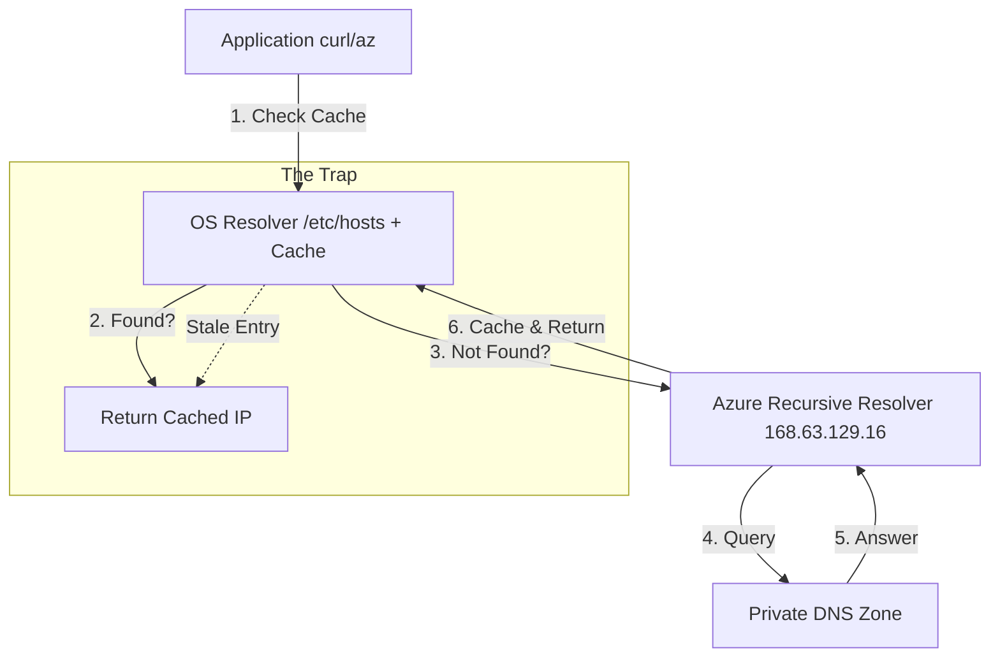

# Lab 2: Stale DNS Cache After Private Endpoint Recreation

## 📋 Objectives

**What Breaks**: The Private Endpoint was recreated with a new IP address, but the agent's DNS cache still contains the old (now invalid) IP.

**What You'll Learn**:
- How DNS caching works on Linux (systemd-resolved)
- Why DNS cache can persist after infrastructure changes
- How `/etc/hosts` overrides DNS resolution
- How to diagnose stale cache vs live DNS queries
- How to flush DNS cache on Ubuntu/Debian systems

**What You'll Fix**: Clear the stale DNS cache so the agent resolves the correct (new) IP address.

---

## 📧 Background Story

You are Jordan Chen, DevOps Engineer at Contoso HealthTech Solutions. A week after resolving the DNS A record issue (Lab 1), the infrastructure team had to recreate the Private Endpoint due to a subnet reconfiguration. The Private DNS Zone was updated with the new IP address, but the pipeline is now failing with connection timeouts to Key Vault.

Your manager wants you to investigate why the agent can't reach Key Vault even though the DNS records are correct.

> **Real-World Context**: This is extremely common after Private Endpoint recreations, VM reboots, or DNS record changes. The OS-level DNS cache can hold onto old IP addresses for hours, even after the authoritative DNS has been updated. The confusing part? `nslookup` may show the correct IP (because it bypasses the cache), but applications still timeout (because they use the cached IP).

---

## 💰 Cost Reminder

This lab uses Azure resources that are already deployed. **After completing all labs**, remember to destroy infrastructure to avoid ongoing charges:

```bash
terraform destroy
```

**Estimated cost for this lab:** $0.15 - $0.50 (1-2 hours)

---

## 💡 TA Note: DNS Caching in Support

When troubleshooting connectivity issues where `nslookup` works but the application fails, Microsoft Support suspects **DNS Caching** or **OS-level overrides**.

### Standard Troubleshooting Workflow

Before escalating to the specialized Azure Networking Team, you (the Support Engineer) must complete these diagnostic steps:

| Step | Description | Tools/Commands |
|------|-------------|----------------|
| **1. Scope the Issue** | Differentiate between Auth (403) vs. Network (Timeout) | Pipeline Logs |
| **2. Check Live DNS** | Verify authoritative DNS is correct | `nslookup <fqdn>` |
| **3. Check OS Cache** | Verify what the OS resolver sees | `getent hosts <fqdn>` or `ping <fqdn>` |
| **4. Check Overrides** | Look for static entries | `cat /etc/hosts` |
| **5. Test Connectivity** | Test actual connection attempt | `curl -v https://<endpoint>` |

---

## Prerequisites

- Completed Lab 1 (DNS A Record Misconfiguration)
- Understanding of Azure Private DNS Zones
- Basic knowledge of Linux DNS resolution (systemd-resolved, `/etc/hosts`)

---

## STEP 1: Review the Objectives

Before breaking anything, understand what you're about to investigate:

**The Break**: We'll update the Private DNS Zone A record to a new IP (simulating Private Endpoint recreation), then pre-populate the agent VM's DNS cache with the old IP (simulating a stale cache).

**Expected Symptom**: The agent will try to connect to the old (cached) IP address instead of the new IP, resulting in connection timeouts.

### Why This Matters

DNS caching issues are silent killers in production. They often occur after:
- **Private Endpoint Recreation**: New IP assigned, but clients remember the old one.
- **DNS Record Updates**: TTL (Time To Live) hasn't expired yet.
- **VM Migrations**: Subnet changes result in new IPs.
- **Disaster Recovery Drills**: Failover to new region/IPs.

**Learning Goal**: Understand the difference between:
- **Cached DNS responses** (what the OS remembers)
- **Live DNS queries** (what nslookup/dig actually fetch)
- **DNS overrides** (what /etc/hosts forces)

---

## STEP 2: Break the Lab and Observe the Failure

Run the break script:
```bash
./break-lab.sh lab2
```

**What this does** (silently, like real-world infrastructure changes):
- Updates the Private DNS Zone A record to a new IP (simulating Private Endpoint recreation)
- Pre-populates the agent VM's `/etc/hosts` with the old IP (simulating a stale DNS cache)
- Restarts the agent to ensure it uses the cached DNS

Now trigger your pipeline in Azure DevOps (push a commit or click "Run pipeline").

**Expected Error Output**:
```
Starting: Retrieve Configuration from Key Vault
==============================================================================
Task         : Azure Key Vault
Description  : Download Azure Key Vault secrets
Version      : 2.x.x
==============================================================================
Key vault name: kv-dns-lab-xxxxx
Downloading secret value for: AppMessage
##[error]Connection timeout trying to reach Key Vault.
##[error]Failed to fetch the value of secret AppMessage. Error: Connection timed out after 120 seconds
Finishing: Retrieve Configuration from Key Vault
```

📸 **Take a screenshot** of this error - you'll document the timeout behavior.

---

## ⚖️ Comparison: Lab 1 vs Lab 2

It is crucial to understand how this differs from the previous lab:

| Feature | Lab 1 (A Record Wrong) | Lab 2 (Cache Stale) |
|---------|------------------------|---------------------|
| **Symptom** | Connection Timeout | Connection Timeout |
| **Private DNS Zone** | **Incorrect IP** (Typo) | **Correct IP** (Updated) |
| **nslookup result** | Wrong IP | **Correct IP** (Surprise!) |
| **curl result** | Wrong IP | Wrong IP |
| **Root Cause** | Azure Configuration | **Client OS State** |

**Key Takeaway**: In Lab 2, the Azure infrastructure is **perfectly healthy**. The problem is entirely inside the client VM.

---

## STEP 3: Understand the Architecture

Before diving into troubleshooting, understand how DNS caching works:

### Discover Your Resources

Get your Key Vault name and current IPs:
```bash
# Get Key Vault name
KV_NAME=$(terraform output -raw key_vault_name)
echo "Key Vault: $KV_NAME"

# Get the ACTUAL current IP from Private DNS Zone (this is the NEW IP after recreation)
az network private-dns record-set a show \
  --resource-group $(terraform output -raw resource_group_name) \
  --zone-name privatelink.vaultcore.azure.net \
  --name "$KV_NAME" \
  --query "aRecords[0].ipv4Address" -o tsv
```

### DNS Resolution Layers

Understanding where DNS resolution happens is critical.



### Three DNS Resolution Methods

| Method | What It Uses | Bypasses Cache? | Use Case |
|--------|--------------|-----------------|----------|
| **Application connection** (`curl`, `az`) | OS cache → Live DNS | ❌ No | Real-world behavior (what fails) |
| **nslookup / dig** | Live DNS query | ✅ Yes | Verify authoritative DNS is correct |
| **/etc/hosts file** | Static OS override | ✅ Yes (overrides everything) | Force specific IP for testing |

**Key Insight**: This is why `nslookup` may show the correct IP, but your application still times out - they're reading from different sources!

---

## STEP 4: Architecture Discovery & Email Draft

As in Lab 1, we need to document our findings systematically.

**Your Task:**
1. Open `labs/lab2/EMAIL_TEMPLATE.md` (or create a new one based on Lab 1).
2. Fill in the **"Affected Resource Details"** table with the values you found in Step 3.
3. Prepare the **"DNS Resolution Data"** section—you will fill this in during the next steps.

> **Pro Tip**: Documenting the "Expected IP" (from Step 3) vs the "Actual Resolved IP" (from Step 6) is the smoking gun for cache issues.

---

## STEP 5: Analyze the Error

Let's interpret what the error message tells us:

| What the Error Says | What This Means |
|---------------------|-----------------|
| "Connection timeout" | TCP connection to IP address failed |
| "after 120 seconds" | No response from target host (IP is unreachable) |
| Key Vault task failed | Agent tried to reach Key Vault but couldn't establish connection |

**Root Cause Hypothesis**: The agent is trying to connect to an **old IP address** that no longer hosts the Private Endpoint. The DNS cache is serving stale data.

### Diagnostic Layer Comparison

To prove this hypothesis, we need to compare three layers of truth:

| Layer | Command | What it tells us |
|-------|---------|------------------|
| **Layer 1: Static Override** | `cat /etc/hosts` | Is the OS forced to use a specific IP? |
| **Layer 2: OS Cache** | `ping` or `curl` | What IP is the application actually using? |
| **Layer 3: Authoritative DNS** | `nslookup` | What is the *correct* IP in Azure? |

### 🧠 The Stale Cache Problem

Here's what happened:

1. **Before Recreation**:
   - Private Endpoint had IP `10.x.x.5`
   - Agent queried DNS, got `10.x.x.5`, cached it
   - Everything worked

2. **During Recreation** (infrastructure team):
   - Private Endpoint recreated, got new IP `10.x.x.50`
   - Private DNS Zone updated to `10.x.x.50`
   - Agent VM not restarted, cache not flushed

3. **After Recreation** (now):
   - Agent still has `10.x.x.5` in cache (stale)
   - Agent tries to connect to `10.x.x.5` → **timeout** (nothing there)
   - Meanwhile, Private DNS Zone says `10.x.x.50` (correct)

**The Disconnect**: Authoritative DNS is correct, but the agent's OS cache is stale.

---

## STEP 6: SSH to the Agent VM and Diagnose

Let's prove the cache is stale by comparing what the agent sees vs what DNS actually says.

### 📍 Checkpoint: Where We Are Now
- ✅ We know the pipeline is failing with timeout.
- ✅ We know the Azure Private DNS Zone has the **NEW** IP (from Step 3).
- ❓ We need to know what IP the agent is actually trying to use.

### Get VM Access Information

```bash
# Get VM public IP for SSH
VM_IP=$(terraform output -raw vm_public_ip)
echo "VM Public IP: $VM_IP"

# Get Key Vault name
KV_NAME=$(terraform output -raw key_vault_name)
echo "Key Vault: $KV_NAME"

# SSH to the agent
ssh -i ~/.ssh/terraform_lab_key azureuser@$VM_IP
```

### Check What the Agent VM "Sees"

Once SSH'd into the VM, run these commands:

#### 1. Check /etc/hosts (Static Overrides)

```bash
grep vault /etc/hosts
```

**Expected Output** (this is the STALE entry):
```
10.x.x.5 kv-dns-lab-xxxxx.vault.azure.net
```

**What This Means**: Someone (or the break script) added a static entry forcing the agent to use the old IP. This is the smoking gun!

#### 2. Try Connecting to Key Vault

```bash
curl -v https://$KV_NAME.vault.azure.net 2>&1 | grep -i "connect"
```

**Expected Output**:
```
* Trying 10.x.x.5:443...
* connect to 10.x.x.5 port 443 failed: Connection timed out
```

**What This Means**: The agent is trying to reach `10.x.x.5` (the cached IP), which is no longer valid.

#### 3. Compare: What Does Live DNS Say?

```bash
nslookup $KV_NAME.vault.azure.net
```

**Expected Output**:
```
Name:   kv-dns-lab-xxxxx.privatelink.vaultcore.azure.net
Address: 10.x.x.50
```

**What This Means**: The authoritative DNS (Private DNS Zone) correctly returns `10.x.x.50` (the new IP), but the agent ignores this because `/etc/hosts` overrides it.

### Analysis: What Do These Outputs Tell Us?

| Command | Result IP | Status |
|---------|-----------|--------|
| `/etc/hosts` | `10.x.x.5` | ❌ **STALE/WRONG** |
| `curl` | `10.x.x.5` | ❌ **STALE/WRONG** |
| `nslookup` | `10.x.x.50` | ✅ **CORRECT** |

**Update Your Email**: Record these three values in your `EMAIL_TEMPLATE.md` draft. This proves the issue is local to the VM.

---

## STEP 7: Synthesize Evidence & Decide

Before fixing, let's formalize our decision.

### Comparison Table

| Data Source | IP Address | Correct? |
|-------------|------------|----------|
| **Azure Control Plane** (Step 3) | `10.x.x.50` | ✅ Yes (Source of Truth) |
| **Agent Live DNS** (nslookup) | `10.x.x.50` | ✅ Yes (DNS is healthy) |
| **Agent OS Cache** (curl/hosts) | `10.x.x.5` | ❌ No (Stale) |

### Root Cause Confirmed
The issue is **Local Configuration Drift**. The `/etc/hosts` file contains a stale entry that overrides the correct DNS resolution.

**Decision Tree**:
- If `nslookup` was WRONG → Go to Lab 1 (Fix Azure DNS).
- If `nslookup` is RIGHT but `curl` is WRONG → **Fix Local Cache (This Lab)**.
- If BOTH are RIGHT but connection fails → Go to Lab 3 (Firewall/NSG).

---

## STEP 8: Fix the Stale DNS Cache

Now that you've confirmed the root cause, fix it by clearing the stale DNS data.

### Option 1: Manual Fix (Learning Exercise)

While still SSH'd into the agent VM:

```bash
# 1. Remove the stale /etc/hosts entry
sudo sed -i '/vault\.azure\.net/d' /etc/hosts

# 2. Verify it's gone
grep vault /etc/hosts || echo "No stale entries found ✓"

# 3. Flush systemd-resolved DNS cache
sudo systemd-resolve --flush-caches 2>/dev/null || sudo resolvectl flush-caches

# 4. Verify DNS now returns correct IP
nslookup $KV_NAME.vault.azure.net | grep Address

# 5. Test connectivity to new IP
curl -I https://$KV_NAME.vault.azure.net
```

**Expected Result**: `curl` should now successfully connect (returning HTTP/1.1 or similar).

### Option 2: Automated Fix (Production Approach)

Exit the SSH session and run the automated fix script:

```bash
exit  # Exit SSH session
./fix-lab.sh lab2
```

**What this does**:
1. Removes stale entries from `/etc/hosts`
2. Flushes systemd-resolved DNS cache
3. Verifies the agent can now resolve and reach the correct IP

### Verify the Fix

Re-run your pipeline in Azure DevOps.

**Expected Output** (success):
```
Starting: Retrieve Configuration from Key Vault
==============================================================================
Key vault name: kv-dns-lab-xxxxx
Downloading secret value for: AppMessage
Successfully fetched secret: AppMessage
##[section]Finishing: Retrieve Configuration from Key Vault
```

---

## STEP 9: Key Takeaways

### What You Learned

1. **DNS Resolution Layers**:
   - `/etc/hosts` overrides everything (OS-level static mapping)
   - systemd-resolved provides OS-level DNS caching
   - Live DNS queries (`nslookup`, `dig`) bypass the cache

2. **Why nslookup vs curl Show Different Results**:
   - `nslookup`: Queries DNS servers directly (bypasses cache)
   - `curl`/`az`/applications: Use OS resolver (respects cache and /etc/hosts)

3. **DNS Cache Stale Scenarios**:
   - Private Endpoint recreated with new IP
   - Manual DNS record changes
   - VM migrated to different subnet
   - Long TTL values combined with infrequent restarts

4. **How to Diagnose**:
   - Check `/etc/hosts` for static overrides: `grep <hostname> /etc/hosts`
   - Compare cached resolution: `getent hosts <hostname>`
   - Compare live DNS: `nslookup <hostname>`
   - Test actual connectivity: `curl -v https://<hostname>`

5. **How to Fix**:
   - Remove stale `/etc/hosts` entries: `sudo sed -i '/<pattern>/d' /etc/hosts`
   - Flush DNS cache: `sudo systemd-resolve --flush-caches` or `sudo resolvectl flush-caches`
   - Restart application/agent to pick up fresh DNS

### Real-World Applications

**When This Happens**:
- After Private Endpoint recreation (new IP, cache not flushed)
- After DNS record updates (TTL hasn't expired, cache still has old value)
- After subnet migrations (VM moved, cache has old subnet IP)
- Long-running VMs with high TTL DNS records (cache persists for days)

**Prevention Strategies**:
- Lower TTL values for frequently-changing resources (e.g., 60 seconds instead of 300)
- Automate DNS cache flush after infrastructure changes
- Monitor DNS cache hit/miss rates with systemd-resolved stats
- Document cache-clearing procedures in runbooks

**Further Reading**:
- [systemd-resolved DNS Cache Management](https://www.freedesktop.org/software/systemd/man/systemd-resolved.service.html)
- [Linux DNS Resolution Order (/etc/nsswitch.conf)](https://man7.org/linux/man-pages/man5/nsswitch.conf.5.html)
- [Azure Private Endpoint DNS Configuration](https://docs.microsoft.com/azure/private-link/private-endpoint-dns)

---

## 🎉 Lab 2 Complete!

You've successfully:
- ✅ Diagnosed a stale DNS cache issue after Private Endpoint recreation
- ✅ Differentiated between cached DNS (what apps use) and live DNS (what nslookup shows)
- ✅ Understood how `/etc/hosts` overrides all DNS resolution
- ✅ Flushed DNS cache on Ubuntu/systemd-resolved
- ✅ Verified connectivity after cache clear

**Next Lab**: [Lab 3 - Custom DNS Server Misconfiguration](../lab3/README.md)

