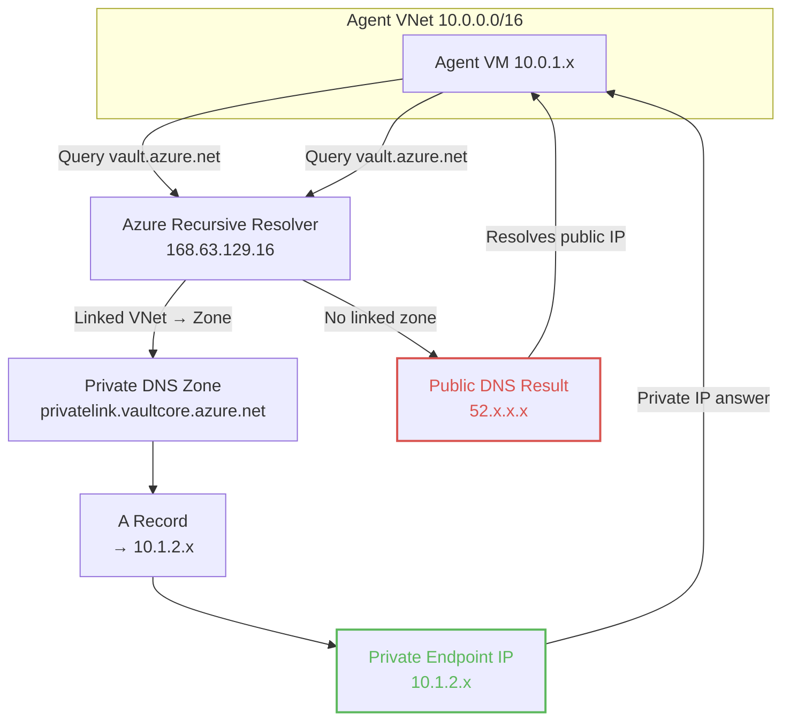

# Lab 2: Private Endpoint Connectivity

## 🎯 Overview

This exercise simulates a network connectivity failure where private endpoint access becomes unreliable. Your deployment pipeline intermittently fails to reach Azure Key Vault, despite infrastructure appearing properly configured. You'll need to investigate DNS resolution, network paths, and access policies to identify the root cause.

## 🌍 Real-World Scenario

**Tuesday, 10:00 AM:** Your deployment pipeline suddenly fails with timeout errors accessing Azure Key Vault. The infrastructure team confirms "nothing changed" overnight. Private DNS zones exist, the private endpoint shows healthy status in the portal, and the agent VM can ping other resources without issue.

**What you observe:**
- Pipeline fails to retrieve secrets from Key Vault
- No obvious errors in Azure Portal
- Private endpoint resource shows "Succeeded" state
- DNS infrastructure appears intact

**Your task:**
- Investigate why private endpoint connectivity is broken
- Use DNS and network diagnostic tools to narrow scope
- Identify which layer(s) of the network stack are failing
- No one documented the change

**Your mission:** Figure out why DNS is returning the public IP and restore private connectivity.

> **Real-World Context**
> This happens when a new application team spins up a VNet and assumes they can use the "centrally managed" Private DNS Zone, but forgets to link it. Or when an IaC pipeline runs in a different order than expected, creating the zone before the link. The confusing part? DNS "works" – it just returns the wrong answer (public IP). Traffic might succeed if public access is enabled, masking the misconfiguration.

## 🏗️ Lab Architecture

High-level resolution path (observe behavior first; do not assume cause). Compare the two flows and note what differs in answers returned.



Reflection prompts:
- Which hop produces the answer actually returned to the agent?
- Which component appears unused in the broken path?
- What additional evidence would confirm why the public IP is chosen?

---

## 💥 Start the Scenario

To start this exercise, you will self-inject a fault into the environment to simulate a real-world outage.

1. **Run the scenario script:**
   ```bash
   ./break-lab.sh lab2
   ```
   *This removes the Virtual Network Link between the Agent VNet and the Private DNS Zone.*

   > **Note:** Once this script finishes, switch your mindset. You are the on-call responder. The application team reports that they are suddenly connecting to the public endpoint instead of the private one.

2. **Verify the failure by running the pipeline:**

Go to Azure DevOps and queue a new run of the `DNS-Lab-Pipeline`. The pipeline should fail during the "Fetch Secrets from Key Vault" task.

**Expected Pipeline Failure:**
```text
Starting: Fetch Secrets from Key Vault
==============================================================================
Task         : Azure Key Vault
Description  : Download Azure Key Vault secrets
Version      : 2.259.2
Author       : Microsoft Corporation
Help         : https://docs.microsoft.com/azure/devops/pipelines/tasks/deploy/azure-key-vault
==============================================================================
SubscriptionId: fcfa67ae-efeb-417c-a966-48b4937d2918.
Key vault name: kv-dns-lab-c56368d5.
Downloading secret value for: TestSecret.
##[error]
TestSecret: "Public network access is disabled and request is not from a trusted service 
nor via an approved private link.
Caller: appid=***;oid=5b710bd4-3ad8-48da-966f-d487510739cb;iss=https://sts.windows.net/...
Vault: kv-dns-lab-c56368d5;location=westus2. The specified Azure service connection needs 
to have Get, List secret management permissions on the selected key vault..."
Uploading /home/azureuser/azagent/_work/1/ProvisionKeyVaultPermissions.ps1 as attachment
Finishing: Fetch Secrets from Key Vault
```

---

## 🔍 Investigation: Systematic Troubleshooting

### STEP 1: Investigate DNS Resolution

Connect to your agent VM and check how the Key Vault resolves:

```bash
# 1. Get Key Vault Name
KV_NAME=$(terraform output -raw key_vault_name)

# 2. Test DNS Resolution
nslookup ${KV_NAME}.vault.azure.net
```

**Expected Output (Broken State):**
```text
Non-authoritative answer:
Name:   kv-dns-lab-xxxx.vault.azure.net
Address: 52.154.x.x  <-- PUBLIC IP (Wrong for Private Link)
```

### STEP 2: Analyze the Failure

What information can you gather from the error message and DNS resolution?

1. **Pipeline error says:**
   - "Public network access is disabled"
   - "Request is not from a trusted service nor via an approved private link"

2. **DNS resolution shows:**
   - Returning public IP addresses (52.x, 13.x, or 20.x range)
   - Not returning the private endpoint IP (10.1.2.x)

**Key observations:**
- The agent is resolving to public IPs instead of the private endpoint
- Public access is disabled on the Key Vault
- Even if the agent could reach those public IPs, the Key Vault would reject the connection

**What does this tell us?** Two potential issues:
- DNS resolution path (why public instead of private?)
- Network access path (how to reach private endpoint?)

---

### STEP 3: Check Private DNS Zone Configuration

The most common cause for resolving a Public IP when a Private Endpoint exists is a missing **Virtual Network Link**.

**Check via Azure CLI:**

```bash
# Get Resource Group Name
RG_NAME=$(terraform output -raw resource_group_name)

# List all VNet links for the zone
az network private-dns link vnet list \
  --resource-group $RG_NAME \
  --zone-name privatelink.vaultcore.azure.net \
  --output table
```

**Expected output (when broken):**
```
(No output - empty list)
```

**Result:**
- If the list is empty or your VNet is missing, the link does not exist.
- The Private DNS Zone cannot answer queries for VNets that are not linked to it.

---

### STEP 4: Verify the DNS Zone Has the Correct Record

Even though the link is missing, let's confirm the zone itself is configured correctly:

```bash
KV_NAME=$(terraform output -raw key_vault_name)

az network private-dns record-set a show \
  --resource-group $RG_NAME \
  --zone-name privatelink.vaultcore.azure.net \
  --name $KV_NAME \
  --query "aRecords[0].ipv4Address" -o tsv
```

**Expected output:**
```
10.1.2.5
```

This confirms the zone has the correct private IP. The problem is that our VNet can't see this zone.

---

### STEP 5: Root Cause Identification

| Resource | Status | Result |
|----------|--------|--------|
| Private DNS Zone | ✅ Exists | Contains correct A record |
| A Record in Zone | ✅ Correct | Points to 10.1.2.5 |
| VNet Link | ❌ **Missing** | Zone can't answer queries from VNet |
| Client DNS Query | ⚠️ Falls back | Queries public DNS, gets public IP |

**Root Cause:** Without the VNet link, Azure's recursive resolver (168.63.129.16) doesn't know to check the Private DNS Zone for this VNet's queries. It falls back to public DNS.

**How DNS resolution works:**
1. Agent VM sends DNS query to Azure DNS (168.63.129.16)
2. Azure DNS checks: "Is this VNet linked to any Private DNS Zones?"
3. No links found → Azure DNS forwards query to public internet DNS
4. Public DNS returns the public IP for `*.vault.azure.net`
5. Agent connects to public endpoint (fails if firewall blocks, or succeeds but bypasses Private Link)

---

## 🛠️ Fix the Issue

Restore the infrastructure to its baseline configuration:

```bash
./fix-lab.sh lab2
```

This script will:
- Re-enable Key Vault public network access (so Terraform can connect)
- Run `terraform apply` to restore all infrastructure including the VNet link
- Bring the environment back to the working baseline state

---

## ✅ Verify the Fix

### 1. Check DNS Resolution (from the VM)

SSH back into the agent VM (if you aren't there already) and test again:

```bash
# Clear DNS cache first (important!)
sudo systemd-resolve --flush-caches

# Test resolution
KV_NAME=$(terraform output -raw key_vault_name)
nslookup ${KV_NAME}.vault.azure.net
```

**Expected Output (Fixed State):**
```text
Name:   kv-dns-lab-xxxx.privatelink.vaultcore.azure.net
Address: 10.1.2.5  <-- PRIVATE IP (Correct)
```
✅ **Success!** The DNS now resolves to the correct Private Endpoint IP.

### 2. Automated Verification (Optional)

Run the lab-specific verification script:
```bash
./scripts/verify-lab.sh lab2
```

This will check VNet link status and DNS resolution automatically.

### 3. Re-run the Pipeline
1. Go back to Azure DevOps.
2. Find your failed pipeline run.
3. Click **"Rerun failed jobs"**.

It should now succeed (green checkmarks everywhere)! 🎉

---

## 🧠 Key Learning Points

1. **Split-Horizon DNS**
   - Azure uses the *same* DNS name (e.g., `vault.azure.net`) for both public and private access.
   - The "view" you get depends on where you are coming from.
   - Without a VNet Link, you get the "Public View".
   - With a VNet Link, you get the "Private View".

2. **The "Public IP" Symptom**
   - If you are troubleshooting Private Link and see a Public IP, **90% of the time it is a missing VNet Link**.
   - The other 10% is usually a custom DNS server misconfiguration (Lab 3).

3. **Registration Enabled vs Disabled**
   - `registration-enabled false`: The VNet can *read* records from the zone (Resolution).
   - `registration-enabled true`: The VNet can *read* AND auto-register its own VM hostnames into the zone.
   - For Private Link zones (`privatelink.*`), we usually keep registration **disabled**.

4. **Systematic Investigation**  
   Follow the path: Observe (what's happening) → Locate (what should happen) → Compare (find the gap) → Understand (why) → Fix.

### Reusable Troubleshooting Process

Next time you see private resources resolving to public IPs:

1. Verify the Private DNS Zone exists and has correct records
2. Check if the client's VNet is linked to the zone
3. Check VNet DNS settings (Azure DNS vs custom)
4. Test DNS from within the VNet (not from your laptop)
5. Clear DNS caches after fixing
6. Verify with both `nslookup` and actual connection test

---

### 📺 Recommended Watching

If you want to truly master this topic, these videos are the gold standard:
- [Azure Private Link and DNS - The Missing Manual](https://www.youtube.com/watch?v=UVR9lhUGAyU) by John Savill
- [Azure Private Endpoint DNS Configuration](https://www.youtube.com/watch?v=j9QmMEWmcfo) by John Savill

---

## 🎓 Next Steps

- **Lab 3:** Custom DNS Misconfiguration (DNS server can't resolve private zones)

Good luck! 🚀
