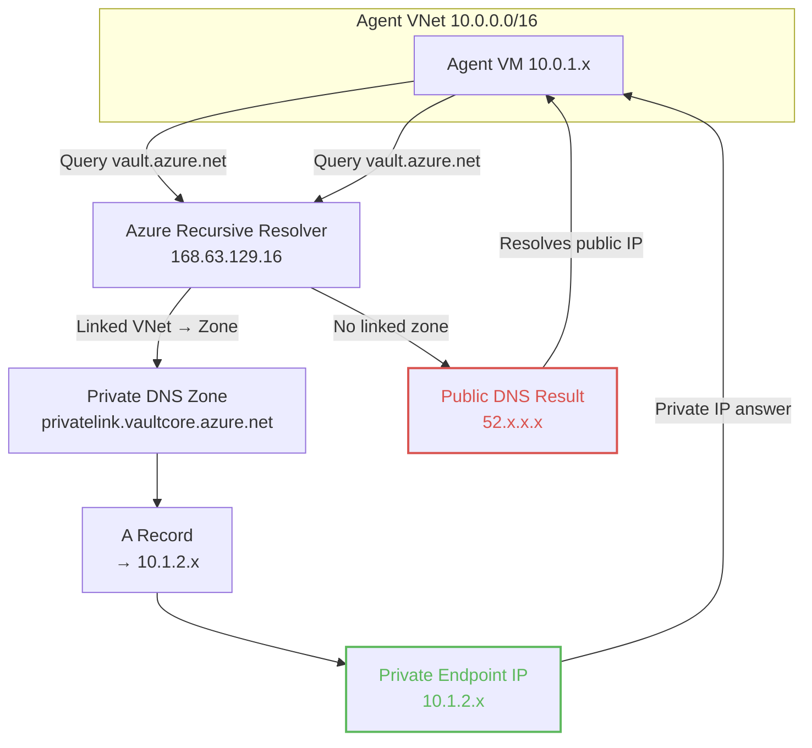

# Lab 2: Private Endpoint Connectivity

## 📧 Background Story

> **Read the full scenario:** [SCENARIO.md](SCENARIO.md)

You are Jordan Chen, DevOps Engineer at Contoso HealthTech Solutions. Three weeks after resolving the DNS A record issue (Lab 1), the pipeline is failing again with Key Vault access timeouts. This time DNS resolution looks correct (returns the private IP), but the agent still cannot establish a connection to the Key Vault private endpoint.

Your manager wants you to follow the Azure Support troubleshooting workflow systematically before escalating to a support case.

---

## 🎯 Your Mission

Investigate why the build agent cannot reach the Key Vault private endpoint despite DNS resolving correctly to the private IP address. Validate the Private DNS zone VNet links and network path to identify the root cause.

> **Real-World Context**
> This happens when a new application team spins up a VNet and assumes they can use the "centrally managed" Private DNS Zone, but forgets to link it. Or when an IaC pipeline runs in a different order than expected, creating the zone before the link. The confusing part? DNS resolution "works" (returns an IP), but network connectivity fails because the VNet cannot actually route to that private IP.

## 🏗️ Lab Architecture

High-level resolution path (observe behavior first; do not assume cause). Compare the two flows and note what differs in answers returned.


```mermaid
flowchart TB
      subgraph A[Agent VNet 10.0.0.0/16]
            VM[Agent VM 10.0.1.x]
      end

      DNS[Azure Recursive Resolver\n168.63.129.16]
      ZONE[Private DNS Zone\nprivatelink.vaultcore.azure.net]
      RECORD[A Record\n<keyvault-name> → 10.1.2.x]
      PE[Private Endpoint IP\n10.1.2.x]
      PUB[Public DNS Result\n52.x.x.x]

      %% Broken Path
      VM -->|Query vault.azure.net| DNS
      DNS -->|No linked zone| PUB
      PUB -->|Resolves public IP| VM

      %% Expected Path
      VM -->|Query vault.azure.net| DNS
      DNS -->|Linked VNet → Zone| ZONE
      ZONE --> RECORD --> PE
      PE -->|Private IP answer| VM

      classDef broken stroke:#d9534f,stroke-width:2,color:#d9534f;
      classDef good stroke:#5cb85c,stroke-width:2,color:#5cb85c;
      PUB:::broken
      PE:::good
```

Reflection prompts:
- Which system ultimately returned the Public IP to your agent? (Azure's central service or the public internet?)
- Which crucial VNet connectivity piece did the agent's VNet fail to use? (Think: subscription to the private phone book.)
- What final confirmation shows the agent is falling back to public DNS? (Hint: the IP range returned by `nslookup`.)

Analogy cheat sheet:
- Private DNS Zone → "Private Phone Book" (used to find private addresses)
- Virtual Network Link → "Phone Book Subscription" (tells the VNet to use the private phone book)
- Azure Recursive Resolver (168.63.129.16) → "Azure's Central Directory Service"
- Split-Horizon DNS → "Two Views of the World" (public vs private answer)

---

## 💥 Start the Lab

### Step 1: Simulate the Infrastructure Change

Run this command to simulate the infrastructure issue:
```bash
./break-lab.sh lab2
```

This represents an infrastructure change made outside your pipeline's control. The script runs silently (just like real-world undocumented changes).

### Step 2: Observe the Pipeline Failure

Trigger your pipeline in Azure DevOps. The deployment will fail during the Key Vault retrieval stage with timeout or "Public network access is disabled" errors.

---

## 💡 TA Note: Before Escalating to Azure Networking Team

When troubleshooting private endpoint connectivity issues in production environments, Azure Support follows a systematic diagnostic process before escalating to specialized teams. This ensures the issue is well-documented and simple misconfigurations are caught early.

### Standard Troubleshooting Workflow

Before opening a collaboration ticket with the Azure Networking Team, complete these diagnostic steps:

| Step | Description | Tools/Commands |
|------|-------------|----------------|
| **1. Run Guided Troubleshooter** | Perform initial diagnostics for DNS, NSG, and firewall issues | Azure Portal → Resource → Diagnose and Solve Problems |
| **2. Validate DNS Zone Links** | Ensure private DNS zones are linked to relevant VNets | `az network private-dns link vnet list` |
| **3. Test Endpoint Reachability** | Confirm connectivity to required endpoints over TLS 443 | `curl -v https://<endpoint>`, `telnet <ip> 443` |
| **4. Review Network Policies** | Check NSGs, route tables, and subnet delegations | Network Watcher, `az network nsg rule list` |
| **5. Verify Proxy Settings** | Ensure proxy variables are correctly configured | `echo $HTTP_PROXY`, `echo $HTTPS_PROXY` |
| **6. Collect Evidence** | Attach GT results, Network Watcher logs, and diagrams | Screenshots, command output, architecture diagrams |

### Why This Matters

**In this lab:** You have full control of the environment and can fix issues directly. However, understanding this workflow prepares you for real-world scenarios where:

- You may need to work with separate networking teams who control DNS/VNet configurations
- Support engineers will ask for this data before escalating internally
- Documenting your troubleshooting steps helps justify infrastructure changes to management

### For This Exercise

You'll focus on **Step 2** (validating Private DNS zone VNet links). In production, you'd complete all six steps before escalating. The goal is to identify why DNS resolution works but network connectivity fails.

**Key Question to Answer:** Is the Private DNS zone properly linked to the VNet where the build agent resides?

Once you've gathered diagnostic evidence:
- ✅ **If you identify the issue:** Document the finding and implement the fix
- ⚠️ **If the issue remains unclear:** This is when you'd escalate to the Azure Networking Team with your complete diagnostic data

---

## 🔍 Investigation: Systematic Troubleshooting

**Expected Pipeline Failure:**
```text
Starting: Fetch Secrets from Key Vault
==============================================================================
Task         : Azure Key Vault
Description  : Download Azure Key Vault secrets
Version      : 2.259.2
Author       : Microsoft Corporation
Help         : https://docs.microsoft.com/azure/devops/pipelines/tasks/deploy/azure-key-vault
==============================================================================
SubscriptionId: fcfa67ae-efeb-417c-a966-48b4937d2918.
Key vault name: kv-dns-lab-c56368d5.
Downloading secret value for: TestSecret.
##[error]
TestSecret: "Public network access is disabled and request is not from a trusted service 
nor via an approved private link.
Caller: appid=***;oid=5b710bd4-3ad8-48da-966f-d487510739cb;iss=https://sts.windows.net/...
Vault: kv-dns-lab-c56368d5;location=westus2. The specified Azure service connection needs 
to have Get, List secret management permissions on the selected key vault..."
Uploading /home/azureuser/azagent/_work/1/ProvisionKeyVaultPermissions.ps1 as attachment
Finishing: Fetch Secrets from Key Vault
```

---

## 🔧 Breaking the Lab

Run the break script to inject the fault:

```bash
./break-lab.sh lab2
```

**What happens next:**
The infrastructure will be in a degraded state. Your job is to investigate why the pipeline fails and restore functionality.

**Your Role:**
You are the on-call engineer. The application team reports that the pipeline suddenly started failing with connectivity errors to Key Vault.

---

## 🔍 Investigation: Systematic Troubleshooting

This is the same process you'll use on the job when a pipeline breaks. Work through each step—don't skip ahead.

---

### STEP 1: Scope the Problem (What Do We Know?)

Before logging into the agent or diving into Azure resources, gather basic information about the failure. This is what support engineers ask first.

> Tip: If an error mentions "public network" or "private link", your next step is to investigate DNS resolution. The pipeline is likely using the public address due to DNS configuration.

**Answer these questions:**

1. **What stage failed?**
   - Look at your pipeline run
   - Which step shows the red ✗?
   - Answer: `___________________`

2. **What type of agent?**
   - Self-hosted or Microsoft-hosted?
   - If self-hosted: What OS? (Windows/Linux/macOS)
   - Answer: `___________________`

3. **Did this ever work?**
   - Was this pipeline working before?
   - If yes, when did it last succeed?
   - Answer: `___________________`

4. **What does the error message say?**
   - Read the exact error from the pipeline output
   - Look for keywords: "public network", "private link", "trusted service"
   - Answer: `___________________`

5. **What changed recently?**
   - Any pipeline code changes?
   - Agent updates?
   - Infrastructure changes (even by other teams)?
   - Network changes?
   - Answer: `___________________`

**Expected Pipeline Output:**
```
Starting: Fetch Secrets from Key Vault
==============================================================================
Task         : Azure Key Vault
Description  : Download Azure Key Vault secrets
Version      : 2.259.2
Author       : Microsoft Corporation
Help         : https://docs.microsoft.com/azure/devops/pipelines/tasks/deploy/azure-key-vault
==============================================================================
SubscriptionId: fcfa67ae-efeb-417c-a966-48b4937d2918.
Key vault name: kv-dns-lab-c56368d5.
Downloading secret value for: TestSecret.
##[error]
TestSecret: "Public network access is disabled and request is not from a trusted service nor via an approved private link.
```

> **Tip:** The error message gives you clues, but doesn't tell you the full story. You'll need to investigate DNS resolution to understand *why* the agent is trying to use the public network.

---

### STEP 2: Investigate DNS Resolution

> Support note: SSH access is not always available. In customer-facing roles, learn to read Azure Portal and Azure CLI outputs for Private DNS Zone links and Private Endpoint connections. `nslookup` from the agent (when accessible) is the definitive test of what the agent sees.

Connect to your agent VM and check how the Key Vault resolves (without relying on Terraform):

```bash
# 1. Identify the Key Vault name from the pipeline log or Azure Portal
#    Azure DevOps log shows: "Key vault name: kv-dns-lab-xxxxxxxx"
#    Or in Azure Portal: Key Vaults → locate your lab vault name
KV_NAME="<your-key-vault-name>"

# 2. Test DNS Resolution
nslookup ${KV_NAME}.vault.azure.net
```

**Expected Output (Broken State):**
```text
Non-authoritative answer:
Name:   kv-dns-lab-xxxx.vault.azure.net
Address: 52.154.x.x  <-- PUBLIC IP (Wrong for Private Link)
```

---

### STEP 3: Analyze the Failure

What information can you gather from the error message and DNS resolution?

1. **Pipeline error says:**
   - "Public network access is disabled"
   - "Request is not from a trusted service nor via an approved private link"

2. **DNS resolution shows:**
   - Returning public IP addresses (52.x, 13.x, or 20.x range)
   - Not returning the private endpoint IP (10.1.2.x)

**Key observations:**
- The agent is resolving to public IPs instead of the private endpoint
- Public access is disabled on the Key Vault
- Even if the agent could reach those public IPs, the Key Vault would reject the connection

**What does this tell us?** Two potential issues:
- DNS resolution path (why public instead of private?)
- Network access path (how to reach private endpoint?)

---

### STEP 4: Check Private DNS Zone Configuration

The most common cause for resolving a Public IP when a Private Endpoint exists is a missing **Virtual Network Link**.

**Check via Azure CLI (no Terraform required):**

```bash
# Get Resource Group Name from Portal or CLI
# Option A: Portal → Resource groups → locate the lab RG name
# Option B: CLI filter by naming convention
az group list --query "[?contains(name, 'dns-lab')].name" -o tsv
RG_NAME="<your-resource-group-name>"

# List all VNet links for the zone
az network private-dns link vnet list \
   --resource-group $RG_NAME \
   --zone-name privatelink.vaultcore.azure.net \
   --output table
```

**Check via Azure Portal (alternative method):**
1. Navigate to **Private DNS Zones** → `privatelink.vaultcore.azure.net`
2. Click **Virtual network links** in the left menu
3. Look for a link to your agent VNet

**Expected output (when broken):**
```
(No output - empty list)
```

**Result:**
- If the list is empty or your VNet is missing, the link does not exist.
- The Private DNS Zone cannot answer queries for VNets that are not linked to it.

---

### STEP 5: Verify the DNS Zone Has the Correct Record

Even though the link is missing, let's confirm the zone itself is configured correctly:

```bash
# Use the Key Vault name identified earlier
# KV_NAME is set from pipeline logs or Portal
az network private-dns record-set a show \
   --resource-group $RG_NAME \
   --zone-name privatelink.vaultcore.azure.net \
   --name $KV_NAME \
   --query "aRecords[0].ipv4Address" -o tsv
```

**Expected output:**
```
10.1.2.5
```

This confirms the zone has the correct private IP. The problem is that our VNet can't see this zone.

---

### STEP 6: Root Cause Identification

| Resource | Status | Result |
|----------|--------|--------|
| Private DNS Zone | ✅ Exists | Contains correct A record |
| A Record in Zone | ✅ Correct | Points to 10.1.2.x |
| VNet Link | ❌ **Missing** | Zone can't answer queries from VNet |
| Client DNS Query | ⚠️ Falls back | Queries public DNS, gets public IP |

**Root Cause:** Without the VNet link, Azure's recursive resolver (168.63.129.16) doesn't know to check the Private DNS Zone for this VNet's queries. It falls back to public DNS.

> Gotcha: The DNS query "worked" but returned the wrong answer (a Public IP). The agent's VNet didn't know to consult its Private Phone Book first because the subscription (VNet Link) was missing.

**How DNS resolution works:**
1. Agent VM sends DNS query to Azure DNS (168.63.129.16)
2. Azure DNS checks: "Is this VNet linked to any Private DNS Zones?"
3. No links found → Azure DNS forwards query to public internet DNS
4. Public DNS returns the public IP for `*.vault.azure.net`
5. Agent connects to public endpoint (fails if firewall blocks, or succeeds but bypasses Private Link)

---

## 🛠️ Fix the Issue

Restore the infrastructure to its baseline configuration:

```bash
./fix-lab.sh lab2
```

This script will:
- Re-enable Key Vault public network access (so Terraform can connect)
- Run `terraform apply` to restore all infrastructure including the VNet link
- Bring the environment back to the working baseline state

---

## ✅ Verify the Fix

### Re-run the Pipeline

1. Go back to Azure DevOps
2. Find your failed pipeline run
3. Click **"Rerun failed jobs"**

The pipeline should now succeed - the "Fetch Secrets from Key Vault" task will complete successfully and the pipeline will show green checkmarks. 🎉

---

## 🧠 Key Learning Points

1. **Split-Horizon DNS**
   - Azure uses the *same* DNS name (e.g., `vault.azure.net`) for both public and private access.
   - The "view" you get depends on where you are coming from.
   - Without a VNet Link, you get the "Public View".
   - With a VNet Link, you get the "Private View".

2. **The "Public IP" Symptom**
   - If you are troubleshooting Private Link and see a Public IP, **90% of the time it is a missing VNet Link**.
   - The other 10% is usually a custom DNS server misconfiguration (Lab 3).

3. **Registration Enabled vs Disabled**
   - `registration-enabled false`: The VNet can *read* records from the zone (Resolution).
   - `registration-enabled true`: The VNet can *read* AND auto-register its own VM hostnames into the zone.
   - For Private Link zones (`privatelink.*`), we usually keep registration **disabled**.

4. **Systematic Investigation**  
   Follow the path: Observe (what's happening) → Locate (what should happen) → Compare (find the gap) → Understand (why) → Fix.

### Reusable Troubleshooting Process

Next time you see private resources resolving to public IPs:

1. Verify the Private DNS Zone exists and has correct records
2. Check if the client's VNet is linked to the zone
3. Check VNet DNS settings (Azure DNS vs custom)
4. Test DNS from within the VNet (not from your laptop)
5. Clear DNS caches after fixing
6. Verify with both `nslookup` and actual connection test

> Important: During diagnosis and troubleshooting, do not rely on Terraform outputs or state. Treat Terraform purely as the provisioning tool. Use Azure DevOps logs, Azure Portal, and Azure CLI to discover names and configurations.

---

### 📺 Recommended Watching

**Official Documentation:**
- [Azure Private Endpoint DNS configuration](https://learn.microsoft.com/en-us/azure/private-link/private-endpoint-dns)
- [Private Link DNS integration scenarios](https://learn.microsoft.com/en-us/azure/private-link/private-endpoint-dns-integration)
- [Review pipeline logs and diagnostics (Azure DevOps)](https://learn.microsoft.com/en-us/azure/devops/pipelines/troubleshooting/review-logs?view=azure-devops&tabs=windows-agent)
 - [Troubleshoot Azure Private Endpoint connectivity](https://learn.microsoft.com/en-us/azure/private-link/private-endpoint-troubleshoot)

**Video Resources:**
- [Azure Private Link and DNS Integration Scenarios](https://www.youtube.com/watch?v=vJXMF_jHb2Y) by John Savill
- [Azure Private Endpoint DNS Configuration](https://www.youtube.com/watch?v=j9QmMEWmcfo) by John Savill

---

## 🎓 Next Steps

- **Lab 3:** Custom DNS Misconfiguration (DNS server can't resolve private zones)

Good luck! 🚀
