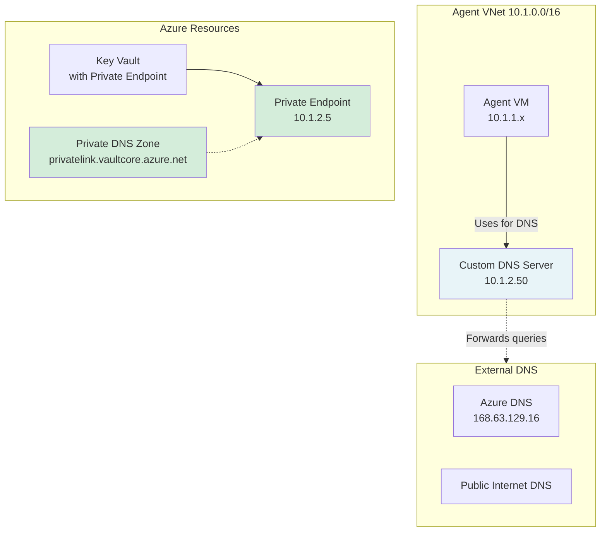

# Lab 3: The Silent Agent Outage

## 🎯 The Situation

**Wednesday, 2:00 PM: The Call 📞**

Your team takes a **Priority 1** call. The CI/CD team reports that their self-hosted build agents have suddenly gone offline. They can't run any deployments.

"We haven't touched the agent configuration," they insist. "They were working fine this morning. Now they just show 'Offline' in Azure DevOps."

**What the CI/CD team tells you:**
- "All agents in the `DNS-Lab-Pool` are offline."
- "We can't even queue a build to debug it."
- "We heard the networking team deployed a new 'security-hardened' DNS solution this afternoon."

**Your mission:** You're the support engineer. The agents are down, so you can't use pipeline logs to troubleshoot. You need to SSH into the agent VM, investigate why it lost connectivity to Azure DevOps, and determine if the new DNS solution is to blame.

> **Real-World Context**
> Self-hosted agents rely on DNS to reach `dev.azure.com`. When organizations switch to custom DNS servers (BIND, Windows DNS, Infoblox) without configuring proper forwarding for public Azure endpoints, agents lose connectivity instantly. This manifests as a "silent outage"—no error logs in the portal, just offline agents.

---

## 📋 Prerequisites

### Initial Setup (First Time Only)

If you haven't set up the lab environment yet, complete these steps:

**1. Add custom DNS server image ID to `terraform.tfvars`:**
```hcl
custom_dns_image_id = "/subscriptions/fcfa67ae-efeb-417c-a966-48b4937d2918/resourceGroups/rg-dns-lab-images-20251129022831/providers/Microsoft.Compute/images/dns-server-lab3-bind9"
```

**2. Deploy base infrastructure:**
```bash
# Source ADO credentials
source .ado.env

# Deploy base infrastructure
terraform init
terraform apply -var="lab_scenario=base" \
  -var="ado_org_url=$ADO_ORG_URL" \
  -var="ado_pat=$ADO_PAT"
```

**3. Register the self-hosted agent:**
```bash
# This script registers the agent and ensures it's online
./scripts/register-agent.sh
```

**4. Set up the Azure DevOps pipeline:**
```bash
./scripts/setup-pipeline.sh
```

**5. Verify the pipeline works:**
- Go to Azure DevOps → Pipelines
- Run the "DNS-Lab-Pipeline"
- It should succeed and fetch the `TestSecret` from Key Vault

### Before Starting This Lab

1. ✅ Base infrastructure deployed and working
2. ✅ Agent registered and online in Azure DevOps
3. ✅ Pipeline successfully runs in base state

**Quick verification:**
```bash
# Check deployed resources
terraform output

# Verify agent is online (check Azure DevOps agent pool)
# Verify pipeline ran successfully (check last run in Azure DevOps)
```

> **Note:** This lab uses a pre-built custom DNS server image with BIND9 pre-configured.

> **⚠️ Troubleshooting: "Public network access is disabled" error during terraform apply**
> 
> If you see this error when running `terraform apply -var="lab_scenario=base"`:
> ```
> Error: making Read request on Azure KeyVault Secret TestSecret: 
> keyvault.BaseClient#GetSecret: Failure responding to request: StatusCode=403
> Code="Forbidden" Message="Public network access is disabled..."
> ```
> 
> **Cause:** The Key Vault has public network access disabled from a previous lab run, but Terraform needs to access it from your Codespace.
> 
> **Fix:**
> ```bash
> # Get Key Vault name
> KV_NAME=$(terraform output -raw key_vault_name)
> 
> # Re-enable public network access
> az keyvault update --name $KV_NAME --public-network-access Enabled
> 
> # Retry terraform apply
> source .ado.env
> terraform apply -var="lab_scenario=base" \
>   -var="ado_org_url=$ADO_ORG_URL" \
>   -var="ado_pat=$ADO_PAT" \
>   -auto-approve
> ```

---

## 🏗️ Lab Architecture

This lab introduces a **custom DNS server** in your VNet:



**What's different in this lab:**
Unlike Labs 1-2 where the VNet used Azure's built-in DNS, this environment has a custom DNS server. The networking team recently deployed it for "centralized DNS management."

**What you don't know (yet):**
- How is the custom DNS server configured?
- Where does it forward queries?
- Why does internet DNS work but Key Vault access fails?

---

---

## 🚀 Start the Lab

### Step 1: Break the Environment

Run the break script to simulate the networking team's DNS changes:

```bash
./break-lab.sh lab3
```

**What just happened?**
- The script updated the VNet to use a custom DNS server (10.1.2.50).
- **The agent went offline.**
- You can no longer run pipelines.

### Step 2: Observe the Failure

1. Go to **Azure DevOps** → **Project Settings** → **Agent Pools** → **DNS-Lab-Pool**.
2. Observe that your agent is **Offline**.
3. Try to queue a pipeline run. It will sit in "Queued" state indefinitely.

**Key observation:** 
- This isn't a pipeline error—it's an infrastructure outage.
- The agent can't talk to Azure DevOps at all.
- Since Azure DevOps is a public service (`dev.azure.com`), this means the agent can't resolve public DNS names correctly.

---

## 🔍 Investigation: Systematic Troubleshooting

Since the agent is offline, you can't use pipeline logs. You must investigate from the VM itself.

### STEP 1: Access the Agent VM

Use the SSH key provided in the lab environment:

```bash
# Get the VM's public IP
VM_IP=$(terraform output -raw vm_public_ip)

# SSH into the VM
ssh azureuser@$VM_IP
```

### STEP 2: Verify Connectivity

Once inside the VM, check if you can reach Azure DevOps.

**1. Test DNS resolution:**
```bash
nslookup dev.azure.com
```
*Does it return an IP address? Or does it time out/fail?*

**2. Test HTTP connectivity:**
```bash
curl -I https://dev.azure.com/ADOTrainingLab/
```
*Does it connect? Or do you get "Could not resolve host"?*

**3. Check DNS configuration:**
```bash
cat /etc/resolv.conf
```
*What nameserver is the VM using? Is it the custom DNS server (10.1.2.50)?*

---

### STEP 3: Investigate the Custom DNS Server

Now that you know the VM is using `10.1.2.50` and failing to resolve names, let's look at that server.

**1. Test the custom DNS server directly:**
```bash
dig @10.1.2.50 dev.azure.com
```
*Does the server answer? If not, is it even running?*

**2. Test the custom DNS server with a known public domain:**
```bash
dig @10.1.2.50 google.com
```
*Does it forward queries to the internet?*

**Discovery:**
The custom DNS server is configured to be an authoritative-only server for internal zones. It has **no forwarders** configured for public domains. This means it drops any query for `dev.azure.com`, `github.com`, or `microsoft.com`.

Without public DNS resolution, the agent cannot:
- Connect to Azure DevOps to get jobs
- Download artifacts
- Reach Azure Key Vault (public endpoint)

---

## 🛠️ Fix the Issue

You have identified the root cause: **The custom DNS server is missing forwarders.**

### Option 1: Fix the DNS Server (The "Right" Fix)

In a real scenario, you would ask the networking team to configure forwarding on their BIND server. Since you don't have access to the DNS server VM in this lab, we will simulate the fix by reverting to Azure DNS.

### Option 2: Revert to Azure DNS (The Lab Fix)

To restore service immediately, we will revert the VNet configuration to use Azure's default DNS.

**1. Run the fix script:**
```bash
# Run this from your Codespace (not the agent VM)
./fix-lab.sh lab3
```

**2. Verify the fix:**
- Wait 30 seconds for the agent to reconnect.
- Check Azure DevOps → Agent Pools. Is the agent **Online**?
- Run the pipeline again. Does it succeed?

---

## 🧠 Reflection

1. **Why did the agent go offline?**
   - The agent polls `dev.azure.com` to ask for work.
   - When DNS broke, it couldn't resolve the URL, so it couldn't connect.

2. **Why didn't we see an error in the pipeline logs?**
   - Because the pipeline never started! The agent couldn't pick up the job.

3. **How would you prevent this in production?**
   - **Monitoring:** Alert on agent offline status.
   - **DNS Redundancy:** Configure a secondary DNS server (e.g., Azure DNS `168.63.129.16`) as a backup in the VNet settings.
   - **Hybrid DNS:** Ensure custom DNS servers have proper forwarders to Azure DNS or public resolvers (8.8.8.8).

---

## 🧹 Cleanup

When you're done with the lab, destroy the infrastructure to save costs:

```bash
./scripts/cleanup.sh
```

```
   - Does the Key Vault have a private endpoint? (Check Azure portal)
   - Is the private endpoint "Approved"?
   - What DNS server is the VNet configured to use?

4. **What's different from Labs 1-2?**
   - In Labs 1-2, the VNet used Azure-provided DNS
   - What's different now?

**🤔 Think about it:**
- If the error says "public network access" but a private endpoint exists, what might be wrong?
- Why would introducing a custom DNS server break Private Link connectivity?

<details>
<summary>💡 Hint: DNS Resolution Path</summary>

When the agent VM queries DNS:
1. It uses whatever DNS server the VNet is configured with
2. That DNS server determines where to look for answers
3. If the DNS server doesn't know about Azure Private Link zones, what will it return?
</details>

---

### STEP 2: Analyze DNS Resolution

**Your investigation approach:**

You need to compare what DNS returns from different perspectives.

**Questions to answer:**
1. What IP does DNS return when you query from the **internet** (your Codespace)?
2. What IP does DNS return when you query from the **agent VM** (inside the VNet)?
3. Are these IPs the same or different?
4. What IP **should** the agent VM be getting?

**Useful commands:**
```bash
# Get Key Vault name
KV_NAME=$(terraform output -raw key_vault_name)

# Test from Codespace (public perspective)
nslookup ${KV_NAME}.vault.azure.net

# Test from agent VM (private perspective)
VM_IP=$(terraform output -raw vm_public_ip)
ssh azureuser@${VM_IP}
nslookup ${KV_NAME}.vault.azure.net
```

**🤔 What to look for:**
- Public IP addresses typically start with: 13.x, 20.x, 40.x, 52.x, 104.x
- Private IP addresses typically start with: 10.x, 172.16-31.x, 192.168.x
- The private endpoint IP is `10.1.2.5` (you can verify in Azure portal)

<details>
<summary>💡 Hint: Split-Horizon DNS</summary>

Key Vault has **two** DNS records:
- **Public DNS:** Returns a public IP (for internet access)
- **Private DNS:** Returns a private IP (when private endpoint is configured)

Which one should the agent VM be getting?
</details>

---

### STEP 3: Investigate the DNS Chain

If the agent VM is getting the wrong IP, you need to understand **why**.

**Key questions:**
1. What DNS server is the agent VM configured to use?
2. Is it using Azure-provided DNS (168.63.129.16) or a custom DNS server?
3. If it's using a custom DNS server, where is that server getting its answers?

**Discovery tasks:**
- Check the agent VM's DNS configuration
  - Hint: On Linux, `resolvectl status` shows DNS settings
- Identify the DNS server IP
- Compare to the custom DNS server IP mentioned in the ticket (10.1.2.50)

**🤔 Think about it:**
- If the agent is using the custom DNS server, why would it return a public IP?
- Where does a DNS server get answers when it doesn't know them itself?
- What's the technical term for this behavior?

<details>
<summary>💡 Hint: DNS Forwarding</summary>

When a DNS server doesn't have an authoritative answer, it **forwards** the query to another DNS server (called an "upstream" DNS server or "forwarder"). The question is: where is the custom DNS server forwarding queries?
</details>

---

### STEP 4: Test the Custom DNS Server Directly

Let's query the custom DNS server explicitly to see what it's doing:

```bash
# From the agent VM, query the custom DNS directly
dig @10.1.2.50 ${KV_NAME}.vault.azure.net

# What does it return?
```

**Expected output (broken):**
```
;; ANSWER SECTION:
kv-dns-lab-xxxxxxxx.vault.azure.net. 60 IN A 40.78.x.x
```

✗ **Problem confirmed:** The custom DNS server is returning a public IP.

**Now test Azure DNS directly:**
```bash
# Query Azure DNS (168.63.129.16) instead
dig @168.63.129.16 ${KV_NAME}.vault.azure.net
```

**Expected output:**
```
;; ANSWER SECTION:
kv-dns-lab-xxxxxxxx.privatelink.vaultcore.azure.net. 10 IN A 10.1.2.5
```

✓ **Azure DNS knows the private IP!** So why isn't the custom DNS server asking Azure DNS?

---

### STEP 5: Inspect the Custom DNS Server

The custom DNS server is the key to understanding this failure.

**Your mission:**
Connect to the DNS server and investigate its configuration.

**Discovery questions:**
1. What DNS software is running? (Hint: Check the ticket—BIND9)
2. Where does BIND9 forward queries it doesn't know about?
3. Does it forward **all** queries to the same place?
4. Or does it use **conditional forwarding** (different destinations for different domains)?

**Investigation approach:**
```bash
# SSH to the DNS server
ssh 10.1.2.50

# Check service status
sudo systemctl status named

# Look at BIND9 configuration files
ls -la /etc/bind/

# Key file to examine: named.conf.options
# This file defines forwarders
```

**🤔 What to look for:**
- What IP addresses are listed as "forwarders"?
- Do you see `168.63.129.16` (Azure DNS)?
- Do you see public DNS servers like `8.8.8.8` (Google), `1.1.1.1` (Cloudflare)?
- Are there any conditional forwarding rules for `*.privatelink.*` zones?

<details>
<summary>💡 Hint: The Problem with Universal Forwarding</summary>

If BIND9 forwards **all** queries to a public DNS server (like Google DNS):
- That public DNS server only knows about **public** Azure records
- It has **zero knowledge** of your Azure Private Link zones
- Result: It returns the public IP

**The fix:** Configure **conditional forwarding**:
- Forward `*.privatelink.*` queries → Azure DNS (168.63.129.16)
- Forward everything else → Your preferred public DNS
</details>

---

### STEP 6: Prove the Theory

Before making changes, let's confirm the behavior with explicit tests:

**Test what Google DNS returns:**
```bash
dig @8.8.8.8 ${KV_NAME}.vault.azure.net
```

**Expected:** Public IP (40.x, 13.x, 20.x, 52.x range)

**Test what Azure DNS returns:**
```bash
dig @168.63.129.16 ${KV_NAME}.vault.azure.net
```

**Expected:** Private IP (10.1.2.5)

**Check BIND9 query logs to see forwarding behavior:**
```bash
sudo tail -f /var/log/named/query.log
```

From another terminal, trigger a query:
```bash
dig @10.1.2.50 ${KV_NAME}.vault.azure.net
```

**What you'll see in the logs:**
```
client @0x... 10.1.1.x#xxxxx (kv-dns-lab-xxx.vault.azure.net): query: ...
forwarding to 8.8.8.8
```

✓ **Proof:** BIND9 is forwarding the query to Google DNS (8.8.8.8), not Azure DNS.

---

## 🛠️ Fix the Issue

### Understanding the Root Cause

If you've discovered that the custom DNS server forwards all queries to a public DNS server (like Google DNS), you now understand why Private Link resolution fails:

- Public DNS servers only know about **public** Azure records
- Azure Private Link zones (`*.privatelink.*`) only exist in **Azure DNS** (168.63.129.16)
- The fix: Configure the custom DNS server to use **conditional forwarding**

**What is conditional forwarding?**

Instead of forwarding all queries to one place, you forward different types of queries to different DNS servers:

| Query Type | Forward To | Why? |
|------------|------------|------|
| `*.privatelink.*` zones | Azure DNS (168.63.129.16) | Only Azure DNS knows private endpoint IPs |
| Everything else | Public DNS (Google, Cloudflare, etc.) | Regular internet domains |

### Fix Options

You have two approaches:

**Option 1: Quick Fix (Hotfix Script)**

SSH to the DNS server and run the helper script:

```bash
ssh 10.1.2.50
sudo /usr/local/bin/toggle-azure-dns.sh enable
sudo systemctl status named  # Verify service restarted
```

**Option 2: Infrastructure Fix (Terraform)**

Update the DNS server configuration via Terraform and redeploy:

```bash
./fix-lab.sh lab3
```

This reapplies the Terraform configuration with the correct BIND9 settings.

**🤔 Which should you choose?**

- **Hotfix:** Fastest way to restore service (minutes)
- **Terraform:** Proper infrastructure-as-code approach (5-10 minutes)

In a real outage, you'd likely hotfix first, then update Terraform afterward.

<details>
<summary>💡 What the fix actually does</summary>

The fix adds conditional forwarding rules to BIND9's configuration:

```bind
zone "privatelink.vaultcore.azure.net" {
    type forward;
    forwarders { 168.63.129.16; };  // Azure DNS
};
```

This tells BIND9: "For queries matching `*.privatelink.vaultcore.azure.net`, forward to Azure DNS instead of your global forwarders."
</details>

---

## ✅ Verify the Fix

### 1. Verify DNS Resolution

Test that DNS now returns the correct private IP:

```bash
# Get Key Vault name
KV_NAME=$(terraform output -raw key_vault_name)

# Test from agent VM
VM_IP=$(terraform output -raw vm_public_ip)
ssh azureuser@${VM_IP}
nslookup ${KV_NAME}.vault.azure.net
```

**What to look for:**
- ✅ Should return `10.1.2.5` (private endpoint IP)
- ❌ Should NOT return a public IP (40.x, 13.x, 20.x, etc.)

### 2. Test the Pipeline

**Run your Azure DevOps pipeline:**
1. Go to Azure DevOps → Pipelines
2. Queue a new run
3. Watch the "Fetch Secrets from Key Vault" step

**Success criteria:**
- ✅ Pipeline completes successfully
- ✅ "Fetch Secrets from Key Vault" step shows green checkmark
- ✅ No "public network access" errors

If the pipeline still fails, revisit the DNS configuration and verify the custom DNS server is forwarding `*.privatelink.*` queries to Azure DNS (168.63.129.16).

---

## 📊 Lab Comparison: Understanding the Differences

This table helps you identify which lab scenario applies when you see similar symptoms in production:

| Aspect | Lab 1 | Lab 2 | Lab 3 (This Lab) |
|--------|-------|-------|------------------|
| **Root Cause** | Private DNS Zone not linked to VNet | Private DNS Zone not linked to VNet | Custom DNS misconfiguration |
| **DNS Server** | Azure-provided (168.63.129.16) | Azure-provided (168.63.129.16) | Custom DNS at 10.1.2.50 |
| **What's Missing** | VNet link in Private DNS Zone | VNet link in Private DNS Zone | Conditional forwarding to Azure DNS |
| **DNS Query Returns** | Public IP (Azure DNS has no link) | Public IP (Azure DNS has no link) | Public IP (forwarded to wrong DNS) |
| **Key Diagnostic** | Check Private DNS Zone links | Check Private DNS Zone links | Check custom DNS forwarders |
| **Fix Approach** | Add VNet link via portal/Terraform | Add VNet link via portal/Terraform | Configure conditional forwarding |
| **Real-World Trigger** | Forgot to link zone during deployment | Zone link removed accidentally | Migrated to custom DNS without proper config |

**How to identify which scenario you're facing:**

```bash
# Step 1: Check VNet DNS settings
az network vnet show -g <rg> -n <vnet> --query "dhcpOptions.dnsServers"

# Empty/null? → Using Azure DNS → Check for Lab 1/2 scenarios
# Custom IP? → Using custom DNS → Check for Lab 3 scenario

# Step 2: If using Azure DNS, check Private DNS Zone links
az network private-dns link vnet list -g <rg> -z <zone-name>

# No links or VNet missing? → Lab 1 or 2

# Step 3: If using custom DNS, SSH and check forwarders
ssh <custom-dns-ip>
sudo cat /etc/bind/named.conf.options  # Or equivalent for your DNS software
```

---

## 🧠 Key Takeaways

### 1. Custom DNS Requires Conditional Forwarding

When using custom DNS servers with Azure Private Link, you **cannot** forward all queries to a single destination:

| Zone Type | Must Forward To | Why? |
|-----------|-----------------|------|
| `*.privatelink.*` | Azure DNS (168.63.129.16) | Only Azure DNS knows private endpoint IPs |
| Everything else | Your preferred DNS (Google, on-prem, etc.) | Regular internet resolution |

### 2. The Special IP: 168.63.129.16

- Azure's Wire Server (recursive resolver)
- **Only** reachable from within Azure VNets
- **Only** source for Private Link zone resolution
- Cannot be queried from on-premises or internet

### 3. Error Messages Are Misleading

```
"Public network access is disabled..."
```

This error **doesn't mention DNS**, but DNS misconfiguration is often the cause. When you see this error with a private endpoint present, always check DNS resolution first.

### 4. Troubleshooting Custom DNS Issues

**Quick diagnostic workflow:**

1. Check VNet DNS settings → Using custom DNS?
2. Query from affected VM → Getting public IP?
3. Query Azure DNS directly (`@168.63.129.16`) → Getting private IP?
4. SSH to custom DNS server → Check forwarders
5. Look for conditional forwarding rules for `*.privatelink.*`

### 5. Common Misconceptions

❌ "We tested the DNS server and it works"
- Test must include actual Private Link FQDNs, not just `google.com`

❌ "We need a forwarder for each private endpoint"
- You forward by **zone**, not by resource
- One rule for `privatelink.vaultcore.azure.net` covers all Key Vaults

❌ "Public DNS should know about our private endpoints"
- Public DNS (Google, Cloudflare) only knows public records
- Private Link zones exist **only** in Azure DNS

---

## 📝 Reflection Questions

Test your understanding before moving on:

1. **Why didn't the error message mention DNS?**
   - What does Key Vault see when the agent connects using a public IP?
   - How does this relate to the "public network access" message?

2. **Could you diagnose this without SSH access to the DNS server?**
   - What did comparing DNS results tell you?
   - Could you query Azure DNS directly from the agent VM?

3. **Why does public DNS return an answer for `*.vault.azure.net`?**
   - Does Key Vault have a public endpoint?
   - What is "split-horizon DNS"?

4. **What other Azure services use `*.privatelink.*` zones?**
   - Think about services you've used with private endpoints
   - Hint: Storage, SQL, Cosmos DB, Container Registry...

5. **How would you automate this fix in production?**
   - Could you use Terraform/cloud-init to configure BIND9?
   - How would you ensure all Private Link zones are covered?

---

## 🔄 Reset to Base State

```bash
./fix-lab.sh lab3
# or
terraform apply -var="lab_scenario=base"
```

---

## 🎓 Congratulations!

You've completed Lab 3 and learned how custom DNS misconfiguration breaks Azure Private Link resolution.

**What you mastered:**
- Diagnosing DNS resolution failures with custom DNS servers
- Understanding conditional forwarding requirements
- Troubleshooting BIND9 configuration
- Distinguishing between VNet link issues and DNS server misconfiguration

**Next steps:**
- Review the lab comparison table to understand scenario differences
- Practice identifying which scenario applies based on symptoms
- Consider how you'd handle this in your production environment

**Real-world application:**
When you encounter "public network access" errors in production:
1. Check if private endpoints exist
2. Verify DNS resolution (public vs private IP)
3. Check VNet DNS settings (Azure-provided vs custom)
4. If custom DNS, verify conditional forwarding for `*.privatelink.*` zones
